# Compilation of READMEs from all the Branches

## Table of READMEs

[1. Single Cycle Reduced RV32I CPU](#Single-cycle-Reduced-RV32I-CPU)
  
[2. Full RV32I (37-Instruction)](#Full-RV32I)

[3. Pipelined RISC-V Processor](#Pipelined-RISC-V-Processor)

[4. Branch Prediction](#Branch-Prediction)

[5. Hierarchical Cache](#Hierarchical-Cache)

[6. M-type Instructions](#M-type-Instructions)

[7. Zicsr and Zba Extensions](#Zicsr-and-Zba-Extensions)

[8. Interrupts and FPGA](#Interrupts-and-FPGA)

[9. Out-of-Order Superscalar Processor](#Out-of-Order=Superscalar-Processor)

[10. Out-of-Order Superscalar Processor with Load Instructions](#Out-of-Order-Superscalar-Processor-with-Load-Instructions)

---

# Single Cycle Reduced RV32I CPU:

## Table of Contents
- [1. Overview](#overview)
- [2. Implementation](#implementation)
  - [2.1 PC](#pc)
    - [2.1.1 Inputs](#inputs)
    - [2.1.2 Logic](#logic)
  - [2.2 Instruction Memory](#instruction-memory)
  - [2.3 Data Memory](#data-memory)
    - [2.3.1 Initialisation](#initialisation)
    - [2.3.2 Read Logic](#read-logic)
    - [2.3.3 Write Logic](#write-logic)
  - [2.4 Register File](#register-file)
    - [2.4.1 Read Logic](#read-logic-1)
    - [2.4.2 Write Logic](#write-logic-1)
  - [2.5 Decoder](#decoder)
    - [2.5.1 Initialisation](#initialisation-1)
    - [2.5.2 Control Signals](#control-signals)
    - [2.5.3 Instructions](#instructions)
  - [2.6 Sign Extender](#sign-extender)
  - [2.7 ALU](#alu)
  - [2.8 Top](#top)
- [3. Schematic](#schematic)
- [4. Testing](#testing)
  - [4.1 Test Benches](#test-benches)
  - [4.2 F1 Lights](#f1-lights)

---

## Overview

This section goes over the baseline foundation of our RV32I CPU and includes the work covered in Lab 4. Working on the single-cycle CPU gave our team an introduction to working with each other and designing and testing a CPU using SystemVerilog and shell script testing environments. Our single-cycle CPU implements the following 9 instructions:


| # | Mnemonic | Type | Opcode (binary) | funct3 | funct7   | Brief description                            |
|---|----------|------|-----------------|--------|----------|----------------------------------------------|
| 1 | `ADDI`   | I    | `0010011`       | `000`  | –        | Add sign-extended immediate to `rs1`.        |
| 2 | `BNE`    | B    | `1100011`       | `001`  | –        | Branch if `rs1 != rs2`.                      |
| 3 | `ADD`    | R    | `0110011`       | `000`  | `0000000`| Register-register add.                       |
| 4 | `LW`     | I    | `0000011`       | `010`  | –        | Load 32-bit word from memory.                |
| 5 | `LBU`    | I    | `0000011`       | `100`  | –        | Load zero-extended byte from memory.         |
| 6 | `JALR`   | I/J* | `1100111`       | `000`* | –        | Jump to `rs1 + imm`, write return PC to `rd`.|
| 7 | `SB`     | S    | `0100011`       | `000`  | –        | Store byte to memory.                        |
| 8 | `JAL`    | J    | `1101111`       | –      | –        | PC-relative jump, write return PC to `rd`.   |
| 9 | `LUI`    | U    | `0110111`       | –      | –        | Load 20-bit upper immediate into `rd`.       |

> *In the reduced version, `JALR` is treated as its own control-flow case and the funct3 field is not fully generalised.

To do so, we had to implement a control path and a datapath for our CPU, as well as learning how to initialise the ROM and RAM with memory.

## Implementation

We can break our implementation into each new module we have made for our RV32I CPU.

### PC 


#### Inputs

```systemverilog
    input logic clk,
    input logic [WIDTH-1:0] Imm_op, 
    input logic [WIDTH-1:0] ALU,
    input logic rst,
    input logic [1:0] pc_src,
    output logic [WIDTH-1:0] pc,
    output logic [WIDTH-1:0] pc_save
```
> Width is 32 as our CPU is 32-bit
- We need Imm_op to add an offset to PC for JAL instructions
- We need ALU to add PC and rs1 for JALR instructions
- We need pc_src to determine how to increment PC
- We output pc_save for saving return addresses for jump instructions

#### Logic

```systemverilog
logic [WIDTH-1:0] branch_pc, inc_pc, internal_pc;
assign branch_pc = internal_pc+Imm_op;
assign inc_pc = internal_pc+4;
assign pc_save = inc_pc;

always_ff @(posedge clk)
    if (rst) internal_pc <= 32'hBFC00000;
    else begin
        case (pc_src)
            2'b00: internal_pc <= inc_pc;    // PC + 4
            2'b01: internal_pc <= branch_pc; // JAL
            2'b10: internal_pc <= ALU;       // JALR
            default: internal_pc <= inc_pc;  
        endcase
    end
assign pc = internal_pc;
```

- Our ROM starts at the address BFC00000 due to the memory map we were provided in the project brief:


### Instruction Memory 

Our instruction memory effectively acts like a ROM:

```systemverilog
   logic [7:0] rom_array [2**12-1:0];

    initial begin
        $display("Loading rom.", );
        $readmemh("program.hex", rom_array);
    end
```

- It will have a size of 4096 in line with the memory map
-We will initialise it using the program.hex, which is the byte converted version of our asm file using the assemble.sh script.

```systemverilog
 always_comb begin // asynchronous read
        local_addr = addr - 32'hBFC00000;
        if (addr >= 32'hBFC00000 && local_addr < (2**12 - 3)) begin
            instr = {
                rom_array[local_addr + 3], 
                rom_array[local_addr + 2], 
                rom_array[local_addr + 1], 
                rom_array[local_addr]
            };
        end else begin
            instr = 32'b0; 
        end
```

- We remove the offset from the address so we can have an array that starts with index 0
- If we are trying to access an address that isn't in the instruction memory, then don't output anything (illegal operation).

### Data Memory

Our data memory is very similar to the instruction memory, but it is a RAM instead, meaning that in addition to reading from it, we can write to it as well.

#### Initialisation

```systemverilog
logic [7:0] ram_array [2**17-1:0];

initial begin
    $display("Loading ram.");
    $readmemh("reference/gaussian.mem", ram_array, 0x10000);
end
```

- We now make an array of size 131,072 in compliance with our memory map.
- We read from gaussian.mem for the pdf.s testcase provided in the project brief. To pass the test, we need an offset of 0x10,0000.

#### Read Logic

```systemverilog
always_comb begin
    if(ByteWrite) begin
        dout[7:0] = ram_array[A];
        dout[31:8] = 24'b0;
    end
    else  begin
        dout[7:0] = ram_array[A];
        dout[15:8] = ram_array[A+1];
        dout[23:16] = ram_array[A+2];
        dout[31:24] = ram_array[A+3];
    end
end
```
- We use ByteWrite to determine if we are trying to read just 1 byte or the whole word.
- The rest of the logic is the same as the ROM.
- We use little-endian logic.

#### Write Logic

```systemverilog
always_ff @(posedge clk) begin
    if (MemWrite) begin
        if (ByteWrite) begin
        ram_array[A] <= WD[7:0];
        end
    end
end
```

- The write logic is clocked since reading does not alter the memory, but writing does, so we need it to only do so when we are absolutely ready.
- MemWrite tells us if the instruction is a Store Word instruction, hence requiring writing to the memory; else, we must NOT write to it.

### Register File

The registers are made using a much smaller array of 32 32-bit registers used by the instructions. 

#### Read Logic:

```systemverilog
    always_comb begin
        RD1= regfile_array[AD1];
        RD2= regfile_array[AD2];
        A0 = regfile_array[10];
        regfile_array[0] = 0;
        regfile_array[8][0] = trigger; // we do not use trigger for now, besides allocating it to the bottom bit of a random register we don't use in our asms 
    end
```

- We have 2 read ports for the register
- A0 is connected to x10 and is our output port
- x0 is always 0 in RISCV
- Trigger is implemented later in our FPGA implementation; for now, it just lets our CPU always run.

#### Write Logic

```systemverilog
    always_ff @(posedge clk) begin
        if(WE3) regfile_array[AD3] <= WD3;
    end
```

- WE3 is an input from the decoder that tells us if we are supposed to be writing to the register or not.
- WD3 is the input that tells us what we should write into AD3.
- We only have 1 write port.

### Decoder

Our decoder takes the 32-bit instruction and breaks it down into different segments to determine what logic we should perform for that given instruction.

#### Initialisation

```systemverilog
logic [6:0] op;
logic [2:0] funct3;
logic [6:0] funct7;
assign op = instr[6:0];
assign funct3 = instr[14:12];
assign funct7 = instr [31:25];
```

The 3 segments that the decoder uses are the OPcode, the funct3 (if available) and the funct7 (if available) to determine what type of instruction we are decoding. The OPcode is always mapped to the bottom 7 bits, and the locations of funct3 and funct7 don't change; however, whether they are available depends on the type of instruction, however. They simply aren't used if they don't exist for that OPcode.


#### Control Signals

Here, we describe what each type of control signal does and set them to 0 to prevent latching:

```systemverilog
always_comb begin
    RegWrite  = 0; // 1 for writing 
    ALUCtrl   = 3'b000; // determines operation of alu
    ALUSrc    = 0; // imm (1) or rd2 (0) for alu
    ImmSrc    = 3'b000; // determines type of sign extension
    PCSrc     = 2'b00; // determines next pc
    ResultSrc = 2'b00; // alu result(0) or RD[alu_result] (1)
    MemWrite  = 0; // write enable for data mem
    ByteWrite = 0; // determines if we are doing word(0) or byte(1) logic
```

#### Instructions

Here, we reassign control signals for each instruction; later on, we will not assign signals to 0 (as they already have been), but we do it here to help illustrate what each signal does and where they do and don't matter.

```systemverilog
// i type instructions
    if (op == 7'b0010011) begin  // ADDI
        if (funct3 == 3'b0) begin
            RegWrite = 1; // enable write to write the result into
            ALUCtrl = 3'b000; // addition
            ALUSrc = 1; // we need imm for addi
        end
    end

    else if (op == 7'b1100011) begin  // BNE
        if (funct3 == 3'b001) begin
            ALUCtrl = 3'b001; // subtraction
            ImmSrc = 3'b010; // type of signext for bne
            if (EQ == 0) begin
                PCSrc = 1; // pc + imm
            end
        end
    end

    else if (op == 7'b0110011) begin
        if (funct3 == 3'b000)  begin
            if (funct7 == 7'b0000000) begin // ADD
                RegWrite = 1; // we are writing into rd
                ALUCtrl = 3'b000; // we are adding
                ALUSrc = 0; // use ALU_op2
            end
        end
    end

    else if (op== 7'b0000011) begin
        if (funct3 == 3'b010) begin // LW
            RegWrite=1;
            ALUSrc = 1'b1; // we need the imm to write 
            ImmSrc = 3'b000; //must be 00 because it is an immediate type instruction
            ResultSrc = 1; //we are writing the output of the data mem to the regfile
        end
    else if (funct3 == 3'b100) begin // LBU
            RegWrite=1;
            ALUSrc = 1'b1; 
            ImmSrc = 3'b000; //must be 000 because it is an immediate type instruction
            ResultSrc = 1; //we are writing the output of the data mem to the regfile
            ByteWrite = 1; // bytwwise logic
        end
    end

    else if (op == 7'b1100111) begin // JALR    
        RegWrite = 1; // as we are saving the old value
        ALUCtrl = 3'b0; // we need to add r1 and imm
        ALUSrc = 1; // to add imm
        ImmSrc = 3'b000; // 000 for jalr  instruction
        PCSrc = 2'b10; // for adding an offset to PC and register
        ResultSrc = 2'b10; // for jump instruction
    end

    // S type instructions
    else if (op == 7'b0100011) begin // SB
        ALUCtrl  = 3'b000; // adding rs1 and imm
        ALUSrc   = 1; // we need imm
        ImmSrc   = 3'b001;  // for store
        MemWrite = 1; // need to write into memory
        ByteWrite = 1; // byte wise logic
    end

    // J type instructions
    else if (op == 7'b1101111) begin // JAL 
        RegWrite = 1; // as we are saving the old value
        ALUCtrl = 3'b0; // doesn't matter, ALU not used
        ALUSrc = 0; // // doesn't matter
        ImmSrc = 3'b011; // 11 for j type instruction
        PCSrc = 1; // for adding an offset to PC
        ResultSrc = 2'b10; // for jump instruction
    end

    // U type instructions
    else if (op == 7'b0110111) begin // LUI 
        RegWrite = 1; // to write into R[Rd]
        ALUCtrl = 3'b100; // just makes ALUout rd
        ALUSrc = 1; // we need to use the imm
        ImmSrc = 3'b100; // 4 for U type instructions
    end
end
```

### Sign Extender

The Immediate we get from the instruction will always be less than 32 bits; however, its location, length and type of extension we need to apply varies from instruction to instruction as shown by the diagram above. Hence, we must use a case statement as below:

```systemverilog
always_comb begin
    if (ImmSrc == 3'b000) begin   // for I instructions
        immext = {{20{instr[31]}}, instr[31:20]};
    end
    else if (ImmSrc == 3'b001) begin // for S instructions
        immext = {{20{instr[31]}}, instr[31:25], instr[11:7]};
    end
    else if (ImmSrc == 3'b010) begin // for B instructions
        immext = {{20{instr[31]}}, instr[7], instr[30:25], instr[11:8], 1'b0};
    end

    else if (ImmSrc == 3'b100) begin // for U instructions
        immext = {{instr[31:12]}, 12'b0};
    end

    else if (ImmSrc == 3'b011) begin  // for J instructions
        immext = {{12{instr[31]}}, instr[19:12], instr[20], instr[30:21], 1'b0};
    end
    else immext = 32'b0; // no Imm
end
```

- Note there is actually no sign extension happening for U instructions, just bit shifting
- For J instructions, the last bit is always 0, as we can't jump to half of an instruction

### ALU

The ALU is the Arithmetic Logic Unit, where register and immediate operations happen, with the type of operation happening depending on the input ALUCtrl.

```systemverilog
    always_comb
    begin
        //default to avoid latches
        ALUout = 0;
        EQ = 1'b0;

        if (ALUop1 - ALUop2 == 0) EQ = 1'b1;
        else EQ = 1'b0;

        case (ALUctrl)
        3'b000 : ALUout = ALUop1 + ALUop2; // add
        3'b001 : ALUout = ALUop1 - ALUop2; // subtract
        3'b010 : ALUout = ALUop1 & ALUop2; // and
        3'b011 : ALUout = ALUop1 | ALUop2; // or
        3'b100: ALUout = ALUop2; // for LUI
        default: ALUout = 32'b0;
        endcase
    end
```

- We added some extra operations that would be useful in future additions, such as AND and OR.
- We use the EQ "flag" for branch instructions that depend on equality of the registers.


### Top

We need to add some multiplexers in the top-level file to determine the inputs to certain modules:

To determine what we are writing to the register, we use this MUX:

```systemverilog
    always_comb begin
        case (ResultSrc)
            2'b00: write_to_reg = output_ALU;     // ALU
            2'b01: write_to_reg = output_DataMem; // Memory
            2'b10: write_to_reg = pc_save;        // for jump instructions
            default: write_to_reg = 32'b0;
        endcase
    end
```

To determine if the 2nd operator in the ALU comes from the register or is an immediate:

```systemverilog
        mux mux(
        .in0(regOp2),
        .in1(ImmOp),
        .sel(ALUsrc),
        .out(ALUop2)
    );
```

We also have a MUX in our top-level schematic (below) for determining PC; however, we implemented that one in the PC_block.

## Schematic


## Testing

### Test Benches:

For lab 4 (which covered the first 3 instructions), we made unit tests for every block:


With each test bench containing many test cases:


> Example: Testbench for PC block.

For a single cycle, we used the testbenches provided in the project brief for our testing:


And all the tests passed:


### F1 Lights


https://github.com/user-attachments/assets/0c69e605-449a-43a5-ae6c-754687139dbb


Here is the assembly code that we used to implement the F1 countdown mechanism:
```

.text
.globl main
.text
.globl main
main:
    addi a0, zero, 0
    addi t2, zero, 1
mloop:
    bne x8, t2, mloop
    jal t3, iloop
    addi a0, zero, 0
    jal t3, mloop
iloop:
    li a0, 0
    addi    a0, a0, 1
    addi    a0, a0, 2
    addi    a0, a0, 4
    addi    a0, a0, 8
    addi    a0, a0, 16
    addi    a0, a0, 32
    addi    a0, a0, 64
    addi    a0, a0, 128
    jalr t3, t3, 0
end:
    addi a0, zero, 0
```
Our trigger input is mapped to register 8 in our register file. This assembly code program loops at the top of mloop until the value of trigger is set to 1. If `x8` is set, we enter the F1 count-up subroutine by jumping to iloop. Once the subroutine is finished, we return to the main loop, where, if trigger is set again, the subroutine is re-entered.

```cpp
TEST_F(CpuTestbench, F1StartLights)
{
    setupTest("f1");

    initSimulation();

    // Initialise VBuddy
    vbdOpen();
    vbdSetMode(1);

    // Main simulation loop
    for (int i = 0; i < MAX_SIM_CYCLES && !Verilated::gotFinish(); ++i)
    {
        // delay introduced
        std::this_thread::sleep_for(std::chrono::milliseconds(500));
        // Advance one clock cycle
        runSimulation(1);
        top_->trigger = vbdFlag();

        // Drive the bargraph with the lower 8 bits of the F1 output signal
        vbdBar(top_->F1_SIGNAL & 0xFF);
        // & 0xFF is to truncate the result to fit the number of LEDs
    }

    vbdClose();

    // CpuTestbench::TearDown() will be called by gtest automatically
}

```


The delay that I introduced at the beginning of each cycle allows us to have the distinguisably slow count-up that you can observe in the video. As mentioned, trigger is set by `vbdFlag()` on the Vbuddy chip.
    


### PDF tests
```cpp
TEST_F(CpuTestbench, noisy)
{

    setupTest("5_pdf");
    setData("reference/noisy.mem"); // the .mem file from which we read was changed for each test


    // Create Vdut, set up tracing, reset, etc.
    initSimulation();

    // Initialise VBuddy
    vbdOpen();
    vbdSetMode(1);
    vbdHeader("Single PDF");


    const int MAX_FUNC_CYC = 1000650;   // this gives pdf.s enough time to build the PDF
    int  bins = 0;     // display-cycle counter
    bool display = false;
    int  prev_a0 = top_->a0; // value of a0 before display phase, which will allow us to track when it first changes
    
    // Main simulation loop
    for (int i = 0;i <MAX_FUNC_CYC && !Verilated::gotFinish(); ++i)
    {

        runSimulation(1);


        // display turns on the first time the program changes a0
        if (!display && top_->a0 != prev_a0) {
            prev_a0 = top_->a0;
            display = true;
        }

        if (display) {
                ++bins;

                // a0 only changes every 4 instructions in display loop
                // so that we can fit the shape in a single or less windows
                //we can change this value as we see fit, which we did during testing and documentation (see videos)
                 if (bins % 4 == 0) {
                    vbdCycle(i);
                    vbdPlot(int(top_->a0) & 0xFF, 0, 255);
                 }
            // }
        }
    }

    vbdClose();

    // CpuTestbench::TearDown() will be called by gtest automatically
}
```

#### triangle.mem


https://github.com/user-attachments/assets/bff91a51-b9f0-47c0-a872-223c2331e0df


#### noisy.mem, 1


https://github.com/user-attachments/assets/770a829a-33fc-433d-b491-fc4e19501dce


#### noisy.mem, 2


https://github.com/user-attachments/assets/ee6f12fb-fede-4ab4-96b9-0ce7068977f9


---

# Full RV32I

## Table of Contents
- [1. Overview](#overview)
- [2. Implementation](#implementation)
  - [2.1 Instruction Set Coverage](#instruction-set-coverage)
  - [2.2 Control Unit Evolution: From 9 to 37 Instructions](#control-unit-evolution-from-9-to-37-instructions)
  - [2.3 New Multiplexer: PC vs Register](#new-multiplexer-pc-vs-register-mux_pcvsreg)
  - [2.4 Extended ALU Control](#extended-alu-control)
  - [2.5 Extended Branch Comparison Signals](#extended-branch-comparison-signals)
  - [2.6 Memory Interface Extensions](#memory-interface-extensions)
- [3. Final Circuit Schematic](#final-circuit-schematic)
- [4. Testing](#testing)
  - [4.1 Unit Testbenching](#unit-testbenching)
  - [4.2 Additional testing added to demonstrate the new features](#assembly-test-programs)
  - [4.3 Results](#results)
    
## Overview

This section extends the reduced RV32I core from a 9-instruction subset to the full 37-instruction RV32I base integer ISA. The original design already implemented a working single-cycle datapath with a compact control unit targeting a minimal, but functional, subset of instructions. The work presented here **keeps the same overall datapath structure** and **systematically enriches the control logic** so that all arithmetic/logic, load/store, branch, and control-flow instructions defined in RV32I are supported.

The key idea is to move from a “special-case” control unit (hard-coding behaviour for a few instructions) to a **fully decoded, opcode-driven controller** that distinguishes instruction *types* (R, I, S, B, U, J) and handles all funct3/funct7 variants, while remaining compatible with the original modules (ALU, PC update logic, register file, sign-extension block, and memory interface).

---
## Implementation

### Instruction Set Coverage

#### Reduced 9-Instruction Subset (Previous Section)

The initial control unit supported the following 9 instructions:

| # | Mnemonic | Type | Opcode (binary) | funct3 | funct7   | Brief description                            |
|---|----------|------|-----------------|--------|----------|----------------------------------------------|
| 1 | `ADDI`   | I    | `0010011`       | `000`  | –        | Add sign-extended immediate to `rs1`.        |
| 2 | `BNE`    | B    | `1100011`       | `001`  | –        | Branch if `rs1 != rs2`.                      |
| 3 | `ADD`    | R    | `0110011`       | `000`  | `0000000`| Register-register add.                       |
| 4 | `LW`     | I    | `0000011`       | `010`  | –        | Load 32-bit word from memory.                |
| 5 | `LBU`    | I    | `0000011`       | `100`  | –        | Load zero-extended byte from memory.         |
| 6 | `JALR`   | I/J* | `1100111`       | `000`* | –        | Jump to `rs1 + imm`, write return PC to `rd`.|
| 7 | `SB`     | S    | `0100011`       | `000`  | –        | Store byte to memory.                        |
| 8 | `JAL`    | J    | `1101111`       | –      | –        | PC-relative jump, write return PC to `rd`.   |
| 9 | `LUI`    | U    | `0110111`       | –      | –        | Load 20-bit upper immediate into `rd`.       |

> *In the reduced version, `JALR` is treated as its own control-flow case and the funct3 field is not fully generalised.

---

#### Full 37-Instruction RV32I Subset (This Section)

The extended control unit now covers **all 37 base RV32I instructions**, grouped by type.

|# | Mnemonic | Type | Opcode (binary) | funct3 | funct7   | Brief description                            |
|---|----------|------|-----------------|--------|----------|----------------------------------------------|
| 1 | `LUI`    | U    | `0110111`       | –      | –        | Load upper 20 bits of immediate into `rd`.   |
| 2 | `AUIPC`  | U    | `0010111`       | –      | –        | `rd = PC + (imm << 12)`.                     |
| 3 | `JAL`    | J    | `1101111`       | –      | –        | PC-relative jump, write return PC to `rd`.   |
| 4 | `JALR`   | I/J* | `1100111`       | `000`* | –        | Jump to `rs1 + imm`, write return PC to `rd`.|
| 5 | `BEQ`    | B    | `1100011`       | `000`  | –        | Branch if `rs1 == rs2`.                      |
| 6 | `BNE`    | B    | `1100011`       | `001`  | –        | Branch if `rs1 != rs2`.                      |
| 7 | `BLT`    | B    | `1100011`       | `100`  | –        | Branch if `rs1 < rs2` (signed).              |
| 8 | `BGE`    | B    | `1100011`       | `101`  | –        | Branch if `rs1 >= rs2` (signed).             |
| 9 | `BLTU`   | B    | `1100011`       | `110`  | –        | Branch if `rs1 < rs2` (unsigned).            |
|10 | `BGEU`   | B    | `1100011`       | `111`  | –        | Branch if `rs1 >= rs2` (unsigned).           |
|11 | `LB`     | I    | `0000011`       | `000`  | –        | Load sign-extended byte from memory.         |
|12 | `LH`     | I    | `0000011`       | `001`  | –        | Load sign-extended half-word from memory.    |
|13 | `LW`     | I    | `0000011`       | `010`  | –        | Load 32-bit word from memory.                |
|14 | `LBU`    | I    | `0000011`       | `100`  | –        | Load zero-extended byte from memory.         |
|15 | `LHU`    | I    | `0000011`       | `101`  | –        | Load zero-extended half-word from memory.    |
|16 | `SB`     | S    | `0100011`       | `000`  | –        | Store byte to memory.                        |
|17 | `SH`     | S    | `0100011`       | `001`  | –        | Store half-word to memory.                   |
|18 | `SW`     | S    | `0100011`       | `010`  | –        | Store 32-bit word to memory.                 |
|19 | `ADDI`   | I    | `0010011`       | `000`  | –        | Add sign-extended immediate to `rs1`.        |
|20 | `SLTI`   | I    | `0010011`       | `010`  | –        | Set `rd = 1` if `rs1 < imm` (signed).        |
|21 | `SLTIU`  | I    | `0010011`       | `011`  | –        | Set `rd = 1` if `rs1 < imm` (unsigned).      |
|22 | `XORI`   | I    | `0010011`       | `100`  | –        | Bitwise XOR of `rs1` and immediate.          |
|23 | `ORI`    | I    | `0010011`       | `110`  | –        | Bitwise OR of `rs1` and immediate.           |
|24 | `ANDI`   | I    | `0010011`       | `111`  | –        | Bitwise AND of `rs1` and immediate.          |
|25 | `SLLI`   | I    | `0010011`       | `001`  | –        | Logical left shift by immediate shamt.       |
|26 | `SRLI`   | I    | `0010011`       | `101`  | –        | Logical right shift by immediate shamt.      |
|27 | `SRAI`   | I    | `0010011`       | `101`  | –        | Arithmetic right shift by immediate shamt.   |
|28 | `ADD`    | R    | `0110011`       | `000`  | `0000000`| Register-register add.                       |
|29 | `SUB`    | R    | `0110011`       | `000`  | `0100000`| Register-register subtract.                  |
|30 | `SLL`    | R    | `0110011`       | `001`  | `0000000`| Logical left shift by `rs2[4:0]`.           |
|31 | `SLT`    | R    | `0110011`       | `010`  | `0000000`| Set `rd = 1` if `rs1 < rs2` (signed).        |
|32 | `SLTU`   | R    | `0110011`       | `011`  | `0000000`| Set `rd = 1` if `rs1 < rs2` (unsigned).      |
|33 | `XOR`    | R    | `0110011`       | `100`  | `0000000`| Bitwise XOR of `rs1` and `rs2`.              |
|34 | `SRL`    | R    | `0110011`       | `101`  | `0000000`| Logical right shift by `rs2[4:0]`.          |
|35 | `SRA`    | R    | `0110011`       | `101`  | `0100000`| Arithmetic right shift by `rs2[4:0]`.       |
|36 | `OR`     | R    | `0110011`       | `110`  | `0000000`| Bitwise OR of `rs1` and `rs2`.               |
|37 | `AND`    | R    | `0110011`       | `111`  | `0000000`| Bitwise AND of `rs1` and `rs2`.              |


### Control Unit Evolution: From 9 to 37 Instructions

To go from the reduced 9-instruction core to the full 37-instruction RV32I implementation, the control unit was **generalised and extended** while keeping compatibility with the original datapath:

- **Richer ALU control**:  
  `ALUCtrl` was widened from **3 bits to 4 bits**, providing enough unique codes for all arithmetic, logical, comparison, and shift operations (`ADD`, `SUB`, {`AND`,`OR`,`XOR`}, {`SLT`,`SLTU`}, {`SLL`,`SRL`,`SRA`}, plus `LUI`/`AUIPC` behaviours).

- **Additional comparison inputs for branches**:  
  The controller now takes three status inputs (`EQ`, `LT`, `LTU`) instead of only `EQ`, allowing it to implement **all six branch instructions** (`BEQ`, `BNE`, `BLT`, `BGE`, `BLTU`, `BGEU`) by steering `PCSrc` based on signed and unsigned comparisons.

- **Load/store size and sign handling**:  
  The previous single-bit `ByteWrite` was replaced by a **2-bit `SizeWrite`** signal to distinguish byte, half-word, and word stores (`SB`, `SH`, `SW`). For loads, two new signals, **`LoadSize` (2 bits)** and **`LoadUnsigned`**, were added so that the data memory block can correctly implement `LB`, `LH`, `LW`, `LBU`, and `LHU`.

- **PC-relative operand selection (`ALUsrc2`)**:  
  A new control line **`ALUsrc2`** selects between `rs1` and a saved `PC` value as the first ALU operand. This is required for **`AUIPC`**.

- **Systematic opcode-based decoding**:  
  Instead of several nested `if`/`else` blocks, the new controller uses a `case(op)` structure with **named opcode constants** (`OPC_LUI`, `OPC_AUIPC`, `OPC_JAL`, `OPC_JALR`, `OPC_BRANCH`, `OPC_LOAD`, `OPC_STORE`, `OPC_OPIMM`, `OPC_OP`). Within each opcode, `funct3`, `funct7`, and `imm[11:5]` are decoded to select the exact instruction. This makes the controller scalable and easier to read.

- **Preserved interfaces and defaults**:  
  Signals such as `RegWrite`, `ImmSrc`, `PCSrc`, `ResultSrc`, and `MemWrite` retain the same roles as in the 9-instruction version, so the existing datapath modules (register file, sign-extension unit, PC logic, and data memory) can be reused with only minimal, local changes .

Together, these changes transform the original “minimal subset” controller into a complete **RV32I-compliant control unit**, while maintaining the same overall architectural style introduced in the previous section.

---

### New Multiplexer: PC vs Register (`mux_pcVSreg`)

A key addition is the multiplexer selecting between `rs1` (register source 1) and `pc_save` (program counter) for ALU operand 1.
This design exploits an important observation about the RISC-V ISA:

**The PC is never paired with a register operand, it is always paired with an immediate.**

Instruction that use PC as an operand in the ALU (JAL uses PC but not as an operand in the ALU) :
- `AUIPC`: Computes `PC + U-immediate`

Since these instructions always use an immediate for the second operand, we can safely multiplex between:
- `in0`: Register value (`regOp`) for R-type, I-type, S-type, B-type instructions
- `in1`: Program counter (`pc_save`) for `AUIPC`

The select signal `ALUsrc2` is set by the control unit:
- `ALUsrc2 = 0`: Use register (`rs1`)
- `ALUsrc2 = 1`: Use PC

#### Implementation

```systemverilog
mux mux_pcVSreg(
    .in0(regOp),      // Register source 1
    .in1(pc_save),    // Program counter
    .sel(ALUsrc2),    // Control signal from control unit
    .out(ALUop1)      // To ALU operand 1
);
```

---

### Extended ALU Control

The ALU control signal was expanded from 3 bits to 4 bits to support additional operations.

| Signal | 9-Instruction | 37-Instruction |
|--------|---------------|----------------|
| Width | `[2:0] ALUctrl` | `[3:0] ALUCtrl` |
| Operations | ADD, SUB, AND, OR, SLT | ADD, SUB, AND, OR, XOR, SLL, SRL, SRA, SLT, SLTU, LUI passthrough, AUIPC |

#### ALU Control Encoding (4-bit)

| ALUCtrl | Operation |
|---------|-----------|
| `0000` | ADD |
| `0001` | SUB |
| `0010` | AND |
| `0011` | OR |
| `0100` | XOR |
| `0101` | SLL (Shift Left Logical) |
| `0110` | SRL (Shift Right Logical) |
| `0111` | SRA (Shift Right Arithmetic) |
| `1000` | SLT (Set Less Than, signed) |
| `1001` | SLTU (Set Less Than, unsigned) |
| `1010` | LUI passthrough (output operand 2) |
| `1011` | AUIPC (ADD with PC) |

---

### Extended Branch Comparison Signals

The 9-instruction version only supported `BEQ` with a single equality flag. The full implementation adds signed and unsigned comparison outputs.

```systemverilog
// 9-Instruction Version
output logic EQ

// 37-Instruction Version
output logic EQ,   // Equal (for BEQ, BNE)
output logic LT,   // Less Than, signed (for BLT, BGE)
output logic LTU   // Less Than, unsigned (for BLTU, BGEU)
```

#### Branch Instruction Support

| Branch | Condition |
|--------|-----------|
| `BEQ` | `EQ == 1` |
| `BNE` | `EQ == 0` |
| `BLT` | `LT == 1` |
| `BGE` | `LT == 0` |
| `BLTU` | `LTU == 1` |
| `BGEU` | `LTU == 0` |

---

### Memory Interface Extensions

#### Store Operations

The `ByteWrite` signal was replaced with a 2-bit `SizeWrite` signal to support all store widths.

| SizeWrite | Operation | Bytes Written |
|-----------|-----------|---------------|
| `2'b00` | `SB` (Store Byte) | 1 |
| `2'b01` | `SH` (Store Halfword) | 2 |
| `2'b10` | `SW` (Store Word) | 4 |

#### Load Operations

Two new signals were added to support variable-width loads with sign/zero extension.

| Signal | Purpose |
|--------|---------|
| `LoadSize[1:0]` | Specifies load width (byte, halfword, word) |
| `LoadUnsigned` | Selects zero-extension (1) or sign-extension (0) |

| LoadSize | LoadUnsigned | Operation |
|----------|--------------|-----------|
| `2'b00` | `0` | `LB` (Load Byte, sign-extend) |
| `2'b00` | `1` | `LBU` (Load Byte, zero-extend) |
| `2'b01` | `0` | `LH` (Load Halfword, sign-extend) |
| `2'b01` | `1` | `LHU` (Load Halfword, zero-extend) |
| `2'b10` | `X` | `LW` (Load Word) |


---
## Final Circuit Schematic:


---
## Testing:

We first verified individual blocks, such as the control unit and ALU, writing c++ testbenches: `alu_tb.cpp` and `control_tb.cpp` .Once confident in the core modules, we proceeded to evaluate the full datapath integration using the five reference tests originally provided with the reduced RV32I version. We additionally wrote custom assembly programs that tested the new behaviors introduced in the full 37-instruction implementation.

### Unit Testbenching:

Unit testbenching allows us to isolate and verify individual components of the processor, ensuring each module functions correctly before integrating them into the complete system.

#### Control Unit Verification ( ` control_tb.cpp ` ):

This testbench verifies the control unit by feeding raw 32-bit RISC-V instructions and checking that the correct control signals are generated for each instruction type:

- **Upper Immediate:** LUI, AUIPC
- **Jumps:** JAL, JALR
- **Branches:** BEQ, BNE, BLT, BGE, BLTU, BGEU (taken and not taken)
- **Loads:** LB, LH, LW, LBU, LHU
- **Stores:** SB, SH, SW
- **I-Type ALU:** ADDI, SLTI, SLTIU, XORI, ORI, ANDI, SLLI, SRLI, SRAI
- **R-Type ALU:** ADD, SUB, SLL, SLT, SLTU, XOR, SRL, SRA, OR, AND

This testbench is available in ` tb/tests ` and in order to run it we need :
1. Navigate to the testbench ( `tb` ) folder
2. Make script executable:
   ```bash
   chmod +x doitcontrol.sh
   ```
The initial `doit.sh` file is modified so we can run this test 
3. Run the test:
   ```bash
   ./doit.sh tests/control_tb.cpp
   ```

Here is what we obtain:

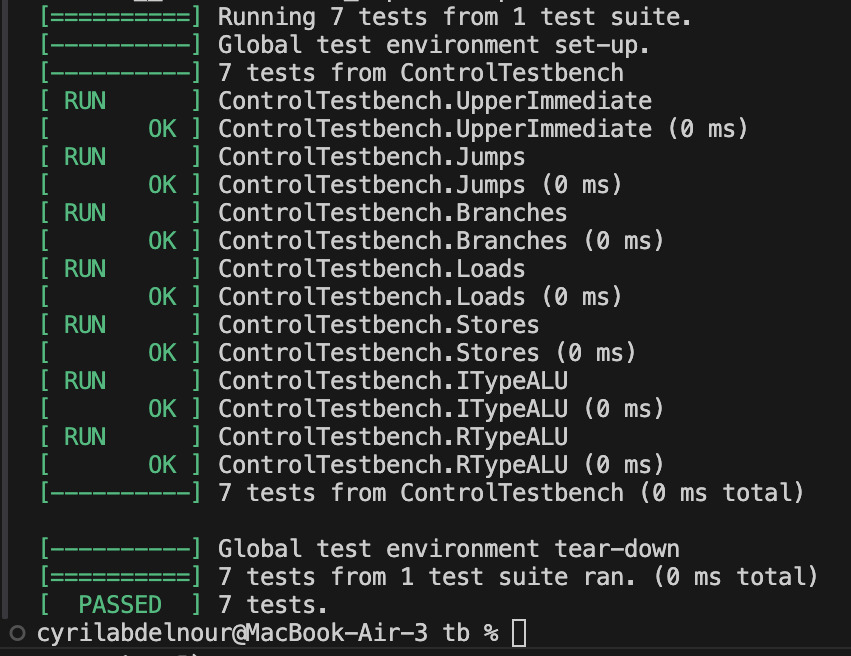

#### ALU Verification ( `alu_tb.cpp` ):

This testbench verifies the ALU by testing all 13 supported operations with various input combinations and edge cases:
- **Arithmetic:** ADD (with wrap-around), SUB (with negative result)
- **Bitwise:** AND, OR, XOR
- **Shifts:** SLL, SRL, SRA
- **Comparisons:** SLT (signed), SLTU (unsigned)
- **Special:** LUI passthrough, AUIPC (A + B - 4)
- **Flags:** EQ, LT, LTU

This testbench is available in `tb/tests` and in order to run it we need:
1. Navigate to the testbench (`tb`) folder
2. Make script executable:
   ```bash
   chmod +x doitalu.sh
   ```
The initial `doit.sh` file is modified so we can run this test.
3. Run the test:
   ```bash
   ./doit.sh tests/alu_tb.cpp
   ```
Here is what we obtain:

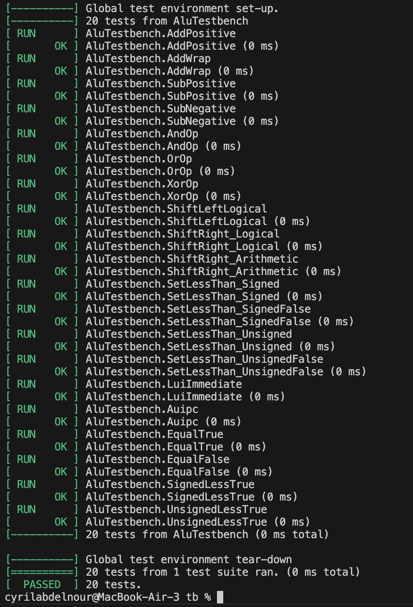


### Assembly Test Programs:


#### Test 6: Branch Equal (`6_beq.s`)

##### Purpose
Tests the `BEQ` (Branch if Equal) instruction in a loop context.

##### Code
```asm
.text
.globl main
main:
    addi t1, zero, 1
    li a0, 0
iloop:
    addi a0, a0, 1
    beq t1, a0, iloop
```

##### Execution Trace

| Cycle | Instruction | a0 | t1 | Branch Taken? |
|-------|-------------|----|----|---------------|
| 1 | `addi t1, zero, 1` | 0 | 1 | - |
| 2 | `li a0, 0` | 0 | 1 | - |
| 3 | `addi a0, a0, 1` | 1 | 1 | - |
| 4 | `beq t1, a0, iloop` | 1 | 1 | Yes (1 == 1) |
| 5 | `addi a0, a0, 1` | 2 | 1 | - |
| 6 | `beq t1, a0, iloop` | 2 | 1 | No (1 ≠ 2) |

##### Expected Output
```
a0 = 2
```

##### What It Tests
-`BEQ` instruction correctly compares two registers
- Branch taken when registers are equal
- Branch not taken when registers differ
- Loop control flow with conditional branching

---

#### Test 7: Store Byte & Load Word (`7_sb_lw.s`)

##### Purpose
Tests byte-level memory operations and little-endian word construction.

##### Code
```asm
.text
.globl main
main:
    li t1, 0
    li a0, 1
    sb a0, 0(zero)
    sb a0, 1(zero)
    sb t1, 2(zero)
    sb t1, 3(zero)
    lw a0, 0(zero)
```

##### Memory Layout After Stores

| Address | Value | Source |
|---------|-------|--------|
| 0x00 | 0x01 | `sb a0, 0(zero)` |
| 0x01 | 0x01 | `sb a0, 1(zero)` |
| 0x02 | 0x00 | `sb t1, 2(zero)` |
| 0x03 | 0x00 | `sb t1, 3(zero)` |


##### Expected Output
```
a0 = 257 (0x00000101)
```

##### What It Tests
-`SB` (Store Byte) instruction
- `LW` (Load Word) instruction
- Little-endian byte ordering
---

#### Test 8: Inequality Branching (`8_inequality_branching.s`)

##### Purpose
Tests all inequality branch instructions, including signed vs unsigned comparison edge cases.

##### Code
```asm
.text
.globl main
main:
    addi t2, zero, 2
    li a0, -5
    bltu a0, t2, mloop      # Unsigned: -5 = 0xFFFFFFFB > 2
    blt a0, t2, iloop       # Signed: -5 < 2
mloop:
    bgeu a0, t2, endm       # Unsigned: 0xFFFFFFFB >= 2
iloop:
    addi a0, a0, 1
    blt a0, t2, iloop       # we loop while a0 < 2 (signed)
    bge a0, t2, endi        # exit when a0 >= 2 (signed)
endm:
    li a0, 10
endi:
```

##### Key Insight: Signed vs Unsigned Comparison

| Value | Signed Interpretation | Unsigned Interpretation |
|-------|----------------------|------------------------|
| `0xFFFFFFFB` | -5 | 4,294,967,291 |

When comparing `-5` with `2`:
- **Signed (`BLT`)**: -5 < 2 → **True**
- **Unsigned (`BLTU`)**: 4,294,967,291 < 2 → **False**

##### Expected Output
```
a0 = 2
```

##### What It Tests
- `BLT` (Branch if Less Than, signed)
- `BGE` (Branch if Greater or Equal, signed)
- `BLTU` (Branch if Less Than, unsigned)
- `BGEU` (Branch if Greater or Equal, unsigned)
- Signed vs unsigned comparison semantics
- Negative number handling in comparisons

---

#### Test 9: Add Upper Immediate to PC (`9_auipc.s`)

##### Purpose
Tests the `AUIPC` instruction which adds an upper immediate to the program counter.

##### Code
```asm
.text
.globl main
main:
    auipc a0, 1
```

##### Calculation

The program is loaded at address `0xBFC00000`:

```
a0 = PC + (imm << 12)
a0 = 0xBFC00000 + (1 << 12)
a0 = 0xBFC00000 + 0x00001000
a0 = 0xBFC01000
```

##### Expected Output

```
a0 = 0xBFC01000 = 3217035264 (decimal)
```

##### What It Tests
- `AUIPC` instruction
- PC-relative address calculation
- Correct datapath:ALU input (PC) via `ALUsrc2` multiplexer

---

#### Test 10: Add Upper Immediate to PC (`10_shifts.s`)

##### Code

```
.text
.globl main
main:
    li t1, 5    
    li t2, 3        
    slli t3, t1, 2   
    add t4, t3, t2    
    srli t5, t4, 1  
    xor a0, t5, t2   
```

##### Execution Trace

The program begins by loading immediate values 5 into t1 and 3 into t2.

Next, it performs a left shift on t1 by 2 bits, yielding t3 = 20, then adds t2 to get t4 = 23.

The value in t4 is right-shifted by 1 bit, producing t5 = 11, and finally an XOR operation between t5 (11 = 0b1011) and t2 (3 = 0b0011) is performed.

The final result stored in a0 is 8.

##### What It Tests
- Left Shift: Testing slli for bit manipulation toward MSB
- Right Shift: Testing srli for unsigned bit shift toward LSB
  
---
### Results

These files containing the additional assembly code are in the asm folder contained in the testbench folder. The tests with their corresponding expected value are incleded in the `verify.cpp` file. 

#### Running the code

1. Navigate to the testbench ( `tb` ) folder:
   ```bash
   cd testbench
   ```

2. Make scripts executable:
   ```bash
   chmod +x assemble.sh
   chmod +x doit.sh
   ```
   Grant execution permissions to the assembly and run scripts.

3. Run the test:
   ```bash
   ./doit.sh tests/verify.cpp
   ```
   Execute the testbench with the verification file to validate the program.

Here are the results:

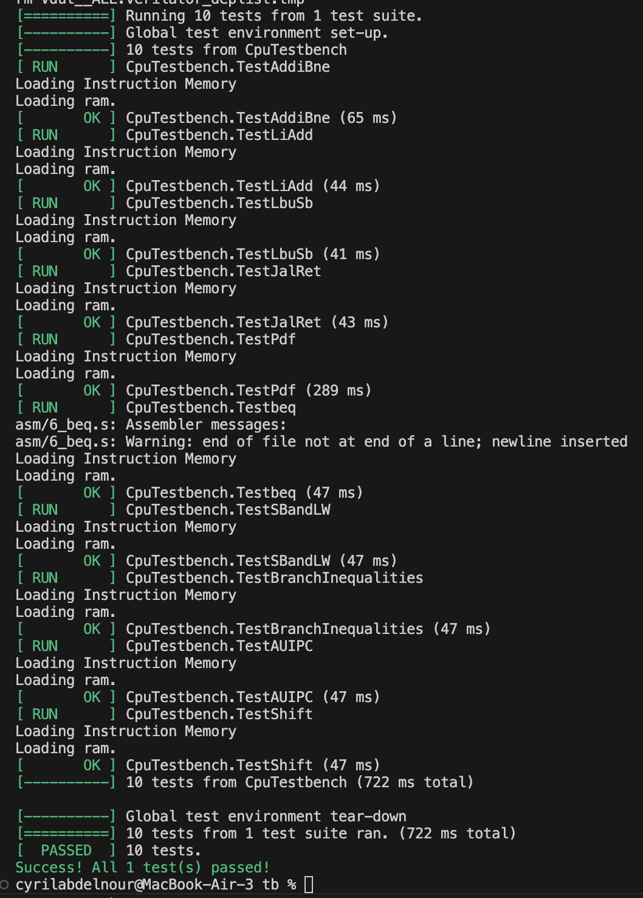

All test cases pass.

---

# Pipelined RISC-V Processor

## Table of Contents
- [1. Overview](#1-overview)
- [2. Implementation](#2-implementation)
  - [2.1 Pipeline Architecture](#21-pipeline-architecture)
  - [2.2 Performance Analysis](#performance_analysis)
  - [2.3 Forwarding Multiplexers](#forwarding-multiplexers)
  - [2.4 PCSrc_assertion logic explained](#pcsrc_assertion-labeled-as-pcsource-in-the-diagram-below-logic-explained)
  - [2.5 Hazard Unit](#22-hazard-unit)
- [3. Schematic](#3-schematic)
- [4. Testing & Verification](#4-testing--verification)
  - [4.1 Hazard Unit Testing](#41-hazard-unit-testing)
  - [4.2 Full Pipeline Testing](#42-full-pipeline-testing)

---

## 1. Overview

Pipelining is a technique used to improve processor performance by letting different parts of multiple instructions run at the same time instead of completing one instruction fully before starting the next.
In a single-cycle CPU, each instruction passes sequentially through several steps: fetch, decode, execute, memory access, and writeback and this total delay defines the clock cycle. 

Pipelining divides these steps into separate hardware stages and places pipeline registers between them, so that each stage works on a different instruction every cycle. As a result, while one instruction is being executed, another is being decoded and a third is already being fetched. The processor therefore achieves higher throughput.

In our design, we extend the original single-cycle (full 37 instructions) cpu into a 5-stage pipeline processor :fetch, decode, execute, memory access, and writeback . This will require new pipeline registers, modified writeback timing, and hazard-handling logic. We will add forwarding and stalling mechanisms to resolve data dependencies, and flushing logic to handle control hazards introduced by branches.

---

## 2. Implementation

### Pipeline Architecture

#### The Five Pipeline Stages

| Stage | Name | Description |
|-------|------|-------------|
| **F** | Fetch | Retrieve instruction from instruction memory using PC |
| **D** | Decode | Read registers and decode instruction; generate control signals |
| **E** | Execute | Perform ALU operation or calculate memory address |
| **M** | Memory | Access data memory for loads and stores |
| **W** | Writeback | Write result back to register file |

##### Signal Naming Convention

Introducing pipeline registers creates multiple instances of the same signal, each belonging to a different instruction. For example, the Program Counter (PC) value propagates through the pipeline, but the PC at the Execute stage corresponds to a **different instruction** than the PC at the Fetch stage.

To distinguish signals at different pipeline stages, we append a suffix indicating the stage:

| Suffix | Stage | Example |
|--------|-------|---------|
| `F` | Fetch | `PCF`, `InstrF` |
| `D` | Decode | `PCD`, `RD1D`, `RD2D` |
| `E` | Execute | `PCE`, `ResultSrcE`, `LoadSizeE` |
| `M` | Memory | `PCM`, `LoadUnsignedM` |
| `W` | Writeback | `ResultSrcW`, `RdW` |

##### Control Signal Propagation

The control unit for a pipelined processor is essentially **identical** to that of the single-cycle processor. However, there is one critical difference: **all control signals must also be pipelined**.

Control signals must travel alongside the data through the pipeline registers, ensuring that each stage receives the correct control signal for the instruction currently occupying that stage. For instance, `MemWrite` generated during Decode must arrive at the Memory stage exactly when the corresponding instruction reaches that stage.

```
Decode Stage          Execute Stage         Memory Stage
────────────────      ────────────────      ────────────────
MemWriteD ──────────► MemWriteE ──────────► MemWriteM ─────► Data Memory
RegWriteD ──────────► RegWriteE ──────────► RegWriteM ─────► ...
ALUCtrlD ────────► ALUCtrlE ────────► (not needed)
```

##### Register File Timing

In the pipelined design, the register file writeback occurs on the **falling edge** of the clock rather than the rising edge. This design choice enables:

- **First half of cycle**: Write data to the register file (Writeback stage)
- **Second half of cycle**: Read data from the register file (Decode stage)

This allows a subsequent instruction to read a value written by a preceding instruction within the same clock cycle, reducing certain data hazards.

---

#### Performance Analysis

The performance of a processor is determined by the time required to execute a program:

```
Execution Time = (# Instructions) × CPI × Tc
```

Where:
- **# Instructions**: Total number of instructions in the program
- **CPI**: Cycles Per Instruction (average clock cycles per instruction)
- **Tc**: Clock cycle time (seconds per cycle)

##### Component Delays

The table (from Harris and Harris book) below shows typical propagation delays for processor components:

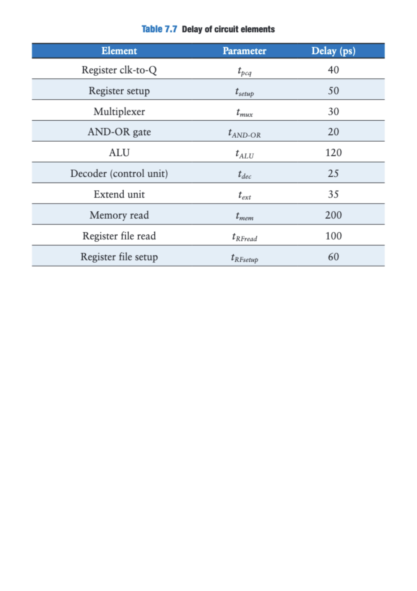

##### Single-Cycle Processor Performance

For a single-cycle processor, the clock period must accommodate the **entire critical path** through all stages:

```
Tc_single = t_pcq + 2·t_mem + t_RFread + t_ALU + t_mux + t_RFsetup
          = 40 + 2(200) + 100 + 120 + 30 + 60
          = 750 ps
```

**Example**: Program with 300 billion instructions

```
Execution Time = (# Instructions) × CPI × Tᶜ
               = (300 × 10⁹) × (1) × (750 × 10⁻¹² s)
               = 225 seconds
```

##### Pipelined Processor Performance

For a pipelined processor, the clock period is determined by the **slowest pipeline stage**:
We note that the formula seen in the lecture accounts for the extra hardware in our circuit (implementing all of the 37 instructions).
(We count the different occurences of each component using the schematic drawn in the section below)

```
Tc_pipelined = max of:
    -Fetch:     t_pcq + t_mem + t_setup              = 290 ps
     -Decode:    2(t_RFread + t_setup)                = 300 ps
    -Execute:   t_pcq + 4·t_mux + t_ALU + t_AND-OR + t_setup = 350 ps 
    -Memory:    t_pcq + t_mem + t_setup              = 290 ps
    -Writeback: 2(t_pcq + t_mux + t_RFwrite)         = 280 ps

Tc_pipelined = 350 ps (from the execute stage)
```

The Execute stage is the **critical path**, limiting the clock frequency.

However, pipelining introduces **hazards** (data dependencies, control dependencies) that require stalls. This increases the effective CPI above the ideal value of 1.

**Example**: Program with 300 billion instructions, we assume CPI = 1.23 (idealy 1 but here higher due to stalls)

```
Execution Time = (# Instructions) × CPI × Tc
               = (300 × 10⁹) × (1.23) × (350 × 10⁻¹² s)
               = 129 seconds
```

#### Performance Comparison

Despite the increased CPI due to hazard-related stalls, the pipelined processor achieves a **1.74× speedup** over the single-cycle design by significantly reducing the clock period.

```
Speedup = 300s / 129s ≈ 1.74×
```

This demonstrates the fundamental advantage of pipelining: **higher throughput** through instruction-level parallelism, even at the cost of slightly reduced efficiency per instruction.


### Forwarding Multiplexers

Data hazards occur when an instruction depends on the result of a previous instruction still in the pipeline. Rather than stalling, we can **forward** the required data directly from where it is available to where it is needed.

##### Key Insight

A result computed by the ALU is available at the end of the Execute stage, **before** it is written back to the register file. By adding forwarding paths, we can bypass the pipeline registers and deliver this value directly to dependent instructions.

Two multiplexers are added at the ALU inputs to select between three possible sources: (see schematic below)

```systemverilog
// Forwarding multiplexers
mux4 forwardingRS1(
    .in0(RD1E),           // 00: Normal path from register file
    .in1(ResultW),        // 01: Forward from Writeback stage
    .in2(ALUResultM),     // 10: Forward from Memory stage
    .in3(RD1E),           // 11: Unused (default to register file)
    .select_line(ForwardAE),
    .out(SrcAE)    
);

mux4 forwardingRS2(
    .in0(RD2E),           // 00: Normal path from register file
    .in1(ResultW),        // 01: Forward from Writeback stage
    .in2(ALUResultM),     // 10: Forward from Memory stage
    .in3(RD2E),           // 11: Unused (default to register file)
    .select_line(ForwardBE),
    .out(WriteDataE)    
);
```


##### Hazard Unit Role

The **Hazard Unit** monitors register addresses across pipeline stages (`Rs1E`, `Rs2E`, `RdM`, `RdW`) and generates the forwarding control signals (`ForwardAE`, `ForwardBE`). It determines:
This allows most data hazards to be resolved **without stalling**, maintaining pipeline throughput. (See more on the hazard unit logic below)


### PCSrc_assertion (labeled as PCSource in the diagram below) logic explained

In the single-cycle design, branch resolution happens within the control unit. In the pipelined design, however:
1. **Control signals are generated in Decode** which is before comparison flags are available
2. **Comparison flags are computed in Execute** by the ALU

Therefore, we need a dedicated module in the Execute stage that combines the pipelined control signals (`Branch_e`, `Jump_e`, `funct3`) with the ALU flags (`EQ`, `LT`, `LTU`) to produce the final `PCSrcE` decision.

#### Output

This module generates the `PCSrcE` control signal, which selects the source for the next Program Counter:

| PCSrcE | Next PC Source | Condition |
|--------|----------------|-----------|
| `2'b00` | `PC + 4` | No branch/jump (sequential execution) |
| `2'b01` | `PCTargetE` | Branch taken or `JAL` |
| `2'b10` | `ALUResultE` | `JALR` (register based jump) |

Which matches the logic in the pc_block: 

```systemverilog
case (pc_src)
  2'b00: internal_pc <= inc_pc;    // PC + 4
  2'b01: internal_pc <= branch_pc; // PC + Imm
  2'b10: internal_pc <= ALU;       // JALR
  default: internal_pc <= inc_pc;  
```

#### Branch Resolution Logic

When `Branch_e` is asserted, the module decodes `funct3` to determine which comparison flag to evaluate:

| funct3 | Instruction | Branch Taken When |
|--------|-------------|-------------------|
| `3'b000` | `BEQ` | `EQ == 1` (equal) |
| `3'b001` | `BNE` | `EQ == 0` (not equal) |
| `3'b100` | `BLT` | `LT == 1` (less than, signed) |
| `3'b101` | `BGE` | `LT == 0` (greater or equal, signed) |
| `3'b110` | `BLTU` | `LTU == 1` (less than, unsigned) |
| `3'b111` | `BGEU` | `LTU == 0` (greater or equal, unsigned) |

Note the symmetry: each pair of branches (`BLT`/`BGE`, `BLTU`/`BGEU`, `BEQ`/`BNE`) uses the **same flag** but with **opposite polarity**.

#### Jump Resolution Logic

When `Jump_e` is asserted:

| ALUSrcE | Instruction | PCSrcE | Target Calculation (computed in the pc block) |
|---------|-------------|--------|-------------------|
| `0` | `JAL` | `2'b01` | `PC + immediate` (PC-relative) |
| `1` | `JALR` | `2'b10` | `rs1 + immediate` (register-based) |


---

### 2.2 Hazard Unit
#### 1.	Why hazards occur in a pipeline? 
(A good analogy may be the conveyor belt along an assembly line in a car factory. At any one time, there are multiple cars along the belt, with each car being built stage by stage by workers who only specialize in one action)
In a pipelined CPU, multiple instructions are executed in parallel. Hazards arise due to this inherently parallel structure. 
Data Hazards occur when one or more instructions depend on results that have not yet been written back into the register file. Specifically, this arises when the destination register of the previous instruction is one of the source registers of the latter instruction. This phenomenon is called a Read-After-Write hazard.
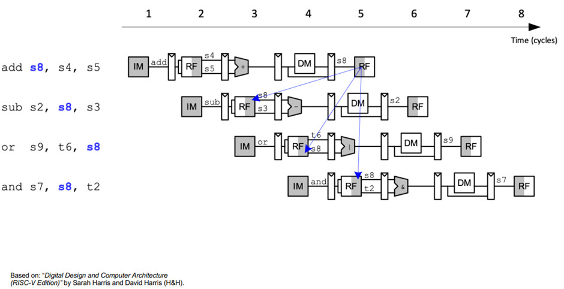

In the figure above, instructions that follow the `add s8, s4, s5` instruction use the s8 register as a source register in their arithmetic and logical operations. For instance, `sub s2, s8, s3` requires the contents of the register s8 in the 3rd clock cycle, the next instruction in the 4th, and the one after on the 5th. However, the initial add instruction is only able to write back to the register file by the end of the 5th clock cycle. Therefore, the instructions that follow read the previous value of s8 from the register, which is invalid in the logical sequence of execution and will most likely culminate in an erroneous result. 
A special case arises when the first instruction is a “Load” instruction.

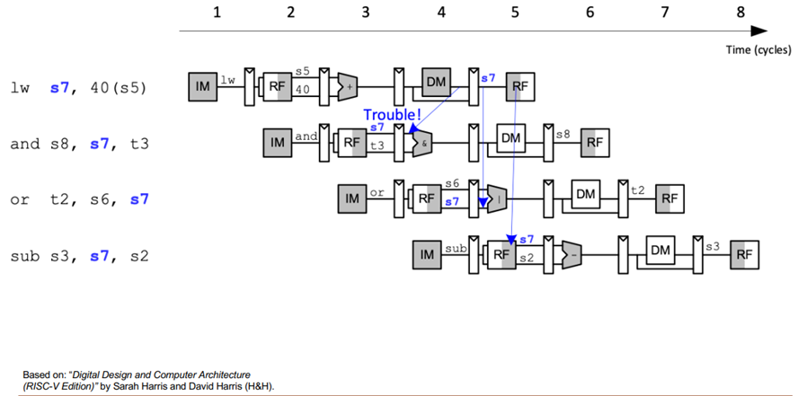
 
When the instruction immediately after an “lw” instruction has a source register that is meant to be written into by the `lw` instruction, the 2 stage difference between the decode and memory stages means that the result of the “lw” instruction only becomes available once the next instruction has already reached and completed its execution stage. This is shown by the topmost arrow pointing from the bus carrying the result of the data memory (the “lw” result) to the top input of the ALU. Since the data dependency involves a result that only becomes available in the same clock cycle as the execution of the dependent instruction, forwarding on its own is no longer sufficient. 

Control Hazards are caused by branch instructions where the condition required for the branch is true, meaning the branch is taken. Once it is determined that the branch predicate is true, the program counter must branch to a different location, and the sequential order in which instructions are fetched from the instruction memory is broken. Depending on the offset of a branch instruction, an asserted branch invalidates the instructions fetched after the branch instruction and before the deduction of the branch condition’s validity. 

#### 2.	Motivation for/responsibilities of the hazard unit
Our hazard unit encapsulates all of the regulatory logic required to tackle the issues introduced by pipelining, including both data hazards and control hazards. Hence, the hazard unit is a single comprehensive module that triggers and employs stalling, flushing, and forwarding mechanisms (what these mechanisms do will be explained later together with the solutions). We chose this unitary and holistic approach to resolving both kinds of hazards because the input signals required to generate the relevant control signals for stalling, flushing and forwarding are the same or similar.

In summary, the primary goals of the Hazard Unit are:

•	To resolve data hazards through forwarding whenever possible, minimizing performance loss.

•	To detect and stall only when forwarding cannot supply the required operand in time (“Load” data dependency).

•	To flush instructions that enter the pipeline speculatively once a branch outcome becomes known.


#### Data hazard resolution: forwarding logic
For most arithmetic and logical instructions, the result becomes available before Write-Back, either at the end of the `EX` or `MEM` stage, allowing us to resolve these hazards without inserting stalls by forwarding the result directly to the ALU inputs.
The Hazard Unit implements this forwarding by checking whether the source registers used by the instruction currently in the Execute (EX) stage match the destination registers of instructions that are still in the Memory (MEM) or Write-Back (WB) stages.
Forwarding Decision Conditions (PUT the code for forwarding only somewhere around here or right next)
```systemverilog
always_comb begin
    //Default:no forwarding
    selectline1 = 2'b00;
    selectline2 = 2'b00;

    //Operand1 forwarding
    if (regWriteM && rdM != 0 && rdM == rs1E) begin
        selectline1 = 2'b10;  //from MEM stage
    end 
    else if (WriteBack_Regfile && rdWB !=0 && rdWB == rs1E) begin
        selectline1 = 2'b01;  //from WB stage
    end

    // Operand 2 forwarding
    if (regWriteM && rdM !=0 && rdM == rs2E) begin
        selectline2 = 2'b10;
    end 
    else if (WriteBack_Regfile && rdWB !=0 && rdWB == rs2E) begin
        selectline2 = 2'b01;
    end

end

```
The forwarding logic compares decoded operands rs1E and rs2E with the destination registers rdM and rdWB:

•	If the instruction in the MEM stage writes a register (regWriteM = 1) and its destination rdM matches the operand in EX, then the operand should be forwarded from MEM.

•	Else if the instruction in the WB stage writes a register (WriteBack_Regfile = 1) and its destination rdWB matches, then forward from WB.

•	Register x0 is never forwarded, so matches must ignore rd = 0.


##### Select Line Encoding
To control operand multiplexers feeding the ALU, the Hazard Unit sets two 2-bit signals:
| Value | Operand Source          |
| ----- | ----------------------- |
| 00    | Register file output    |
| 01    | Forward from Write-Back |
| 10    | Forward from Memory     |


So the circuit schematic for exclusively the hazard unit’s forwarding mechanism is identical to that detailed in the lecture slides as shown below:

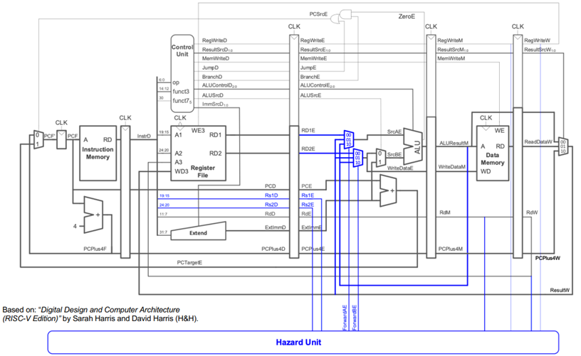
 
What this diagram does not cover is how the hazard unit tackles load word data dependencies and control hazards, discussed later.
Why forwarding ignores loads here
Even though this logic covers most RAW hazards, it does not prevent a load word hazard, because a load instruction does not produce valid data until the end of the MEM stage. In such cases, forwarding would still not provide the correct value in time, which is why the Hazard Unit must insert a stall (described in Section 4).
Forwarding entirely removes stalls that would otherwise be caused by data dependencies for:

•	ALU-to-ALU dependency chains (e.g., add, sub, and, or, etc.)

•	Immediate arithmetic dependencies (e.g., addi, ori)

•	Register-producing control instructions if value is known early (e.g., jalr)

#### 4. Load word data dependency
Forwarding cannot resolve a dependency when the preceding instruction is a load. In a load instruction, the data is only available after the Memory stage, meaning forwarding cannot provide a valid operand in the immediate next cycle.

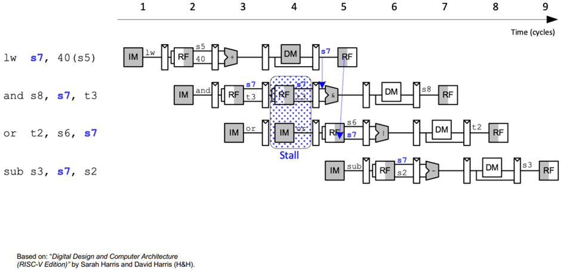
 
(Modify this diagram to show that the execute stage is actually flushed, not stalled)
In this case, the Hazard Unit must stall the pipeline for exactly one cycle. It freezes the Program Counter and Fetch-to-Decode pipeline register and flushes the Decode-to-Execute pipeline register. The reason why Decode-to-Execute pipeline register is flushed is that if it were only stalled, the “lw” instruction would propagate through to the memory stage but also still remain in the Decode-to-Execute pipeline register, essentially duplicating the lw instruction. Thus, flushing this stage of the pipeline both achieves the stall required for synchronization (since the next register is not able to propagate into the execute stage) and prevents the duplication that would cause 2 back to back “lw” instructions.

```systemverilog
logic wStall;
//logic lw_write_back;

assign wStall = (resultSrCE == 2'b01) &&
                 ( (rdE != 0) &&
                   ( (rdE == rs1D) || (rdE == rs2D) ) );

...

always_comb begin

    // Default: no stall, and no flush
    PCWrite     = 1;
    F_Write = 1;
    flush_d_exec = 0;
    flush_f_d = 0;

    ... //Control hazard detection and flushing

    if(wStall == 1) begin
        PCWrite     = 0;
        F_Write = 0;
        flush_d_exec = 1;
    end
end

```

The stall condition used in the design asserts when: (Same as data dependency section, put the code somewhere over here)
•	The instruction in Execute is a load (resultSrCE == 2'b01), and
•	Its destination register rdE matches either source register in Decode (rs1D or rs2D), and
•	rdE != 0.
This is implemented in:
(code)
When a stall is necessary:
•	PCWrite = 0 prevents PC update,
•	F_Write = 0 prevents writing to IF/ID,
•	flush_d_exec = 1 inserts a bubble into Execute.
Thus, one cycle later, forwarding can resume as normal.


#### 5. Control hazard detection and Flush logic

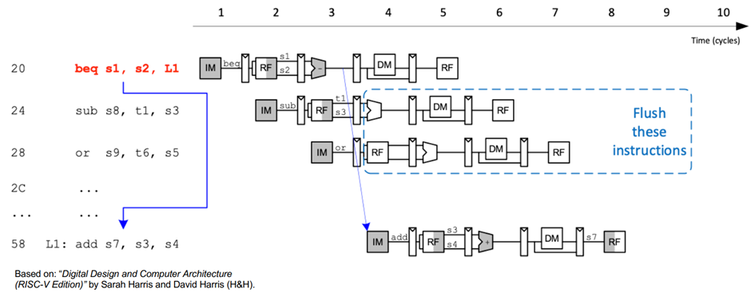
 
In the image, the first instruction in the sequence is “beq s1, s2, L1”. In the first clock cycle, the instruction is fetched from instruction memory and fed to the pipeline register connecting the fetch stage to the decode stage. In the second clock cycle, the branch instruction is decoded and the relevant registers read from the register file. Meanwhile, the next instruction – “sub s8, t1, s3” – is fetched from instruction memory. Only by the third clock cycle, does the ALU determine that s1 and s2 are equal. However, two new instructions have been fetched already from instruction memory under the speculative assumption that the branch will not be taken. The solution is to “flush” the fetch and decode stages. To do this, the hazard unit outputs a control signal to the Fetch-to-Decode and Decode-to-Execute pipeline registers. Our pipeline registers have internal logic that synchronously sets the contents of the pipeline registers to 0 once the one-bit control signal from the hazard unit triggers flushing. Since the PC is updated to the branch target, the pipeline then continues with correct instructions.

```systemverilog
if(PCSrcE == 2'b10 || PCSrcE == 2'b01) begin
        flush_f_d = 1;
        flush_d_exec = 1;
    end
```
---

## 3. Schematic


---

## 4. Testing & Verification

### 4.1 Hazard Unit Testing
#### Test 1: Forward From MEM to Operand1 (`T1_MEM_Fwd_Op1`)

##### Purpose
Ensures the hazard unit forwards data from the MEM stage when `rdM` matches `rs1E`.

##### Signal Setup
```text
rs1E      = 5
rdM       = 5
regWriteM = 1
```

##### Input Signals

| Signal             | Value  |
|--------------------|--------|
| `rs1D`             | 0      |
| `rs2D`             | 0      |
| `rs1E`             | 5      |
| `rs2E`             | 0      |
| `rdM`              | 5      |
| `rdE`              | 0      |
| `rdWB`             | 0      |
| `regWriteM`        | 1      |
| `resultSrCE`       | 0      |
| `WriteBack_Regfile`| 0      |
| `PCSrcE`           | 0b00   |

##### Expected Output
```text
selectline1  = 2'b10
selectline2  = 2'b00
PCWrite      = 1
F_Write      = 1
flush_d_exec = 0
flush_f_d    = 0
```

##### What It Tests
- RAW hazard on operand 1 resolved via forwarding from MEM stage
- No stall or flush when there is no load-use or branch/jump
---
#### Test 2: Forward From WB to Operand2 (`T2_WB_Fwd_Op2`)

##### Purpose
Ensures the hazard unit forwards data from the WB stage when `rdWB` matches `rs2E` and MEM does not write.

##### Signal Setup
```text
rs2E              = 9
rdWB              = 9
WriteBack_Regfile = 1
regWriteM         = 0
```

##### Input Signals

| Signal             | Value  |
|--------------------|--------|
| `rs1D`             | 0      |
| `rs2D`             | 0      |
| `rs1E`             | 0      |
| `rs2E`             | 9      |
| `rdM`              | 0      |
| `rdE`              | 0      |
| `rdWB`             | 9      |
| `regWriteM`        | 0      |
| `resultSrCE`       | 0      |
| `WriteBack_Regfile`| 1      |
| `PCSrcE`           | 0b00   |

##### Expected Output
```text
selectline1  = 2'b00
selectline2  = 2'b01
PCWrite      = 1
F_Write      = 1
flush_d_exec = 0
flush_f_d    = 0
```

##### What It Tests
- RAW hazard on operand 2 resolved via forwarding from WB stage
- WB forwarding only used when MEM does not provide a matching destination
---
#### Test 3: Load-Use Stall via `rs1D` (`T3_LW_Stall_rs1D`)

##### Purpose
Ensures a load-use dependency between the instruction in EX and the instruction in Decode triggers a stall and inserts a bubble into EX.

##### Signal Setup
```text
resultSrCE = 2'b01   (load in EX)
rdE        = rs1D    (true dependency)
```

##### Input Signals

| Signal             | Value  |
|--------------------|--------|
| `rs1D`             | 3      |
| `rs2D`             | 0      |
| `rs1E`             | 0      |
| `rs2E`             | 0      |
| `rdM`              | 0      |
| `rdE`              | 3      |
| `rdWB`             | 0      |
| `regWriteM`        | 0      |
| `resultSrCE`       | 2'b01  |
| `WriteBack_Regfile`| 0      |
| `PCSrcE`           | 0b00   |

##### Expected Output
```text
PCWrite      = 0
F_Write      = 0
flush_d_exec = 1
flush_f_d    = 0
selectline1  = 2'b00
selectline2  = 2'b00
```

##### What It Tests
- Load-use hazard detection (`wStall = 1`)
- Program counter and fetch stage are stalled
- Decode→Execute pipeline register is flushed (bubble inserted)
---
#### Test 4: Branch Flush Without Stall (`T4_Branch_Flush`)

##### Purpose
Ensures that when a branch/jump is taken in EX (`PCSrcE != 2'b00`), the hazard unit flushes F/D and D/EX but does not stall the PC or fetch.

##### Signal Setup
```text
PCSrcE = 2'b01   (taken branch)
no load-use hazards
```

##### Input Signals

| Signal             | Value  |
|--------------------|--------|
| `rs1D`             | 0      |
| `rs2D`             | 0      |
| `rs1E`             | 0      |
| `rs2E`             | 0      |
| `rdM`              | 0      |
| `rdE`              | 0      |
| `rdWB`             | 0      |
| `regWriteM`        | 0      |
| `resultSrCE`       | 0      |
| `WriteBack_Regfile`| 0      |
| `PCSrcE`           | 2'b01  |

##### Expected Output
```text
flush_f_d    = 1
flush_d_exec = 1
PCWrite      = 1
F_Write      = 1
selectline1  = 2'b00
selectline2  = 2'b00
```

##### What It Tests
- Control hazard handling for taken branches/jumps
- Both F/D and D/EX pipeline registers are flushed
- No unnecessary stall of PC or fetch stage

---
```bash
[==========] Running 4 tests from 1 test suite.
[----------] Global test environment set-up.
[----------] 4 tests from HazardUnitTestbench
[ RUN      ] HazardUnitTestbench.ForwardOperand1FromMem
[       OK ] HazardUnitTestbench.ForwardOperand1FromMem (1 ms)
[ RUN      ] HazardUnitTestbench.LoadUseStall
[       OK ] HazardUnitTestbench.LoadUseStall (1 ms)
[ RUN      ] HazardUnitTestbench.ForwardOperand2FromWb
[       OK ] HazardUnitTestbench.ForwardOperand2FromWb (0 ms)
[ RUN      ] HazardUnitTestbench.BranchFlushWithoutStall
[       OK ] HazardUnitTestbench.BranchFlushWithoutStall (0 ms)
[----------] 4 tests from HazardUnitTestbench (4 ms total)

[----------] Global test environment tear-down
[==========] 4 tests from 1 test suite ran. (4 ms total)
[  PASSED  ] 4 tests.
```
---

### 4.2 Full Pipeline Testing

This section verifies the pipelined design through four test scenarios, each targeting a specific aspect of pipeline behavior and hazard handling.

GTKWave was an invaluable tool for visualizing signal transitions and debugging pipeline behavior, allowing us to trace instruction flow and verify hazard handling cycle-by-cycle.

#### 1) Pipelined Overlapping (No Hazards)
This test demonstrates correct instruction overlapping in the pipeline when no data or control hazards are present, confirming that multiple instructions execute simultaneously across different pipeline stages.

Here is the assembly code run by the processor and the results are shown in the waveform below:
This assembly code can be found in the `asm` folder and was created for testing the instruction overlapping characteristic introduced by pipelining.

```
.text
.globl main
main:
    addi    t0, zero, 10        # t0 = 10 
    addi    t1, zero, 20        # t1 = 20 
    addi    t2, zero, 30        # t2 = 30 
    addi    t3, zero, 40        # t3 = 40
    addi    a0, t3, 0           # a0 = t3 = 40
```

**Waveform:**

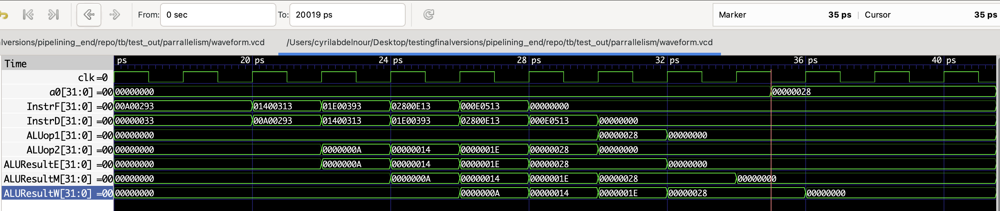

---

#### 2) Data Hazards: Read After Write (RAW)
This test verifies the forwarding unit by demonstrating how RAW hazards are resolved through the forwarding muxes, showing the change in the forward select lines when a dependent instruction requires data from a previous instruction still in the pipeline.

Here is the assembly code run by the processor and the results are shown in the waveform below:

We modified the assembly code provided in the  `asm` folder :`2_li_add` such that `li` is replaced with `addi`.

`li` is broken down into `lui` and `addi`, thus when `add a0, t1, t2` is in the execute stage of the original program `2_li_add` only one of the operand depends on a previous instruction still in the pipeline.

With this modification we have both `addi t1, zero, -900` and `addi t2, 10000` still in the pipeline when `add a0, t1, t2` is in the execute stage.

Note that since `addi` is an I-type instruction -9000 and 10000 are outside the range allowed for the immediate operand. Thus we changed the immediates to 1000 and -900 to adapt to our previous modifications.

Note that we also removed the branch instructions here because they don't provide any insights in demonstrating how RAW hazards are resolved through the forwarding muxes.

```
.text
.globl main
main:
    # li is broken into lui and addi for >12-bit values
    # don't forget that addi sign-extends
    addi t1, zero, -9000    # t1 = -900
    addi t2, zero, 10000    # t2 = 1000
    add a0, t1, t2  # a0 = t1 + t2      (=1000)
```

The `add a0, t1, t2` instruction depends on the values of t1 and t2, which are written by the immediately preceding `addi` instructions still in the pipeline. 

Since these values have not yet been written back to the register file, the forwarding unit detects the RAW hazard and routes the results directly from the Memort and Writeback pipeline registers to the ALU inputs. 

This allows the add instruction to execute correctly without stalling, demonstrating the effectiveness of our forwarding mechanism.

**Waveform:**

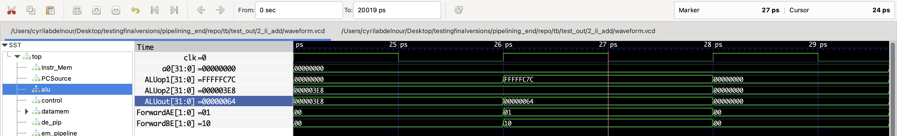


---

#### 3) Load-Use Hazards
This test demonstrates the 1-cycle stall required when a load instruction is immediately followed by a dependent instruction. The stall is achieved by:
- Disabling (freezing) the FD pipeline register for 1 cycle
- Preventing the program counter from incrementing for 1 cycle
- Flushing the DE pipeline register

To illustrate these points on gtkwave we use the assembly test: `3_lbu_sb`, where we are only interested in the following part:

```
    lbu t3, 0(s0)   # t3 = *(0x00010000)    (=100)
    lbu t4, 1(s0)   # t4 = *(0x00010001)    (=200)
    add a0, t3, t4  # a0 = t3 + t4          (=300)
```

In the following waveform , we can track the cycle in which the `add a0, t3, t4` reaches the Decode stage through the sign `InstrD` and the cycle in which it reaches the Execute stage through the ALU operands value (0xC8 corresponds to 200 and 0x64 corresponds to 100).

An important observation is that the Decode stage and the Execute stage are seperated by 1 cycle caused by the stall.

The signals causing the stall are also shown in the waveform.

**Waveform:**

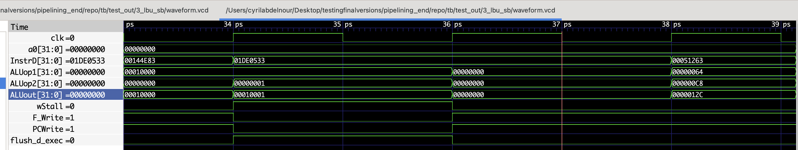


---

#### 4) Control Hazards: Branch Misprediction
Branches are predicted as not taken by default (see [Branch Prediction Enhancement]([https://github.com/TahaMunir2/Team5/tree/branchprediction]) for improved prediction). When a branch reaches the execute stage and is determined to be taken, a flush occurs to discard the incorrectly fetched instructions.

We will use the assembly code `6_beq` with a small modification consisting of adding 2 instructions after the branch to illustrate how a flush occurs to discard the incorrectly fetched instructions.
```
.text
.globl main
main:
    addi t1, zero, 1
    li a0, 0
iloop:
    addi a0, a0, 1
    beq t1, a0, iloop
    addi a0, a0, 0
    addi a0, a0, 0
```

In the following waveform, we observe the flush signals high when `beq t1, a0, iloop` is in the Execute stage. 
We identify that `beq t1, a0, iloop` is in the Execute stage using the `PCE` signal. 

Crucialy we observe the value of the program counter being redirected correctly to the address of `iloop` corresponding to the value of the   ` (program counter at beq t1, a0, iloop) -4 ` : 

Value of PCE for `beq t1, a0, iloop` in the Execute stage : **0xBFC0000C**

At the next cycle the value of PCF is: **0xBFC00008** ( ` PCE - 4 ` )


**Waveform:**

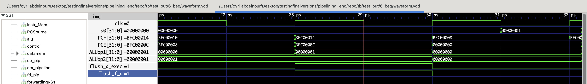

#### Running the code

1. Navigate to the testbench ( `tb` ) folder:
   ```bash
   cd repo/tb
   ```

2. Make scripts executable:
   ```bash
   chmod +x assemble.sh
   chmod +x doit.sh
   ```
   Grant execution permissions to the assembly and run scripts.

3. Run the test:
   ```bash
   ./doit.sh tests/verify.cpp
   ```
   Execute the testbench with the verification file to validate the program.

Here are the results:

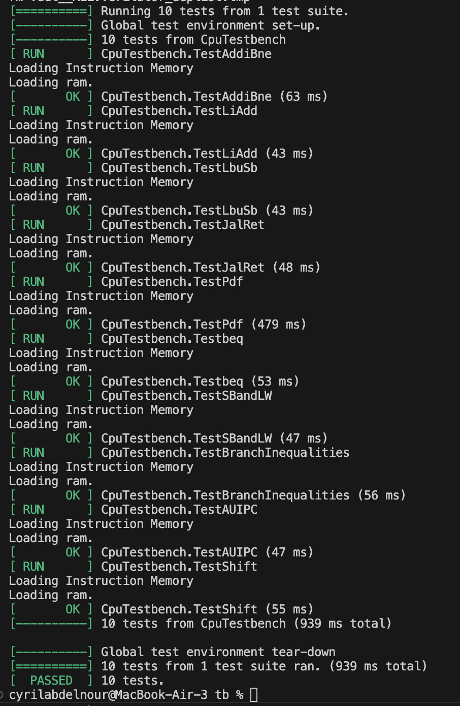

All test cases pass.

---

# Branch Prediction

## Table of Contents
- [1. Overview](#1-overview)
- [2. Implementation](#2-implementation)
  - [2.1 Branch Predictor](#21-branch-predictor)
  - [2.2 PCSrcF Assertion](#22-pcsrcf-assertion)
  - [2.3 Overall Integration](#23-overall-integration)
- [3. Schematic](#3-schematic)
- [4. Testing & Verification](#4-testing--verification)
  - [4.1 Branch Predictor Testing](#41-branch-predictor-testing)
  - [4.2 Full Circuit Testing](#42-full-circuit-testing)

---

## 1. Overview

In our pipelined processor, instructions are fetched sequentially assuming `PC + 4`. Branch decisions are only resolved in the Execute stage, meaning incorrect instructions may already be in the pipeline. This causes **control hazards** requiring flushes, which waste cycles.
The baseline approach predicts all branches as **not taken**, but this performs poorly for loops where backward branches are typically taken repeatedly.

#### Our Solution: Two-Bit Dynamic Prediction

- A **one-bit predictor** remembers only the last outcome
- Problem: it **mispredicts twice per loop** (first and last iteration)

- A **two-bit predictor** requires two consecutive mispredictions before changing its prediction
- Four states: *Strongly Taken → Weakly Taken → Weakly Not Taken → Strongly Not Taken*
- Result: **mispredicts only once per loop** instead of twice

#### Branch Target Buffer (BTB)

We maintain a table indexed by the branch PC containing:
- The **2-bit prediction state**
- The **target address** for fast redirection when predicting "taken"


Finite State Machine diagram taken from Harris and Harris book

**Integration**: Integrating the branch predictor into the pipeline is also challenging because both the Fetch stage (making predictions) and the Execute stage (resolving actual outcomes) compete to update the Program Counter, so we had to implement synchronization between these 2 stages.

---

## 2. Implementation

### 2.1 Branch Predictor

The branch predictor uses a **2-bit counter** for each entry, implementing a four-state finite state machine (FSM) that tracks branch history.

#### Parameters

```systemverilog
parameter TARGET_BUFFER_SIZE = 64,
parameter INDEX_BITS = $clog2(TARGET_BUFFER_SIZE)  // 6 bits
```

- **`TARGET_BUFFER_SIZE`**: Number of branch entries stored (kept small for fast access)
- **`INDEX_BITS`**: Bits extracted from PC to index the table (bits `[7:2]`, skipping the 2 LSBs since instructions are word-aligned)

#### State Encoding

```systemverilog
typedef enum logic [1:0] {
    STRONGLY_NOT_TAKEN = 2'b00,
    WEAKLY_NOT_TAKEN   = 2'b01,
    WEAKLY_TAKEN       = 2'b10,
    STRONGLY_TAKEN     = 2'b11
} my_state;
```

The states are intentionally encoded so that the **MSB indicates the prediction**:
- `0x` → Predict **not taken**
- `1x` → Predict **taken**

#### Storage

```systemverilog
my_state array [TARGET_BUFFER_SIZE-1:0];      // Current state
my_state next_array [TARGET_BUFFER_SIZE-1:0]; // Next state
```

Two arrays hold the current and next states for all 64 entries.

#### Initialization (Reset)

```systemverilog
if (rst) begin
    for (int i = 0; i < TARGET_BUFFER_SIZE; i++)
        array[i] <= WEAKLY_NOT_TAKEN;
end
```

On reset, all entries initialize to **`WEAKLY_NOT_TAKEN`**, a neutral starting point since we have no prior branch history.
We could have also picked **`WEAKLY_TAKEN`** .
However, we intentionally don't pick **`STRONGLY_TAKEN`** or **`STRONGLY_NOT_TAKEN`** because these extreme states would bias the predictor before any branch history is available.

#### State Transitions (Update Logic)

When `enable` is asserted (i.e., a branch instruction reaches the Execute stage), the FSM updates based on the **actual outcome**:

```systemverilog
case (array[update_index])
    STRONGLY_NOT_TAKEN: next = actual_taken ? WEAKLY_NOT_TAKEN : STRONGLY_NOT_TAKEN;
    WEAKLY_NOT_TAKEN:   next = actual_taken ? WEAKLY_TAKEN     : STRONGLY_NOT_TAKEN;
    WEAKLY_TAKEN:       next = actual_taken ? STRONGLY_TAKEN   : WEAKLY_NOT_TAKEN;
    STRONGLY_TAKEN:     next = actual_taken ? STRONGLY_TAKEN   : WEAKLY_TAKEN;
endcase
```

| Current State | Branch Taken | Next State |
|---------------|--------------|------------|
| `STRONGLY_NOT_TAKEN` | No | `STRONGLY_NOT_TAKEN` |
| `STRONGLY_NOT_TAKEN` | Yes | `WEAKLY_NOT_TAKEN` |
| `WEAKLY_NOT_TAKEN` | No | `STRONGLY_NOT_TAKEN` |
| `WEAKLY_NOT_TAKEN` | Yes | `WEAKLY_TAKEN` |
| `WEAKLY_TAKEN` | No | `WEAKLY_NOT_TAKEN` |
| `WEAKLY_TAKEN` | Yes | `STRONGLY_TAKEN` |
| `STRONGLY_TAKEN` | No | `WEAKLY_TAKEN` |
| `STRONGLY_TAKEN` | Yes | `STRONGLY_TAKEN` |

This implements a **saturating counter**: the state moves toward "strongly taken" when branches are taken, and toward "strongly not taken" when they aren't, but never wraps around.

#### Prediction Output (Moore Machine)

```systemverilog
pred_taken = array[predict_index][1];
```

The prediction is simply the **MSB of the current state**:
- `STRONGLY_NOT_TAKEN (00)` → bit[1] = `0` → predict **not taken**
- `WEAKLY_NOT_TAKEN (01)` → bit[1] = `0` → predict **not taken**
- `WEAKLY_TAKEN (10)` → bit[1] = `1` → predict **taken**
- `STRONGLY_TAKEN (11)` → bit[1] = `1` → predict **taken**

This is a **Moore machine** : the output depends only on the current state, not the inputs.

#### Timing: We update at the Negative Edge?

```systemverilog
always_ff @(negedge clk)
```

The state update occurs on the **falling edge** of the clock. This ensures that:
1. The prediction is read during the **first half** of the cycle (Fetch stage)
2. The state update from Execute happens during the **second half**, avoiding read-write conflicts


### 2.2 PCSrcF Assertion

The `PCSrcF_assertion` module resolves conflicts between the Fetch and Execute stages when determining the next Program Counter. It decides whether to follow a prediction, correct a misprediction, or proceed sequentially.

#### The Challenge

Two stages compete to control the PC:
- **Fetch stage**: Makes speculative predictions for newly fetched branch instructions
- **Execute stage**: Resolves actual branch outcomes and may need to correct mispredictions

This module arbitrates between them and selects the appropriate next PC.

#### Outputs

| PCSrcF | Next PC Source | Condition |
|--------|----------------|-----------|
| `2'b00` | `PC + 4` (Fetch) | Sequential execution (no branch or prediction = not taken) |
| `2'b01` | `FinalTarget` | Branch predicted/confirmed taken, or jump |
| `2'b11` | `PCPlus4E` (Execute) | Misprediction recovery: predicted taken but actually not taken |

> **Note**: `2'b00` and `2'b11` both select a `PC + 4` value, but from **different stages**. When recovering from a "predicted taken, actually not taken" misprediction, we must return to the `PC + 4` of the mispredicted branch, which has propagated to the Execute stage as `PCPlus4E`. This distinction is handled in the `pc_block` module (see [Overall Integration](#23-overall-integration)).

#### Branch Detection in Fetch

```systemverilog
logic BranchF;
assign BranchF = (opcodeF == 7'b1100011);
```

We check if the fetched instruction is a branch by examining its opcode (`1100011` = B-type).

#### Priority Logic

The module uses a priority-based tree in order to implement synchronization between the 2 stages (2 different instructions are communicating with this block at the same time):

##### Priority 1: Jump Instructions (Highest)

```systemverilog
if (JumpE) begin
    PCSrcF = PCSrcE;
    FinalTarget = targetE;
end
```

Jump instructions (`JAL`/`JALR`) in Execute take precedence. We use the resolved `PCSrcE` and actual target from Execute.

##### Priority 2: Misprediction Recovery

```systemverilog
else if (BranchE && false_prediction) begin
    if (predictionE) begin
        PCSrcF = 2'b11;  // Predicted taken, actually not taken
    end
    else begin
        PCSrcF = 2'b01;  // Predicted not taken, actually taken
        FinalTarget = targetE;
    end
end
```

When Execute detects a misprediction, we must correct the PC:

| Prediction | Actual | Recovery Action |
|------------|--------|-----------------|
| Taken | Not Taken | `PCSrcF = 2'b11` → Resume at `PC + 4` (we went down the wrong path) |
| Not Taken | Taken | `PCSrcF = 2'b01` → Jump to `targetE` (we should have branched) |

##### Priority 3: New Branch Prediction (Lowest)

```systemverilog
else begin
    if (BranchF) begin
        if (predictionF) begin
            PCSrcF = 2'b01;
            FinalTarget = targetF;
        end
        else begin
            PCSrcF = 2'b00;
        end
    end
end
```

If no Execute-stage corrections are needed and Fetch contains a branch:
- **Prediction = Taken**: Speculatively jump to `targetF`
- **Prediction = Not Taken**: Continue with `PC + 4`

#### Default Behavior

```systemverilog
PCSrcF = 2'b00;
FinalTarget = targetE;
```

By default, we proceed sequentially (`PC + 4`). The `FinalTarget` default doesn't matter since it's only used when `PCSrcF = 2'b01`.

##### Target Address Computation

```systemverilog
PCSrcF_assertion PCSourceF(
    // ...
    .targetF(PCF + {{20{InstrF[31]}}, InstrF[7], InstrF[30:25], InstrF[11:8], 1'b0}),
    .targetE(PCE + ExtImmE),
    .FinalTarget(target),
    // ...
);
```

Two targets are computed:
- **`targetF`**: Speculative target from Fetch (B-type immediate extracted directly from `InstrF`)
- **`targetE`**: Actual target from Execute (`PCE + ExtImmE`)

The `PCSrcF_assertion` module selects which one to use as `FinalTarget`.


### 2.3 Overall Integration

This section describes how the branch predictor, PC source assertion, and PC block are wired together. All connections described here are illustrated in the schematic below.

#### Modified PC Block

The `pc_block` module was extended to handle four PC sources instead of three:

```systemverilog
case (pc_src)
    2'b00: internal_pc <= inc_pc;     // PC + 4 (sequential)
    2'b01: internal_pc <= branch_pc;  // Branch target (Imm_op)
    2'b10: internal_pc <= ALU;        // JALR (register-based jump)
    2'b11: internal_pc <= pc_saved;   // Misprediction recovery
    default: internal_pc <= inc_pc;  
endcase
```

| PCSrcF | Source | Signal | Use Case |
|--------|--------|--------|----------|
| `2'b00` | `inc_pc` | `PC + 4` | Sequential execution or prediction = not taken |
| `2'b01` | `branch_pc` | `Imm_op` (target) | Branch/jump target (predicted or confirmed taken) |
| `2'b10` | `ALU` | `ALUResultE` | `JALR` instruction |
| `2'b11` | `pc_saved` | `PCPlus4E` | Recovery from "predicted taken, actually not taken" |

#### Difference between `pc_saved` and `inc_pc` (`pc_saved` is different from `pc_save` in our previous designs) 

Both represent a `PC + 4` value, but from **different instructions**:

- **`inc_pc`** = Current `PCF + 4` (next sequential address from Fetch)
- **`pc_saved`** = `PCPlus4E` (the `PC + 4` of the branch instruction now in Execute)

When we mispredicted "taken", we speculatively jumped to the target. To recover, we need the sequential address of the **mispredicted branch**, not the current Fetch PC.


#### Integration in Top Module

##### 1. Branch Predictor Connections

```systemverilog
branchpredictor2bit branchpredictor (
    .clk(clk),
    .rst(rst),
    .enable(BranchE),           // Update only when Execute has a branch
    .update_index(PCE[7:2]),    // Index from Execute stage PC
    .actual_taken(actual_taken),// Real outcome from PCSrcE
    .predict_index(PCF[7:2]),   // Index from Fetch stage PC
    .pred_taken(pred_takenF)    // Prediction output for Fetch
);
```

- **Prediction path**: `PCF[7:2]` : identifying the branch from the buffer and associating a prediction to it
- **Update path**: `PCE[7:2]` + `actual_taken` : updating the state of this specific entry in the buffer (we update only when `BranchE` is high : used as an enable signal to write to the buffer)

##### 2. Actual Outcome Derivation

```systemverilog
always_comb begin
    case (PCSrcE)
        2'b00:   actual_taken = 0;  // Branch not taken
        2'b01:   actual_taken = 1;  // Branch taken
        default: actual_taken = 0;  // Don't care (not a branch)
    endcase
end
```

The `PCSrcE` output from `PCSrcE_assertion` tells us the real branch outcome. We convert this to a single bit for the predictor update.

##### 3. Misprediction Detection (`evalprediction`)

This module compares what we **predicted** against what **actually happened** to determine if a flush is needed.
```systemverilog
module evalprediction(
    input logic [1:0] PCSrcE,      // Actual branch outcome
    input logic BranchE,           // Is this a branch instruction?
    input logic pred_taken,        // What we predicted in Fetch
    output logic false_prediction  // Misprediction flag
);
```

#### Logic

The module only evaluates predictions when `BranchE == 1` (a branch is in Execute):

```systemverilog
always_comb begin
    false_prediction = 0;  // Default: prediction was correct
    if (BranchE == 1) begin
        case (PCSrcE)
            2'b00: if (pred_taken)  false_prediction = 1;  // Predicted taken, actually not taken
            2'b01: if (!pred_taken) false_prediction = 1;  // Predicted not taken, actually taken
            default: false_prediction = 0;
        endcase
    end
end
```

- Defaulting to `0` prevents unnecessary pipeline flushes

#### Output Usage

The `false_prediction` signal feeds into:
1. **Hazard Unit**: Triggers `flush_f_d` and `flush_d_exec` to clear speculative instructions
2. **`PCSrcF_assertion`**: Overrides Fetch-stage decisions to correct the PC


##### 4. Prediction Propagation Through Pipeline

The prediction made in Fetch must travel with the instruction to Execute for comparison:
This ensures that when a branch reaches Execute, we still know what prediction was made for it.

##### 5. Hazard Unit Modifications

The hazard unit was modified to handle branch mispredictions. Previously, flushing occurred whenever a branch was taken (`PCSrcE != 0`). Now, we only flush on **mispredictions** or **jumps**:
```systemverilog
input logic JumpE,
input logic false_prediction  // Replaces PCSrcE for flush decisions
```

#### Flush Logic
```systemverilog
always_comb begin
    // Default: no stall, no flush
    PCWrite      = 1;
    F_Write      = 1;
    flush_d_exec = 0;
    flush_f_d    = 0;

    // Flush on misprediction or jump
    if (false_prediction || JumpE) begin
        flush_f_d    = 1;  // Flush Fetch-Decode register
        flush_d_exec = 1;  // Flush Decode-Execute register
    end

    // Stall on load-use hazard
    if (wStall == 1) begin
        PCWrite      = 0;
        F_Write      = 0;
        flush_d_exec = 1;
    end
end
```

#### Key Change: When to Flush

| Condition | Old Behavior | New Behavior |
|-----------|--------------|--------------|
| Branch taken, correctly predicted | Flush | **No flush** |
| Branch taken, mispredicted | Flush | Flush |
| Branch not taken, correctly predicted | No flush | No flush |
| Branch not taken, mispredicted | No flush | **Flush** |
| Jump (`JAL`/`JALR`) | Flush | Flush |

This reduces unnecessary flushes when the branch predictor guesses correctly, improving pipeline efficiency.

## 3. Schematic


---

## 4. Testing & Verification

### 4.1 Branch Predictor Testing

We created a c++ testbench ( `predictor_tb.cpp ` ) that isolates the branch predictor module and verifies the correct FSM transitions across all four states: STRONGLY_NOT_TAKEN, WEAKLY_NOT_TAKEN, WEAKLY_TAKEN, and STRONGLY_TAKEN.

**Tests performed:**
- **Initial State:** All entries initialize to WEAKLY_NOT_TAKEN after reset
- **State Transitions:** Correct transitions on taken/not-taken outcomes
- **Saturation:** Counter remains at STRONGLY_TAKEN or STRONGLY_NOT_TAKEN when saturated
- **Misprediction Tolerance:** Two consecutive mispredictions required to flip prediction

#### Running the code

1. Navigate to the testbench ( `tb` ) folder:
   ```bash
   cd repo/tb
   ```

2. Make scripts executable:
   ```bash
   chmod +x doitpredictor.sh
   ```
   Grant execution permissions to the assembly and run scripts.

3. Run the test:
   ```bash
   ./doitpredictor.sh tests/predictor_tb.cpp
   ```
   Execute the testbench with the verification file to validate the program.

Here are the results:

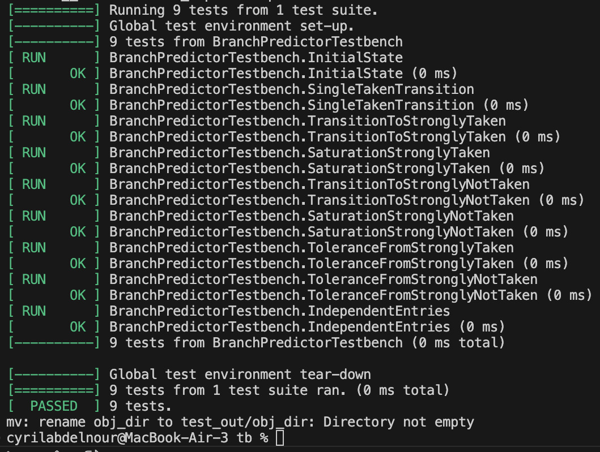


---

### 4.2 Full Circuit Testing

For examination, we will use the assembly program : `1_addi_bne`

```assembly
.text
.globl main
# this is a modified version of the Lab4 test program
# which doesn't run in an infinite loop
main:
    addi    t1, zero, 0xff      # t1 = 255
    addi    a0, zero, 0x0       # output = 0
mloop:
    addi    a1, zero, 0x0       # i = 0
iloop:
    addi    a0, a1, 0           # output = i
    addi    a1, a1, 1           # i++
    bne     a1, t1, iloop       # if i != 255, goto iloop
    bne     a0, zero, finish    # enter finish state

finish:      # expected result is 254
    bne     a0, zero, finish     # loop forever
```

This program runs an inner loop that counts a1 from 0 up to 255, continuously copying the current value of i into a0, so when the loop stops a0 holds 254 (the last value before the branch fails).

##### Correct Prediction (No Flush)

When the branch predictor correctly predicts the branch outcome, no pipeline flush occurs and execution continues without penalty.

Since the branch predictor's initial state is `WEAKLY_NOT_TAKEN`, it will start prediciting correctly at the second iteration of the loop. 

In the following waveform, we observe that the value of `PCF` ( PC at the fetch stage) decreases by 8 (jumps back by 2 to `iloop`) automaticaly when the branch instruction is fetched.

Thus, we avoid the penalty of waiting 2 extra cycles (until the branch instruction reaches the Execute stage) to jump back to the correct address. 

Note that:
- `0xFE659CE3` corresponds to the instruction : ` bne     a1, t1, iloop `
- `0x00058513` corresponds to the instruction : ` bne     a0, a1, 0 `


**Waveform:**

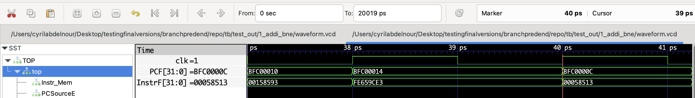


##### Performance Comparison
Comparison of pipeline behavior with and without branch prediction, showing reduced flush cycles for predictable branch patterns.

**Without Branch Prediction:**


**With Branch Prediction:**


#### Running the code

1. Navigate to the testbench ( `tb` ) folder:
   ```bash
   cd repo/tb
   ```

2. Make scripts executable:
   ```bash
   chmod +x assemble.sh
   chmod +x doit.sh
   ```
   Grant execution permissions to the assembly and run scripts.

3. Run the test:
   ```bash
   ./doit.sh tests/verify.cpp
   ```
   Execute the testbench with the verification file to validate the program.

Here are the results:


---

# Hierarchical Cache

## Table of Contents
- [1. Overview](#1-overview)
- [2. Implementation](#2-implementation)
  - [2.1 Overall Hierarchy](#21-overall-hierarchy)
  - [2.2 L1 Instruction Cache](#22-l1-instruction-cache)
  - [2.3 L1 Data Cache](#23-l1-data-cache)
  - [2.4 L2 Cache](#24-l2_cache)
- [3. Schematic](#3-schematic)
- [4. Testing & Verification](#4-testing--verification)
  - [4.1 L1 Instruction Cache Testing](#41-l1-instruction-cache-testing)
  - [4.2 L1 Data Cache Testing](#42-l1-data-cache-testing)
  - [4.3 L2 Cache Testing](#43-l2-cache-testing)
---

## 1. Overview

Caches are relatively small and fast memory components that are used to improve processer performance by decreasing the time taken per fetch and writeback (on average). Caches provide quick and efficient access to a small portion of the main memory, and are also able to be written to and write back to main memory if need be.

Caches exploit spatial and temporal locality in order to improve fetch and writeback speed. Spatial locality is the principle that accessing one memory location increases the likelihood that adjacent memory locations (in the virtual memory space) will be accessed shortly afterward. On the other hand, the concept of temporal locality is that recently accessed data is also highly likely to be re-accessed due to the inherently cyclic nature of programming.

In our design, we have implemented a 2-way associative L1 instruction cache and L1 data cache, as well as a 4-way associative L2 cache. We have decideed not to implement further lower level memory (other than main memory) such as an L3 cache or an L4 cache as these typically handle data from different cores or processors, of which we have neither.

---

## 2. Implementation

### 2.1 Overall Hierarchy

The overall memory hierarchy is as such:

-insert overall hierarchy img

As shown in the diagram above, the processor reads and writes from the L1 caches, which read from and write to the L2 cache, which reads from and writes to main memory.

We have also decided to implement the cache controller and cache array in the same SystemVerilog sheet for all of the caches due to simplicity when integrating all of the submodules into the CPU.

---

### 2.2 L1 Instruction Cache
The instruction cache is reponsible for temporarily storing instructions so that they can be quickly accessed by the processor (control path).

The specifications for our instruction cache are as follows:

| Parameter | Selected Value |
| --------- | -------------- |
| Total Cache Size | 4096 kB |
| Number of Sets | 128 |
| Associativity | 2-way |
| Block Size | 4 words |

The instruction cache supports read requests from the processer and writing from the L2 cache, but does not support writing from the processor, as we are not expecting the processor to change and write over an instruction.


#### Valid and Used bit
Each block contains one valid bit and each set has one used bit. The valid bit indicates whether the data in that cache block is meaningful or not, thus the valid bit is initialised to 0. The used bit indicates the most recently block, which is helpful in determining which block to evict when the set is full (LRU logic).

Valid bit initialisation:
```SystemVerilog
initial begin
    for (int i = 0; i < 128; i++) begin
        cache[i].used           = 1'b0;
        cache[i].block0.valid   = 1'b0;
        cache[i].block1.valid   = 1'b0;
    end
end
```


#### Instruction cache reading
When a read request is sent to the instruction cache, it determines whether there is a hit or miss on the request using the following logic:

Hit/miss detection:
```SystemVerilog
// hit detection
hit0 = (cache[set].block0.tag == tag_bits && cache[set].block0.valid && fetch); // if the tags are the same, and its a valid set and we are working with the cache then its a hit0
hit1 = (cache[set].block1.tag == tag_bits && cache[set].block1.valid && fetch);
miss = ~(hit0 | hit1) && fetch;
```

If the read request is a hit, the instruction cache outputs the data stored at the matching address.

Read way determination:
```SystemVerilog
//way determination
way = hit1;   // if hit1 = 1 then way = 1 if hit1 = 0 then way = 0 as hit0 = 1

// On a hit: enable read from cache
rd_en = 1'b1;
```
However, if the read request is a miss, the instruction cache stalls the rest of the circuit (other than the memory modules) and sends a fetch request to the L2 cache.


#### Load from L2
On a miss the instruction cache needs to decide which way to store the fetched data into. For cold misses, our cache defaults to replacing block 0 if both bits are invalid, or block 1 if block0.valid = 1. However, for capacity misses, our cache uses an LRU replacement policy.

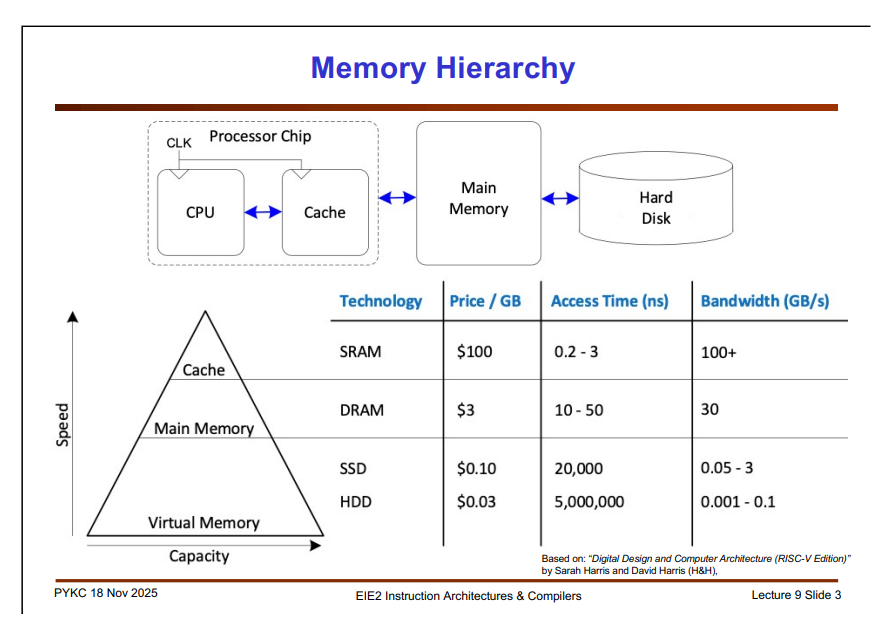

Cold miss eviction:
- `!cache[set].block0.valid && !cache[set].block1.valid` → both blocks are invalid → replace block 0
- `cache[set].block0.valid && !cache[set].block1.valid` → block 1 is invalid → replace block 1
- `!cache[set].block0.valid && cache[set].block1.valid` → block 0 is invalid → replace block 0 (this case will never happen but is added as a safety net)
- `cache[set].block0.valid && cache[set].block1.valid` → both blocks are valid → us LRU logic

For a 2 way associative cache, the LRU replacement policy is fairly straightforward:
- `cache[set].used` = `0` → block 0 was most recently used → replace block 1
- `cache[set].used` = `1` → block 1 was most recently used → replace block 0

Eviction logic:
```SystemVerilog
//way determination
if (!valid0 && !valid1)     way = 1'b0; //both bits are invalid, we choose the default 
else if (!valid0)           way = 1'b0; //way0 is invalid
else if (!valid1)           way = 1'b1; //way1 is invalid
else way = ~cache[set].used; //both bits are valid, we take into account which way was least recently used (LRU logic)
```

Next, the instruction cache waits for the L2 cache to assert ready, signaling that the fetch request has been fulfilled. It then stores the data returned by the L2 cache and sets the block’s valid bit to high.

Load from L2 logic:
```SystemVerilog
// On a miss, disable read and write and stall the rest of the circuit, and let L2 cache retrieve the data before writing it in.
if (!ready) begin
    rd_en      = 1'b0;
    wr_en      = 1'b0;
    stall      = 1'b1;
    l2_fetch   = 1'b1;              
end

// When L2 cache asserts ready: fill the line (as L2 cache has retrieved the data), but don't read from cache this cycle
else begin
    rd_en      = 1'b0;
    wr_en      = 1'b1;
    stall      = 1'b1;
    write_data = line_from_mem;
end
```

---

### 2.3 L1 Data Cache

The data cache is reponsible for storing data so that it can be quickly accessed by the processor (datapath). It also performs write-backs more efficiently, further increasing processor performance.

The specifications for our data cache are as follows:

| Parameter | Selected Value |
| --------- | -------------- |
| Total Cache Size | 4096 kB |
| Number of Sets | 128 |
| Associativity | 2-way |
| Block Size | 4 words |

The data cache performs all the same core functions as the instruction cache—reading, LRU-based eviction, stalling, and loading lines from the L2 cache, while also supporting several additional operations specific to data handling.


#### Additional Load Options
Our data cache supports different load sizes, with the cache being able to load only a single byte, 2 bytes (or half a word), and a full word (4 bytes). Additionally, the data cache supports loading both unsigned and signed integers, implementing sign extension when required. The cache uses the byte offset of the requested address to determine which byte lane to read from.

- `LoadSize` = `2'b00` → only load 1 byte
- `LoadSize` = `2'b01` → load 2 bytes
- `LoadSize` = `2'b10` → load 4 bytes (full word)
- `LoadUnsigned` = `1'b0` → load with sign extension
- `LoadUnsigned` = `1'b1` → load without sign extension

Load type logic:
```SystemVerilog
// lw logic
case (LoadSize)
    // LB / LBU
    2'b00: begin
        bottom_bit = 8 * byte_offset;
        if (LoadUnsigned)
            data_out = {24'b0, data_out[bottom_bit[4:0] +:8]};
        else
            data_out = {{24{data_out[bottom_bit[4:0] + 7]}}, data_out[bottom_bit[4:0] +:8]};
    end

    // LH / LHU
    2'b01: begin
        bottom_bit = 16 * byte_offset;
        if (LoadUnsigned)
            data_out = {16'b0, data_out[bottom_bit[4:0] +:16]};
        else
            data_out = {{16{data_out[bottom_bit[4:0] + 15]}},data_out[bottom_bit[4:0]+:16]};
    end

    // LW
    default: begin
        data_out = data_out;
    end
endcase
```


#### Writeback from Processor

When the processor wants to write data back, it sends a write request to the data cache. This uses the same hit detection logic as used in a read request.

If the write request hits in the cache, the data cache writes the processor’s input data directly into the corresponding cache address.

Write way determination:
```SystemVerilog
//way determination
way = hit1;   // if hit1 = 1 then way = 1 if hit1 = 0 then way = 0 as hit0 = 1

if (MemWrite_m) begin // sb logic, determine size
    wr_en = 1'b1;
    wmask = '1;
    write_data = {4{wd_aligned}};
```
It then sets the block’s dirty bit to high. This bit indicates whether the processor has modified the data in that block.


#### Additional Write Options
Alongside its extended load options, the data cache also supports multiple write sizes. Using the Size_Write_m input, the cache can store 1 byte, 2 bytes (half-word), or a full 4-byte word from the processor. This operation uses a write mask to determine which bytes should be overwritten. The cache uses the byte offset of the requested address to determine which byte lane to write to.

- `SizeWrite_m` = `2'b00` → only store 1 byte → wmask = from bottom_bit to next 8 bits
- `SizeWrite_m` = `2'b01` → store 2 bytes → wmask = from bottom_bit to next 16 bits
- `SizeWrite_m` = `2'b10` → store 4 bytes (full word) → wmask = from bottom_bit to next 32 bits

Store size logic:
```SystemVerilog
if(SizeWrite_m == 2'b00) begin //sb
    bottom_bit = block_offset * 32 + byte_offset * 8;
    wmask[bottom_bit[6:0] +: 8] = '0;
end

else if(SizeWrite_m == 2'b01) begin // sh
    bottom_bit = block_offset * 32 + byte_offset * 8;
    wmask[bottom_bit[6:0] +: 16] = '0;
end

else if(SizeWrite_m == 2'b10) begin // sw
    bottom_bit = block_offset * 32;
    wmask[bottom_bit[6:0] +: 32] = '0;
end

wmask = ~wmask;
```

Furthermore, for store byte and store half word operations, the processor places the byte or half word in wd[7:0] or wd[15:0] respectively, regardless of its true offset. Therefore the cache must use the address’s byte offset to shift the byte or half word into the correct position.

Byte shifting:
```SystemVerilog
logic [DATA_WIDTH-1:0] wd_aligned;
assign wd_aligned = wd << (byte_offset * 8);
```


#### Writeback to L2
Before evicting a block, the data cache must first determine if the data has been changed since it was originally fetched. This allows the processor to write back only to the cache, updating the L2 cache and main memory only when the data is evicted. This avoids unnecessary writes to main memory and improves efficiency. The cache achieves this using the dirty bit described earlier.

- `cache[set].block0.dirty` = `0` → block 0 has not been written to by the processor → no need to write back data from block 0 when evicted
- `cache[set].block0.dirty` = `1` → block 0 has been written to by the processor → need to write back data from block 0 when evicted
- `cache[set].block1.dirty` = `0` → block 1 has not been written to by the processor → no need to write back data from block 1 when evicted
- `cache[set].block1.dirty` = `1` → block 1 has been written to by the processor → need to write back data from block 1 when evicted

If the evicted block’s dirty bit is high, the cache asserts writeback_en, loads the block’s data into write_back, and loads the address corresponding to the block’s first word into write_back_addr. It holds these signals until wb_ready goes high, confirming the L2 cache has received the write-back data, and then resets the block’s dirty bit.

Furthermore, the data cache prevents dirty blocks from being overwritten, ensuring that no data is lost when fetching new data from the L2 cache. If, during an L2 fetch, the destination block is dirty, the data cache delays the write until wb_ready is asserted and dirty bit is cleared, confirming that the dirty data has been preserved and can be safely overwritten.

---

### 2.4 L2 Cache

The L2 cache serves as an intermediate level of memory between the fast L1 caches and the much slower main memory. Its larger size allows it to store more data than the L1 caches, reducing the likelihood of costly misses. By acting as a secondary buffer, it improves overall system performance by balancing access speed with storage capacity.

The specifications for our L2 cache are as follows:

| Parameter | Selected Value |
| --------- | -------------- |
| Total Cache Size | 32 MB |
| Number of Sets | 256 |
| Associativity | 4-way |
| Block Size | 8 words |

The L2 cache supports reading, handling write-backs, and fetching data from main memory.


#### Arbiter Logic

The L2 cache can accept fetch requests from either the instruction cache or the data cache, but not simultaneously, as it has only a single read port. We employ a simple arbiter to manage these requests, prioritising those from the data cache. Since both caches stall the pipeline on a miss until the L2 cache responds to their request, the instruction cache cannot experience starvation. If both L1 caches issue fetch requests to the L2 cache, the instruction cache will spin and continue stalling until the data cache’s request is completed, after which its request is serviced immediately.

For data-cache requests, the L1 write-back enable signal is driven by the data cache’s write_back_en output, ensuring that the L2 cache handles any write-back operations the data cache issues. For instruction-cache requests, however, the write-back enable signal is always set to 0, since instructions are not modified by the processor and the instruction cache will never generate a write-back.

| {fetch_i, fetch_d} | req_i | req_d | addr | l1writeback enable | 
| ------------------ | ----- | ----- | ---- | ------------------ |
| 00 | 0 | 0 | X | X |
| 01 | 0 | 1 | addr_d | write_back_en |
| 10 | 1 | 0 | addr_i | 0 |
| 11 | 0 | 1 | addr_d | write_back_en |

```SystemVerilog
//arbiter logic
if (!fetch_i && !fetch_d) begin
    fetch = 0;
    l1write = 0;
end

else if (fetch_i && !fetch_d) begin
    fetch = 1;
    addr = addr_i;
    l1write = 0;
    req_i = 1;
end

else if (!fetch_i && fetch_d) begin
    fetch = 1;
    addr = addr_d;
    l1write = l1write_back_en;
    req_d = 1;
end

else if (fetch_i && fetch_d) begin
    fetch = 1;
    addr = addr_d;
    l1write = l1write_back_en;
    req_d = 1;
end
```


#### Read Logic

In many respects, the L2 cache’s read logic mirrors that of the L1 caches. The primary differences are that hit detection must check four ways rather than two, and the cache returns four words at once instead of one. This leverages spatial locality by anticipating that neighboring words will likely be accessed soon, thereby reducing the miss rate.

Hit detection:
```SystemVerilog
assign tag_bits_rd = addr[ADDRESS_WIDTH-1:13];
assign set_rd = addr[12:5];
assign block_offset_rd = addr[4:2];
```
```SystemVerilog
hit0_wb = (cache[set_wb].block0.tag == tag_bits_wb && cache[set_wb].block0.valid);
hit1_wb = (cache[set_wb].block1.tag == tag_bits_wb && cache[set_wb].block1.valid);
hit2_wb = (cache[set_wb].block2.tag == tag_bits_wb && cache[set_wb].block2.valid);
hit3_wb = (cache[set_wb].block3.tag == tag_bits_wb && cache[set_wb].block3.valid);
miss_wb = ~(hit0_wb | hit1_wb | hit2_wb | hit3_wb);
```

The read logic also updates the used bits for our LRU mechanism, which will be discussed in more detail later.

Read logic for block 0:
```SystemVerilog   
if (way == 2'b00) begin
    case(block_offset_rd[2])
    1'b0: data_out <= cache[set].block0[127:0];
    1'b1: data_out <= cache[set].block0[255:128];
    endcase
    cache[set].u01 <= 1;
    cache[set].u02 <= 1;
    cache[set].u03 <= 1;
end
```

Upon finishing a read, the L2 cache signals to the requesting cache — data or instruction — that its fetch has been completed by asserting either ready_i (to wake the i cache) or ready_d (to wake the d cache). If the data cache is the recipient, it must additionally confirm that the target block is clean before storing the incoming data, forming a handshake with the L2 cache.

Ready assertion:
```SystemVerilog
//assert ready on the correct L1 cache
if (req_d) begin
    ready_d <= 1;
end

else if (req_i) begin
    ready_i <= 1;
end
```

However, as with the L1 caches, an L2 miss requires issuing a fetch request to main memory and storing the returned data before forwarding it to the requesting L1 cache.


#### Load from Main Memory

As with the L1 caches, our L2 cache uses a default block replacement order of 0–3 on cold misses, and applies LRU logic to choose a block for eviction on capacity misses when storing data fetched from main memory. However, because the L2 cache is 4-way associative, the LRU replacement logic is slightly more complex.

To implement this logic, our initial approach was to use a matrix:

| i \ j |   0   |   1   |   2   |   3   |
|-------|-------|-------|-------|-------|
| **0** |   -   | u01   | u02   | u03   |
| **1** | u10   |   -   | u12   | u13   |
| **2** | u20   | u21   |   -   | u23   |
| **3** | u30   | u31   | u32   |   -   |

where u01 means that 0 was used more recently than 1.

Conceptually, determining the least recently used way can be expressed using pseudocode similar to the following:
```
victim = 0;
for each way k in {0,1,2,3}:
    if M[k][0] == 0 and M[k][1] == 0 and M[k][2] == 0 and M[k][3] == 0 (ignoring M[k][k]):
        victim = k;
        break;
```

However, because the upper triangle contains all the necessary information and the lower triangle can be inferred from it, we chose to implement only the upper half of the matrix.

Furthermore, given that our cache is only 4-way associative, we opted to brute force the solution instead of restructuring the approach above to rely exclusively on the upper triangle of the matrix.This led to the eviction victim block selection logic shown below:

Eviction logic:  
```SystemVerilog
if (!valid0)      way_rd = 2'b00;
else if (!valid1) way_rd = 2'b01;
else if (!valid2) way_rd = 2'b10;          
else if (!valid3) way_rd = 2'b11;
else begin
    evict = 1;

    if (cache[set_rd].u01) begin
        if (cache[set_rd].u12) begin
            if (cache[set_rd].u23) begin
                way_rd = 2'b11;
            end
            else way_rd = 2'b10;
        end
        else if (cache[set_rd].u13) begin
            way_rd = 2'b11;
        end
        else way_rd = 2'b01;
    end

    else if (cache[set_rd].u02) begin
        if (cache[set_rd].u23) begin
            way_rd = 2'b11;
        end
        else way_rd = 2'b10;
    end

    else if (cache[set_rd].u03) begin
        way_rd = 2'b11;
    end

    else way_rd = 2'b00;
end
```

The L2 cache also includes a dirty bit, which indicates whether an evicted block should be stored into the L2 writeback buffer. Once the writeback completes, the L2 cache clears the block’s dirty bit. It then spins until the block is clean and main memory asserts ready, after which it enables the write path and loads the data from main memory.

Write enable logic for block0:
```SystemVerilog
if (way_rd == 2'b00) begin
    if (cache[set_rd].block0.dirty && (l2write_buffer == 0)) begin 
        l2write_back_data_buffer_next = cache[set_rd].block0[255:0];
        l2write_back_addr_buffer_next = {{cache[set_rd].block0.tag}, {set_rd}, {5'b0}};
        clean = 1;
        l2write_buffer_next = 2'b10;
    end

    else if (!cache[set_rd].block0.dirty && ready) begin
        wr_en = 1;
        write_data = line_from_mem;
        wmask = '1;
        way = way_rd;
        tag_bits = tag_bits_rd;
        set = set_rd;
        block_offset = block_offset_rd;
    end
end
```


#### L1 Writeback

As discussed earlier, the L2 cache includes a write-back buffer to handle write-back requests from the L1 data cache. This buffer uses next-state logic to store and output the required information.

l1write_buffer logic:
```SystemVerilog
logic [DATA_WIDTH*4-1:0] l1write_back_data_buffer;
logic [DATA_WIDTH*4-1:0] l1write_back_data_buffer_next;
logic l1write_buffer;
logic l1write_buffer_next;
logic [ADDRESS_WIDTH-1:0] l1write_back_addr_buffer;
logic [ADDRESS_WIDTH-1:0] l1write_back_addr_buffer_next;
```

Upon receiving a write-back request from the data cache, if the L1 write-back buffer is empty, the L2 cache loads the buffer with the provided data and address, asserts l1write_buffer to indicate that the buffer is full, and raises wb_ready_d to confirm to the data cache that the write-back data has been successfully captured.


| l1write_buffer | l1write | action |
| --- | --- | --- |
| 0 | 0 | do nothing as no writeback request has been issued |
| 0 | 1 | fill in the buffer as a writeback request has been issued, and the buffer is empty |
| 1 | 0 | do nothing as no writeback request has been issued |
| 1 | 1 | do not fill as the buffer is already full |


l1write_buffer fill logic:
```SystemVerilog
if (l1write && !l1write_buffer) begin
    wb_ready_d_next = 1;

    l1write_buffer_next = l1write;
    l1write_back_data_buffer_next = l1write_back_data;
    l1write_back_addr_buffer_next = l1write_back_addr;
end
```


The L1 write buffer also performs its own hit/miss check using the address stored in the buffer.

If the L1 writeback buffer detects a hit, it writes the data to the matching address. However, because the cache has only one internal way selection unit and a single write path, it cannot perform write-back buffer operations concurrently with L1 reads or main memory loads. We have decided to give these operations priority, so the buffer must wait until the cache is idle before issuing a write. When issuing a write from the L1 writeback buffer, we also assert wr_wb to indicate that the write originates from the L1 cache. This ensures that the target block is correctly marked as dirty.


l1write_buffer hit logic:
```SystemVerilog
if (l1write_buffer && !rd_en && !wr_en && !miss_wb) begin
    wr_en = 1;
    wr_wb = 1;
    write_data = {2{l1write_back_data_buffer}};
    l1write_buffer_next = l1write_buffer - 1;

    if (hit0_wb) way = 2'b00;
    else if (hit1_wb) way = 2'b01;
    else if (hit2_wb) way = 2'b10;
    else if (hit3_wb) way = 2'b11;

    tag_bits = tag_bits_wb;
    set = set_wb;
    block_offset = block_offset_wb;

    if (block_offset_wb == 3'b000) begin
        wmask = {{128{1'b0}}, {128{1'b1}}};
    end
    else if (block_offset_wb == 3'b100) begin
        wmask = {{128{1'b1}}, {128{1'b0}}};
    end
end
```

However, L1 writeback buffer misses need to be handled differently.


#### Writeback to Main Memory

The L2 cache includes a 4 word writeback data port to main memory. This port handles both L1 writeback misses, which are forwarded directly through the L2 and dirty lines evicted from the L2 cache itself. Since L2 writebacks consist of 8 words instead of 4, they must be issued as two separate 4-word writes to main memory. The l2write_buffer[1:0] signal indicates the number of 4-word segments that are still pending.

We prioritize the L1 writeback buffer over the L2 buffer because it is smaller and easier to drain, and because L1 misses occur far more frequently than combined L1+L2 misses. Giving it priority reduces the likelihood of stalling the processor.

When main memory asserts wb_ready for the L2 cache, indicating it can accept another writeback, the L2 cache asserts write_back_en, outputs the appropriate writeback address and data, and then decrements the number of remaining words in its writeback buffer by one.


| l2write_buffer | l1write_buffer | wb_ready | write_back_data | write_back_addr | write_back_en |
| --- | --- | --- | --- | --- | --- |
| 00 | 0 | 0 | X | X | 0 |
| 00 | 0 | 1 | X | X | 0 |
| 00 | 1 | 0 | X | X | 0 |
| 00 | 1 | 1 | l1_write_buffer_data | l1_write_buffer_addr | 1 |
| 01 | 0 | 0 | X | X | 0 |
| 01 | 0 | 1 | l2_write_buffer_data[127:0] (bottom 4 words) | l2_write_buffer_addr | 1 |
| 01 | 1 | 0 | X | X | 0 |
| 01 | 1 | 1 | l1_write_buffer_data | l1_write_buffer_addr | 1 |
| 10 | 0 | 0 | X | X | 0 |
| 10 | 0 | 1 | l2_write_buffer_data[255:128] (top 4 words) | address of the bottom byte of the top 4 words | 1 |
| 10 | 1 | 0 | X | X | 0 |
| 10 | 1 | 1 | l1_write_buffer_data | l1_write_buffer_addr | 1 |


L2 writeback logic:
```SystemVerilog
if ((l1write_buffer && miss_wb) && wb_ready) begin
    write_back_en_next = 1;
    write_back_data_next = l1write_back_data_buffer;
    write_back_addr = l1write_back_addr_buffer;
    l1write_buffer_next = l1write_buffer - 1;
end

else if ((l2write_buffer == 2'b10) && wb_ready) begin
    write_back_en_next = 1;
    write_back_data_next = l2write_back_data_buffer[127:0];
    write_back_addr = l2write_back_addr_buffer;
    l2write_buffer_next = l2write_buffer - 1;
end

else if ((l2write_buffer == 2'b01) && wb_ready) begin
    write_back_en_next = 1;
    write_back_data_next = l2write_back_data_buffer[255:128];
    write_back_addr = {l2write_back_addr_buffer[31:5], 1'b1, l2write_back_addr_buffer[3:0]};
    l2write_buffer_next = l2write_buffer - 1;
end
```

There is also a critical edge case that must be addressed to ensure data integrity. When the writeback buffer is full and its stored address matches the address returned by main memory during a load, the returning data is obsolete and risks being written into the cache, despite the cache still registering a miss. Because the write operation and the deassertion of l1write_buffer occur synchronously, the L2 cache could, in the same cycle, write stale memory data into the cache while simultaneously forwarding the newer data to main memory. This would propagate incorrect values to the L1 caches and eventually to the processor. To mitigate this, we implemented a specific ad-hoc fix for this situation.


Specific patch for edge case:
```SystemVerilog
if (wr_en && l1write_buffer && (addr[31:4] == l1write_back_addr_buffer[31:4])) begin
    wr_wb = 1;
    l1write_buffer_next = l1write_buffer - 1;
    if (block_offset_wb == 3'b000) begin
        write_data[127:0] = l1write_back_data_buffer;
    end
    else if (block_offset_wb == 3'b100) begin
        write_data[255:128] = l1write_back_data_buffer;
    end
end
```

---

## 3. Schematic

---

## 4. Testing & Verification

### 4.1 L1 Instruction Cache Testing

We created a c++ testbench (l1i_cache_tb.cpp) that isolates the instruction cache module and verifies all of the intended logic, including loading to the processor and storing from the L2 cache. All tests were combined into a single test case to eliminate the need to reinitialise the cache with appropriate values, particularly those required to avoid cold misses before each individual test.
**Tests performed:**
- **Stall Assertion on Cold Miss:** Cache should assert stall when valid = 0
- **Stall Assertion on Capacity Miss:** Cache should assert stall when set capacity is full
- **Load logic:** Loading a whole word from the instruction cache
- **Store logic:** Storing a whole block from the L2 cache into the data cache
- **Correct LRU Replacement Policy:** Ensuring that the instruction cache picks the correct victim based on our LRU replacement policy

#### Running the code

1. Navigate to the testbench ( `tb` ) folder:
   ```bash
   cd repo/tb
   ```

2. Run the test:
   ```bash
   ./doit.sh tests/l1i_cache_tb.cpp
   ```

Here are the results:

---

### 4.2 L1 Data Cache Testing
We also created a c++ testbench (l1d_cache_tb.cpp) to isolate the data cache module and verify all of the intended logic, including loading to the processor, writebacks from the processor, writebacks to the L2 cache and storing from the L2 cache. Given the increased length and complexity of the code, we chose not to place all tests in a single test case, even though this required reinitializing all values for each individual test.
**Tests performed:**
- **Stall Assertion on Cold Miss:** Cache should assert stall when valid = 0
- **Stall Assertion on Capacity Miss:** Cache should assert stall when set capacity is full
- **Load full word logic:** Loading a whole word from the data cache
- **Load half word logic:** Loading half a word from the data cache
- **Load byte logic:** Loading a single byte from the data cache
- **Load signed/unsigned logic:** Loading a signed/unsigned integer from the data cache
- **Store logic:** Storing a whole block from the L2 cache into the data cache
- **Store half word logic:** Storing a whole block from the L2 cache
- **Correct LRU Replacement Policy:** Ensuring that the instruction cache picks the correct victim based on our LRU replacement policy
- **Write full word** Writing a full word from the processor
- **Write half word** Writing a half word from the processor
- **Write byte** Writing a single byte from the processor

#### Running the code

1. Navigate to the testbench ( `tb` ) folder:
   ```bash
   cd repo/tb
   ```

2. Run the test:
   ```bash
   ./doit.sh tests/l1d_cache_tb.cpp
   ```

Here are the results:


---

### 4.3 L2 Cache Testing
We also created a c++ testbench (l2_cache_tb.cpp) to isolate the data cache module and verify all of the intended logic, including loading to the l1d and i cache, writebacks from the data cache, writebacks to main memory and storing from main memory. This time, since the code was slightly more long and complicated, we decided to not include everything in the same test case despite having to reinitialise all of the values for each case.
**Tests performed:**
- **Fetch request from data cache:** Ensuring that the L2 cache successfully fulfills fetch requests from the data cache
- **Fetch request from instruction cache:** Ensuring that the L2 cache successfully fulfills fetch requests from the instruction cache
- **Fetch request from both data and instruction cache:** Ensuring that the L2 cache gives priority to the data cache fetch request, but ultimately fulfills both requests
- **Correct LRU Replacement Policy:** Ensuring that the instruction cache picks the correct victim based on our LRU replacement policy
- **L1 writeback** Ensuring that a writeback from L1 is written into L2 on a hit, or passed onto main memory on a miss
- **L2 writeback** Ensuring that dirty L2 writebacks are successful (2 4 word writebacks as described earlier)

#### Running the code

1. Navigate to the testbench ( `tb` ) folder:
   ```bash
   cd repo/tb
   ```

2. Run the test:
   ```bash
   ./doit.sh tests/l2_cache_tb.cpp
   ```
Here are the results:

---

# M-type Instructions

This document describes how the RV32M integer multiply/divide extension was integrated into our RV32I core. It focuses only on the added functionality and the changes made to the ALU and control modules. Everything else in the CPU (pipeline, hazard unit, register file, memories, etc.) is unchanged.

---

## 1. Scope

We implemented the full RV32M base extension (eight instructions):

- **MUL** — low 32 bits of signed×signed product
- **MULH** — high 32 bits of signed×signed product
- **MULHSU** — high 32 bits of signed×unsigned product
- **MULHU** — high 32 bits of unsigned×unsigned product
- **DIV** — signed quotient with RISC‑V special cases:
  - divisor == 0 → `q = -1` (`0xFFFFFFFF`)
  - overflow `-2^31 / -1` → `q = -2^31` (`0x80000000`)
- **DIVU** — unsigned quotient:
  - divisor == 0 → `q = 0xFFFFFFFF`
- **REM** — signed remainder:
  - divisor == 0 → `r = rs1`
  - overflow case `-2^31 / -1` → `r = 0`
  - remainder has sign of dividend
- **REMU** — unsigned remainder:
  - divisor == 0 → `r = rs1`

Encoding: standard R-type (`opcode = OP (0110011)`), `funct7 = 7'b0000001` indicates M-extension, `funct3` selects the specific M op.

From the perspective of the internal logic of the CPU, M instructions behave like ordinary R-type ALU ops:
- Read `rs1` and `rs2` from the register file
- Produce a 32-bit result and write to `rd` in WB
- `RegWrite = 1`, `ALUSrc = 0`, `ResultSrc = ALU`
- Forwarding and hazard logic is identical to other R-type ops.

---

## 2. ALU changes

### 2.1 ALUCtrl widened
- `ALUCtrl` was widened from 4 bits to **5 bits** to accomodate for the 8 new M instructions.
- Here are the encodings in the new mapping:

  - `5'b01100` — MUL  (low 32 bits)
  - `5'b01101` — MULH (high 32 bits signed×signed)
  - `5'b01110` — MULHU(high 32 bits unsigned×unsigned)
  - `5'b01111` — MULHSU(high 32 bits signed×unsigned)
  - `5'b10000` — DIV  (signed)
  - `5'b10001` — DIVU (unsigned)
  - `5'b10010` — REM  (signed remainder)
  - `5'b10011` — REMU (unsigned remainder)

All previous RV32I ALU codes remain unchanged in the lower range. The new encodings were chosen to be contiguous, incrementing ALUCtrl for every new encoding.

### 2.2 Multiplication implementation

The RV32M multiplication instructions (`MUL`, `MULH`, `MULHSU`, `MULHU`) are all implemented inside the main ALU as purely combinational operations that produce a full 64-bit product and then select either the low or high 32 bits, with the correct signed/unsigned interpretation of the operands.

Approaches that would be possible to implement with fewer lines of code do exist, but the objective with the implementation here was to make the code more efficient for synthesis (even though we did not intend to include M instructions in the design that we put on our FPGA). In the code shown below, based on the ALUCtrl signal, which uniuely identifies the type of ALU instruction being executed, we select whether we want the signed or unsigned representation of each operand:

```Systemverilog
logic [63:0] ALUop1_ext;
logic [63:0] ALUop2_ext;
logic [63:0] product;

always_comb begin
    // default: something sensible
    ALUop1_ext = $unsigned(ALUop1);
    ALUop2_ext = $unsigned(ALUop2);

    unique case (ALUCtrl)
        5'b1100: begin // MUL: unsigned×unsigned low word
            ALUop1_ext = $unsigned(ALUop1);
			ALUop2_ext = $unsigned(ALUop2);
        end
        5'b1101: begin // MULH: signed×signed high word
            ALUop1_ext = $signed(ALUop1);
        ALUop2_ext = $signed(ALUop2);
        end
        5'b1110: begin // MULHSU: signed×unsigned high word
            ALUop1_ext = $signed(ALUop1);
			ALUop2_ext = $unsigned(ALUop2);
        end
        5'b1111: begin // MULHU: unsigned×unsigned high word
            ALUop1_ext = $unsigned(ALUop1);
			ALUop2_ext = $unsigned(ALUop2);
        end
        default: begin
            // non-M ops: a_sel/b_sel values don't matter
        end
    endcase
end

assign product = ALUop1_ext * ALUop2_ext;
```
The reason why we extend each operand to 64 bits even before the multiplication is that, in SystemVerilog, the width of a * b is the max of the operand widths. If the current 32-bit format of ALUop1 and ALUop2 were used, the raw product would also 32 bits. That 32-bit product would then extended to 64 bits when assigned to signed_unsigned_mult, but the upper 32 bits of the result of the multiplication would already have been lost. Therefore, we simply increase the number of bits of our operands to 64 and use ```Systemverilog $signed ``` and ```Systemverilog $unsigned ```, which already take care of the sign extension.

The only task that now remains is to select the upper or lower 32-bits of the product, which is then as such:
```Systemverilog
case (ALUCtrl)
...
5'b1100: ALUout = product[31:0]; //MUL
        5'b1101: ALUout = product[63:32]; //MULH
        5'b1110: ALUout = product[63:32]; //MULHSU
        5'b1111: ALUout = product[63:32]; //MULHU
...
default: ALUout = 32'b0;
endcase
```
### 2.3. Division and remainder with edge cases
The four division/remainder operations share the existing 32-bit ALUout result and are coded as:
•	DIV (ALUCtrl = 5'b10000)
•	DIVU (ALUCtrl = 5'b10001)
•	REM (ALUCtrl = 5'b10010)
•	REMU (ALUCtrl = 5'b10011)

```Systemverilog
        5'b10000: begin //DIV
            if (ALUop2 == 0) begin
                ALUout = -1;
            end
            else if (ALUop1 == 32'h80000000 && ALUop2 == 32'hFFFFFFFF) begin
                ALUout = 32'h80000000;
            end
            else begin
                ALUout = $signed(ALUop1)/$signed(ALUop2);
            end
        end
        5'b10001: begin //DIVU
            if (ALUop2 == 0) begin
                ALUout = -1;
            end
            else begin
                ALUout = $unsigned(ALUop1)/$unsigned(ALUop2);
            end
        end
        5'b10010: begin //REM
            if (ALUop2 == 0) begin
                ALUout = ALUop1;
            end
            else if (ALUop1 == 32'h80000000 && ALUop2 == 32'hFFFFFFFF) begin
                ALUout = 32'h00000000;
            end
            else begin
                ALUout = $signed(ALUop1) % $signed(ALUop2);
            end
        end
        5'b10011: begin //REMU
            if (ALUop2 == 0) begin
                ALUout = ALUop1;
            end
            else begin
                ALUout = $unsigned(ALUop1) % $unsigned(ALUop2);
            end
        end
```
		
They follow the RISC-V spec’s special cases:
1.	Division by zero
DIV / DIVU: result is −1 (all ones), i.e. 0xFFFFFFFF.
REM / REMU: result is the original dividend (rs1).
2.	Signed overflow (−2³¹ / −1):
o	For DIV, when ALUop1 == 0x80000000 and ALUop2 == 0xFFFFFFFF:
The result saturates to 0x80000000 (unchanged dividend).
o	For REM in this special case, the remainder is 0.
Implementation-wise, for DIV:
5'b10000: begin // DIV
    if (ALUop2 == 0) begin
        ALUout = -1;
    end
    else if (ALUop1 == 32'h80000000 && ALUop2 == 32'hFFFFFFFF) begin
        ALUout = 32'h80000000;
    end
    else begin
        ALUout = $signed(ALUop1) / $signed(ALUop2);
    end
end
and similar for DIVU, REM, and REMU using $unsigned or $signed as appropriate.
Again, this is a purely combinational, single-cycle implementation. In a real design you would normally use a multi-cycle divider for timing reasons, but for this coursework the emphasis is correctness and simplicity.


## 3. Control‑Path Changes for M Instructions

To support RV32M, the control unit (`control.sv`) was extended in two ways:

1. ALUCtrl width increased from 4 bits to 5 bits.  
2. Additional decoding for `opcode == OPC_OP` and `funct7 == 7'b0000001`.

#### 3.1 Wider ALUCtrl output

The module header was updated to:

```systemverilog
output logic [4:0] ALUCtrl;
```

All existing RV32I cases were adjusted to drive 5‑bit codes (e.g. `5'b00000` for ADD, `5'b00001` for SUB, etc.). No other control outputs required structural changes — M ops are treated as ordinary R‑type ALU instructions from the pipeline perspective.

#### 3.2 Decoding M operations under OPC_OP

M ops share the R‑type opcode `7'b0110011`. The control logic detects M‑extension via:

- `funct7 == 7'b0000001` → M‑extension present  
- `funct3` selects the specific M operation

Simplified decode sketch:

```systemverilog
OPC_OP: begin
    // funct3 == 3'b000 : ADD / SUB / MUL
    if (funct3 == 3'b000) begin
        if (funct7 == 7'b0000001) begin
            // MUL
            RegWrite = 1;
            ALUCtrl  = 5'b01100;
        end else begin
            // ADD / SUB normal decoding...
        end
    end

    // funct3 == 3'b100 : XOR / DIV
    else if (funct3 == 3'b100) begin
        if (funct7 == 7'b0000001) begin
            // DIV
            RegWrite = 1;
            ALUCtrl  = 5'b10000;
        end else begin
            // XOR normal decoding...
        end
    end

    // ...similar branches for MULH, MULHSU, MULHU, DIVU, REM, REMU
end
```

For every M case, control signals (other than `ALUCtrl`) are set to match a normal R‑type ALU op:

- `RegWrite = 1` — write result to `rd`  
- `ALUSrc = 0` — both operands from registers (`rs1`, `rs2`)  
- `ResultSrc = 2'b00` — select ALU result for WB  
- `MemWrite = 0` — no data-memory access  
- `Jump = 0`, `Branch = 0` — no control transfer  
- `ALUsrc2 = 0` — first ALU operand is `rs1` (not `pc_save`)

No special handling is required elsewhere (hazard unit, register file, pipeline control).

---

### 4. Interaction with the Existing Pipeline and Hazards

- M instructions are ordinary R‑type ALU instructions with a more complex datapath.  
- They pass through IF/ID → ID/EX → EX/MEM → MEM/WB exactly like ADD/SUB.  
- Forwarding and stall logic remain unchanged:
  - Hazard unit inspects register numbers and `RegWrite` / `ResultSrc` only.
  - It does not need to know whether EX does ADD or MUL.  
- Write‑back still selects ALU result / memory data / PC+4 based on `ResultSrc`; M instructions use ALU result.

Timing caveat: combinational multiplier/divider are likely the `EX` critical path. Typical mitigation for this are:

- Multi‑cycle or pipelined multiply/divide unit  
- Run core at lower clock frequency  
- Use a long‑latency functional unit with reservation stations

For this coursework, some modifications were indeed made to accomodate synthesis, but the design remains single‑cycle for the execution of M instructions. As such, M instructions were still omitted from the FPGA‑synthesized configuration.

---

### 5. Summary

Adding RV32M required three main changes:

1. Extend ALU control space to 5 bits (`ALUCtrl`) and add unique encodings for the eight M ops.  
2. Add multiplier/divider datapaths in the ALU:
   - 64‑bit products for each signedness combination, sliced per MUL* semantics.
   - Signed/unsigned division and remainder with RISC‑V corner cases (divide‑by‑zero, `-2^31 / -1`).
3. Extend control decode for `opcode == OPC_OP` and `funct7 == 7'b0000001`, mapping `(funct3, funct7)` → `ALUCtrl` while leaving all R‑type control signals unchanged.

Everything else in the CPU (pipeline registers, hazard unit, branch logic, memories) is unchanged — they see M instructions as standard R‑type ALU ops that take longer to compute.


## 5. ALU test cases (selected) — exact format

### 5.1.11 ALU Test: DIVU (Unsigned Division by Zero)

Purpose  
Checks divide-by-zero behaviour for unsigned division.

Test Case (ALUTest13)
```
ALUCtrl = DIVU (5'b10001)

ALUop1 = 0x00000010

ALUop2 = 0x00000000

Expected ALUout = 0xFFFFFFFF
```
What It Tests

- Unsigned divide-by-zero semantics (quotient = all 1s)  
- Distinction between signed and unsigned division rules

---

### 5.1.12 ALU Test: REM (Remainder with Divisor Zero)

Purpose  
Verifies that for signed remainder the dividend is returned when the divisor is zero.

Test Case (ALUTest14)
```
ALUCtrl = REM

ALUop1 = 0x00000010 (16)

ALUop2 = 0x00000000 (0)

Expected ALUout = 0x00000010
```
What It Tests

- RISC-V rule: when divisor is zero, remainder = dividend (signed)  
- Difference between quotient and remainder behaviour in corner cases

---

### 5.1.13 ALU Test: REMU (Unsigned Remainder with Divisor Zero)

Purpose  
Confirms that in the unsigned case, the remainder also returns the dividend on divide-by-zero.

Test Case (ALUTest15)
```
ALUCtrl = REMU

ALUop1 = 0x00000010

ALUop2 = 0x00000000

Expected ALUout = 0x00000010
```
What It Tests

- Unsigned remainder semantics on divide-by-zero  
- Consistency with the signed REM rule for this case

---

### 6 Trade-offs & notes
- Simplicity vs. timing: combinational implementation is easy to verify but slow. Alternatives for synthesis: multi-cycle or pipelined multiply/divide units, or a long‑latency functional unit.
- Only two modules changed: `alu.sv` (wider `ALUCtrl`, M logic) and `control.sv` (wider `ALUCtrl` output, M decoding). No structural changes to pipeline or hazards.

Summary
- RV32M support implemented in ALU + control with unique 5‑bit `ALUCtrl` encodings for all eight M instructions.
- Behaviour matches the RISC‑V spec, including all specified corner cases.
- M instructions forward and write back like other R-type ALU operations; integration is modular and local to ALU/control.

---

# Zicsr and Zba Extensions

## Table of Contents
- [1. Overview](#1-overview)
- [2. Implementation](#2-implementation)
    - [2.1 Zicsr](#21-zicsr)
        - [2.1.1 Control Status Register](#control-status-register)
        - [2.1.2 Decoder](#decoder)
        - [2.1.3 Immediate MUX](#immediate-mux)
        - [2.1.4 Sign Extension](#sign-extension)
        - [2.1.5 Hazard Unit](#hazard-unit)
    - [2.2 Zba](#22-zba)
        - [2.2.1 Decoder](#decoder-1)
        - [2.2.2 ALU](#alu)
    - [2.3 Top-Level Integration](#23-top-level-integration)
- [3. Schematic](#3-schematic)
- [4. Testing and Verification](#4-testing-and-verification)
    - [4.1 Zicsr Testbench](#zicsr-testbench)
    - [4.2 Zba Testbench](#zba-testbench)

---

## 1. Overview

We decided to implement 2 new extensions, the Zicsr extension, which entailed adding a Control Shift Register module and 6 new instructions, as well as the Zba extension, which introduced 3 new instructions used for Bit-Manipulation.

The control shift register is a register of a fixed size, much larger than the register we use in the reg file module, and has special registers with each register having a special name, purpose and way of handling, unlike the general-purpose registers we use in regfile. The registers are used for a variety of purposes, such as handling interrupts (as discussed in the Interrupts and FPGA branch), managing privilege levels, measuring time/performance, and identifying hardware, among others. 

The Zicsr instructions are implemented with the CSR to read from it and write to it. All Zicsr instructions are atomic read-modify-write instructions, as in they read the old value of the control status register into rd and modify rd all in 1 instruction. In contrast, if we wanted to do this with our normal registers, it would require 2 instructions, one to copy and one to write. There are 6 Zicsr instructions csrrw, csrrs, csrrc, csrrwi, csrrsi and csrrci, with the latter 3 being immediate (instead of register) versions of the first 3. Each instruction has a CSR register (that will be both the source and the destination), a destination register that will get the old value of that CSR, and either a source register or a 5-bit unsigned immediate that will be used for determining the new value of that CSR, as shown below:


The Zba instructions are also atomic in the sense that they reduce shifting and adding into 1 instruction. They are called sh1add, sh2add and sh3add, which are shortened versions of shift and add. They operate on the normal registers and not on the CSR registers, and are just a simple way to make programs more efficient.


## 2. Implementation

### 2.1 Zicsr

#### Control Status Register

We define a module called CSR, which will go in the execution stage of the pipeline. 


##### Parameters

```systemverilog
parameter ADDRESS_WIDTH = 12,
parameter DATA_WIDTH = 32,
parameter CSR_WIDTH = 4096
```

- **`REGFILE_WIDTH = 4096`**: Standard number of Control Status Registers in an ideal RV32I implementation
- **`ADDRESS_WIDTH = 12`**: 2^12 = 4096 hence there are 12 address bits.


##### Initialisation

```systemverilog
  logic[DATA_WIDTH-1:0] temp;
  logic[DATA_WIDTH-1:0] csr_array [CSR_WIDTH-1:0];
  assign dout = csr_array[addr];
```
- **`temp`**: A variable to temporarily hold the new value of the CSR, as we have a synchronous write
- **`dout = csr_array[addr]`**: We first assign the initial value of the CSR to be stored into the destination register.


##### Zicsr Logic

```systemverilog
always_comb begin
        temp = dout;
        case(CSR_OP)
            2'b01: temp =  wd; // CSRRW(I)
            2'b10: temp = temp | wd;   // CSRRS(I)  
            2'b11: temp = temp & (~wd); // CSRRC(I)
            default: temp = dout;
        endcase
    end
```
- **`wd`** can either be RS1 or a 5-bit unsigned intermediate, depending on whether the instruction has I at the end or not.
- **`CSR_OP`**: A 2-bit logic that comes from the decoder that simply tells us what type of CSR instruction is going on
- **`2'b01: temp =  wd`**: CSRRW stands for **Control Status Register Read and Write**, and you simply **read** the value into rd and **write** the value of either the imm or RS1 into the CSR.
- **`2'b10: temp = temp | wd`**: **CSRRS stands for Control Status Register Read and Set**, and you do the same **read** as before but for writing, you go through all the bits in wd and if they are high than the corresponding bit in temp will also be **set** (the rest of the bits are untouched), this can be simplified into an OR operation.
- **`2'b11: temp = temp & (~wd)`**: CSRRC stands for **Control Status Register Read and Clear**, and you do the same **read** as always, but now you go through the bits of wd and if a bit is high, then you **clear** the corresponding bit in the CSR this is the same as an & operation but with **`wd`** inverted.


#### Decoder

We had to update the control module to be able to handle CSR instructions.

```systemverilog
 OPC_CSR: begin
                csr_type = funct3[1:0];
                ALUSrc3 = funct3[2];

                if(funct3 == 3'b001) RegWrite = 1'b1; // CSSRW
                if(funct3 == 3'b010) RegWrite = 1'b1; // CSSRS
                if(funct3 == 3'b011) RegWrite = 1'b1; // CSSRC
                
                if(funct3 == 3'b101) begin // CSSRWI
                    RegWrite = 1'b1;
                    ImmSrc = 3'b101; // for CSR--I instructions
                end
                
                if(funct3 == 3'b110) begin // CSSRSI
                    RegWrite = 1'b1;
                    ImmSrc = 3'b101;
                end 
                
                if(funct3 == 3'b111) begin // CSSRCI
                    RegWrite = 1'b1;
                    ImmSrc = 3'b101; 
                end
            end
```

- We started by defining the OP Code for CSR instructions as **`OPC_CSR = 7'b1110011;`** at the top of the control module.
- As shown in the diagram below, the bottom 2 bits of funct3 in CSR instructions can be used to distinguish the type of CSR instruction, and the top bit can be used to determine if it uses an immediate or RS1, which is controlled by **`ALUSrc3`**
- For the non-immediate instructions, we can simply just do **`RegWrite = 1'b1`** as we only need to write into the destination register
- We control the sign extension done on the 5-bit immediate by **`ImmSrc`** for the I-type CSR instructions, with them reserving the code **`3'b101`**.

    | funct3 | Instruction |
    |--------|-------------|
    | **001** | CSRRW |
    | **010** | CSRRS |
    | **011** | CSRRC |
    | **101** | CSRRWI |
    | **110** | CSRRSI |
    | **111** | CSRRCI |

#### Immediate MUX

We place a MUX before the CSR module to determine the value of **`wd`**.

| ALUSrc3 | Output | Instructions |
|---------|--------|--------------|
| 0 | RS1 | CSRRW/CSRRS/CSRRC |
| 1 | 0-Extended 5-bit Imm | CSRRWI/CSRRSI/CSRRCI |


#### Sign Extension

We also added this case in the Sign Extension module to deal with the 5-bit unsigned immediate.

```systemverilog
    else if(ImmSrc == 3'b101) begin
        immext = {27'b0, instr[19:15]};
    end
```

#### Hazard Unit

We need to add brand new Hazard logic for this new CSR module. Now, since we are atomically reading and writing, the simplest way of dealing with forwarding is to implement stalls if there are any data dependencies. 

```systemverilog
assign csrStall = (|csr_typeD) && ( // check if the current instruction is csr type
                    ( (|csr_typeE) && (csr_addrE == csr_addrD)) || // check if the one before was csr and had data dependancies
                        ( (|csr_typeM) && (csr_addrM == csr_addrD)) ||  // check if the one in memory stage was csr and had data dependancies
                            ( (|csr_typeW) && (csr_addrW == csr_addrD)) // check the one in writeback
                    );
```

And then we can keep our current stall logic and just OR **`wStall`** with **`csrStall`**.

### 2.2 Zba

#### Decoder:


```systemverilog
else if (funct7 == 7'b0010000) begin // sh1add
                        RegWrite = 1;
                        ALUCtrl = 5'b10100;
                    end         
```

For Zba instructions, all we had to do was set RegWrite and assign new ALUCtrl signals for each instruction.

| funct7 | funct3 | Instruction |
| :--- | :--- | :--- |
| 0010000 | 010 | sh1add |
| 0010000 | 100 | sh2add |
| 0010000 | 110 | sh3add |

#### ALU:

These were the only changes we had to make for the Zba instructions in the ALU, with **`<<`** meaning shift left.

```systemverilog
        5'b10100: ALUout = (ALUop1 << 1) + ALUop2; // sh1add
        5'b10101: ALUout = (ALUop1 << 2) + ALUop2; // sh2add
        5'b10110: ALUout = (ALUop1 << 3) + ALUop2; // sh3add
```

### 2.3 Top-Level Integration

The main challenge was working out where to put this new CSR module. It made the most sense to integrate it into the Execute stage with the ALU, as it also operates on the regular registers, so we would not need to change any of the forwarding logic, as it is essentially an extended version of the ALU, but with its own register that only it deals with.

```systemverilog
    assign csr_addrD = InstrD[31:20];

    csr csr ( // belongs in the execute stage
        .clk(clk),
        .CSR_OP(csr_typeE),
        .addr(csr_addrE),
        .en(|csr_typeE), // as all csr_type instructions have write in them and none correspond to 00
        .wd(CSR_write),
        .dout(CSR_read)
    );
```
Beyond this, we only needed to add a few lines to the Hazard unit for the CSR addresses and enables, and one new line out of the control unit called **`csr_type`**.

## 3 Schematic

## 4 Testing and Verification

### Zicsr Testbench


- Line 6: We set x1 to 12345678 and csr[340] to 12345678 with t1 by running csr read and write
- Line 8: We use csr read and set with t2, which is 0000FFFF to set the bottom 2 bytes to 1, so csr[340] = 1234FFFF
- Line 10: We use csr read and clear with t3, which is 000000FF to clear the bottom byte to 0 to get csr[340] = 1234FF00
- Line 11: We use csr read and ser with x0 (0) to just copy csr[340] into a0, so a0 = 1234FF00

Each time we are saving csr[340] into x1, so we can trace the waveforms to check it's actually changing correctly (note: t1 = reg[6], t2 = reg[7], t3 = reg[28]) as shown below:


### Zba Testbench


We ran the following assembly code to test out the Zba functionality. Notably, we had to add a line at the top of the file to allow the compiler to accept the Zba instructions **`.option arch, +zba`**.


As we can see, a0 goes from 135 (0x87) to 263 (0x107) to 519 (0x207), and each operation takes 1 clock cycle, whereas without these instructions it would be spread out over 2 cycles.


---

# Interrupts and FPGA

## Table of Contents
- [1. Overview](#overview)
    - [1.1 Interrupts](#interrupts)
    - [1.2 FPGA](#fpga)
- [2. Implementation](#implementation)
    - [2.1 Interrupts](#interrupts-1)
        - [2.1.1 CSR](#csr)
        - [2.1.2 Hazard Unit](#hazard-unit)
        - [2.1.3 PC Block](#pc-block)
        - [2.1.4 Timer](#timer)
        - [2.1.5 Top Level Integration](#top-level-integration)
    - [2.2 FPGA](#fpga-1)
        - [2.2.1 Memory](#memory)
        - [2.2.2 Top](#top)
        - [2.2.3 GPIO](#gpio)
        - [2.2.4 7-Segment Display](#7-segment-display)
        - [2.2.5 Debouncer](#debouncer)
        - [2.2.6 FPGA Wrapper](#fpga-wrapper)
        - [2.2.7 Pins](#pins)
- [3. Schematic](#3-schematic)
- [4. Testing](#4-testing)
    - [4.1 Interrupts and Simulation](#interrupts-and-simulation)
        - [4.1.1 External Interrupts](#external-interupts)
        - [4.1.2 Timer Interrupts](#timer-interrupts)
    - [4.2 FPGA](#fpga-2)
        - [4.2.1 LEDs and 7-Segment Displays Test](#leds-and-7-segment-displays-test)
        - [4.2.2 External Interrupt Test](#external-interrupt-test)
        - [4.2.3 Timer Interrupt Test](#timer-interrupt-test)
        - [4.2.4 F1 Lights](#f1-lights)

## Overview

### Intro to Branch

This branch contains both the code for making external and timer interrupts work in simulation and on an FPGA. You can skip ahead to see the video of F1 Lights working on an FPGA with external interrupts and a trap handler [here](#f1-lights). There are 3 files, 1 for the tb and rtl for simulation, 1 for the FPGA hardware files and 1 for the FPGA .mif files to initialise the ROM.

### Interrupts

We previously defined a CSR module and added some instructions to play around with the CSR's however, we also mentioned how each register has a special predetermined purpose and can be used for a variety of use cases. The use case we will delve into is **interrupts**, as these enable our CPU to interact with the outside world and also add additional functionality to our CPU. 

Let's start by talking about privilege levels. There are 3 privilege levels in the RV32I CPU: Machine Mode (highest privilege), Supervisor and User (lowest privilege). Depending on the privilege level that the CPU is currently in, certain CSRs might not be available, as they are only available to high privilege levels for security purposes; however, Machine mode can access all the CSRs. For this project, we can assume that we are always in Machine Mode and no other privilege level exists on our CPU; hence, the registers we define are exclusive to M-mode and would theoretically not be available in lower privilege levels. This also means we do not need to deal with complex ideas such as delegations. 


Next, let's talk about the trap handler. The trap handler is a specific piece of code stored somewhere on the instruction memory, and it is only accessed when a "trap" is called. There are technically multiple different trap handlers corresponding to each privilege level; however, as we are only in M-mode, we only have 1. A trap can be either an interrupt (like external interrupts or timer interrupts) or an exception (like **`ecall`** or dividing by 0, etc), and the trap handler is called to deal with them. We will only be dealing with interrupts in this section; however, similar logic can be derived for exceptions.

When an interrupt is called, we must immediately drop everything and enter the trap handler, if we are allowed to (this will be discussed later). However, in a pipelined CPU, this means we need to flush everything that isn't in the Memory or Writeback stage, as we will be returning to the instruction running in the Execution stage after we exit the trap handler. It is the programmer's responsibility to save the registers when dealing with a trap; however, it is the hardware's responsibility to save the return address for the trap handler. The code in the trap handler is all written by the programmer, so it will do whatever they want it to, and then at the end they must call the **`mret`** instruction that allows us to return to whatever process we were in.

Now we need to define how interrupts can happen in our CPU. We will define 2 types of interrupts: External Interrupts and Timer Interrupts (there are also Software Interrupts; however, we don't define them). External Interrupts will replace our current trigger functionality. Now, when a trigger pulse is received, we perceive it as an external interrupt (in our FPGA, we will use one of the keys as a trigger, which is why we our defining it here). We will also add a new module in our CPU called the timer, which counts up to a certain reference value defined by the programmer and sends a timer interrupt pulse when it reaches that value (and then resets and counts again). These will be the 2 ways we enter the trap handler.

To allow these interrupts to occur, we need to define 7 special registers that will aid us with these interrupts, although in proper RISC-V there are many more for a variety of reasons we do not need to consider:


#### mtvec: 0x305
This CSR simply stores the address of where the trap handler program is stored. Theoretically, there are also utvec and stvec for the trap handlers of different privilege levels. This needs to be written by the programmer using the CSR instructions we previously defined, or else we will not know where to jump to for the trap handler. 

#### mepc: 0x341
This CSR stores the return address after we finish running the trap handler. This is written by the hardware right before we enter the trap handler.

#### mecause: 0x342
This CSR tells us what caused us to enter the trap handler. The top bit is high for interrupts (always will be true for our case) and low for exceptions. We set bit 7 for M-mode timer interrupts and bit 11 for M-mode external interrupts. This can be used by the trap handler to determine how to deal with the trap.

#### mscratch: 0x340
This is an extra register that can be used for "scratch work"; it is essentially a general-purpose register.

#### mstatus: 0x300
This is the status register; it is the global interrupt enable and tells us if any type of interrupt can occur (there are also interrupt-specific enables for each type of interrupt that we define later, and both need to be enabled for a trap to be taken). Bit 3 of mstatus tells us if interrupts can occur or not, and when an interrupt is called, that state is saved in bit 7 and bit 3 is overwritten with 0 (to stop infinite loops of going back into the trap handler) and bit 3 is restored once mret is called.

#### mip: 0x344
This CSR tells us if there is an interrupt pending. When an interrupt comes in, either bit 7 (for timer interrupts) is set, or bit 11 is set (for external interrupts). This is so that an interrupt that comes in as a pulse is not missed if we are already in the trap handler, for example.

#### mie: 0x304
This is the interrupt enable; bit 7 needs to be high for timer interrupts to be able to occur, and bit 11 for external interrupts. This needs to be set by the programmer. We can think of this like a local enable if mstatus is a global enable.

Therefore, we need mstatus[3], mip[7] and mie[7] to all be high to enter the trap handler for a timer interrupt (and for external interrupts, replace the 7's with 11's).

### FPGA

An FPGA (Field Programmable Gate Array) is a programmable integrated circuit which can form physical implementations of digital circuits described in HDLs. They are made of a matrix of configurable logic blocks (which can be further broken down into flip-flops, lookup tables and full adders) with configurable interconnects that allow FPGAs to create real digital circuits. The DE-10 lite FPGA that we were able to borrow from EEStore comes with 50,000 logic elements, 200 KB of BRAM, 6 7-segment displays and 10 individually addressable LEDs.


We knew we had to use the BRAM to define the memory, or else the FPGA would use logic elements instead for each register, which would be terribly inefficient and slow and might not work at all. The BRAM on an FPGA are broken into ~1KB blocks called M9k BRAM blocks, which are synchronous are extremely fast and are similar to RAM used in PC's. However, to implement these, we would need to change our ROM and RAM to be read synchronously.

We were able to get everything from the full RV32I instruction set, along with pipelining, as well as external interrupts and timer interrupts, with a trap handler in machine mode working on our FPGA and then make our own version of F1 lights in assembly to run on the FPGA.

## Implementation:

### Interrupts:

#### CSR:

We simplified our 4096 address register to a register of size 7 with all other addresses mapping back to the mscratch register. This was so we didn't use up a whole lot of logic on the FPGA, but also because we would only be using these CSRs going forward. We did this using a case statement as shown below:

```systemverilog
    logic[DATA_WIDTH-1:0] csr_array[7];

    always_comb begin
        case(addr)
            12'h300: mapped_address = 0; // mstatus 
            12'h304: mapped_address = 1; // mie
            12'h305: mapped_address = 2; // mtvec
            12'h341: mapped_address = 3; // mepc
            12'h342: mapped_address = 4; // mcause
            12'h344: mapped_address = 5; // mip
            default: mapped_address = 6; // scratch register
        endcase

        dout = csr_array[mapped_address]; 
```

We also needed to add logic to tell our CPU where to go (when going to or returning from the handler. **`mret_en`** is a signal from the control unit that tells us if an MRET assembly instruction has been called.

```systemverilog
  handler_address =   mret_en ? csr_array[3] : csr_array[2]; // are we going or returning
```

Some internal signals were defined for the interrupt logic with trap_en being an output signal to be used by the pc_block unit:

```systemverilog
    assign global_en = csr_array[0][3]; // the MIE bit allows all interrupts to occur
    assign int_ext_en = csr_array[1][11]; // the MEIE bit tells us if an external interrupt can occur
    assign int_tim_en = csr_array[1][7]; // the MTIE bit tells us if an external interrupt can occur
    assign int_ext_p = csr_array[5][11]; // the MEIP bit tells us if there's an external interrupt pending
    assign int_tim_p = csr_array[5][7]; // the MTIP bit tells us if there's a timer interrupt pending
    assign trap_en = (global_en && ((int_ext_en && int_ext_p) || (int_tim_en && int_tim_p) ) );
    // if interrupts are enabled and there is a certain type of interrupt pending, and that type is enabled, then enter the trap handler
```

And the interrupt logic is defined as shown:

```systemverilog
      csr_array[5][11] <= external_interrupt; // initialise pending que
            csr_array[5][7] <= timer_interrupt; 

            if(trap_en) begin

                csr_array[3] <= PCE; // save the instruction we are on into mepc
                csr_array[0][7] <= csr_array[0][3]; // save the value of MIE into MPIE
                csr_array[0][3] <= 1'b0; // disable interrupts while we handle this one

                if(int_ext_en && int_ext_p) csr_array[4] <= 32'h8000000B; // standard cause code for MEI
                else if (int_tim_en && int_tim_p) csr_array[4] <= 32'h80000007; // standard cause code for MT
           
            end else if (mret_en) begin
                
                csr_array[0][3] <= csr_array[0][7]; // get back enable value
                csr_array[0][7] <= 1'b1; // reset to 1
                
                end

            else if(en) csr_array[mapped_address] <= temp; // we only fully write into the scratch register
```

#### Hazard Unit

Obviously, for this new interrupt logic, we would need to update the Hazard Unit for flush logic as we discussed in the overview, adding a new em flush:

```systemverilog
        if (trap_en) begin 
            flush_f_d    = 1'b1;
            flush_d_exec = 1'b1;
            flush_e_m    = 1'b1;
        end

        else if (mret_en) begin
            flush_f_d = 1'b1;
            flush_d_exec = 1'b1;
        end
```
- Note: We don't flush the fd and de stages after mret is called in case there is some garbage data there.

#### PC Block

We also needed to update PC_block to jump to and from our new trap handler:

```systemverilog
    else if(trap_en || mret_en) internal_pc <= handler_address;
```

#### Timer
```systemverilog
    always_ff @(posedge clk) begin
        if(rst) begin
            mtime     <= '0;
            mtime_ref <= '1; // set to max value on reset so it doesn't trigger immediately
        end else begin
            // default
            mtime <= mtime + 1;

            if(we) begin
                // lower 32 bits 
                if (addr == 32'h80001000) begin
                    mtime_ref[31:0] <= data;
                    
                    // Reset the counter to 0
                    mtime <= '0; 
                end
                
                // upper 32 bits
                if (addr == 32'h80001004) begin
                    mtime_ref[63:32] <= data;
                end
            end
        end
    end
    

    always_comb begin
        if (mtime >= mtime_ref) 
            timer_interrupt = 1'b1; // time is above ref
        else 
            timer_interrupt = 1'b0;
    end
```

- We also implemented a Timer with the unused memory addresses 80001000 and 80001004 being used for the lower and upper 32 bits of the reference time, respectively. 
- This meant store word instructions to those addresses actually set the time for the timer.
- Once the time was set, the timer would restart and resend a high signal once it reached the reference time.
- If untouched, the timer would not send out a timer interrupt for 1000s of years at a clock frequency of 50 MHz.

#### Top Level Integration

We needed to add some safeguarding for the **`we`** in the timer:

```systemverilog
      assign timer_write_en = MemWriteM && (ALUResultM[31:4] == 28'h8000100);
```

We also added a new wire called PCE_Special that didn't get flushed in the DE pipeline, as in simulation, we were getting an issue where PCE gets reset; however, for some reason, on the FPGA, it works just fine, and PCE_Special doesn't.

### FPGA:

Before I describe what we implemented in the FPGA, I must tell you what we omitted; we branched off the Z extension branch, so superscalar and cache were not included in the rtl, due to time restraints, and they were still being developed, and fears of complexity added by them. M instructions were removed as division was causing huge timing delays in compilation in Quartus. Branch prediction and evalprediction modules had to be removed as memory was changed to synchronous, which meant their logic no longer applied, and a buffer and much more complex logic would need to be thought up to keep their functionality. This meant Z instructions and Full RV32I with Pipelining were still included in our FPGA implementation.

To program the FPGA, we had to use a program called Quartus. We were able to put our .sv files onto Quartus and use its many, many features to set up the right conditions for the FPGA to allow us to port our CPU onto it.

The first hurdle was the memory; as we discussed, we would need to use 2 BRAM blocks. First, imem: It would need 1024, 32-bit words called imem_ram, which we will call inside the insmem module. We MUST make sure to uncheck make the output registered or else it will take 2 cycles to read (I had this issue for days). For this imem block, we would also need to initialise its memory content using a program. mif file where we will write the instruction memory code (similar to our program.hex files). This insmem would now be clocked too, making reading from it synchronous. We initialise a new block inside our in-memory block like so:

#### Memory:

```systemverilog
    imem_ram imem_inst (
        .clock   (clk),
        .address (word_index),
        .data    (32'b0),   // never write
        .wren    (1'b0),
        .q       (q)
    );
```

- Note word_index is the address with the bottom 2 bits taken out, as they are always assumed to be 0.

We would follow the same process as above from datamem, however, now with 32768 32-bit words, and with byte-enable indexing turned on and no memory initialisation. We would need to compute the byteena logic as follows:

```systemverilog
    always_comb begin
        byteena = 4'b0000;
        case (SizeWrite)
            2'b00: begin
                // store byte
                byteena = 4'b0001 << byte_offset;
            end
            2'b01: begin
                // store halfword 
                if (byte_offset[1] == 1'b0)
                    byteena = 4'b0011;
                else
                    byteena = 4'b1100;
            end
            default: begin
                // store word
                byteena = 4'b1111;
            end
        endcase
    end
```

And now we would need to call the new dmem_ram inside the datamem module:

```systemverilog
    dmem_ram dmem_inst (
        .clock   (clk),
        .address (word_index),
        .data    (WD),
        .wren    (MemWrite),
        .byteena (byteena),
        .q       (raw_word)
    );
```
- Note **`raw_word`** is the word without load-size or load-sign logic implemented.

#### Top:
We must take note that, as reading memory is now synchronous, we must not pass the outputs of the memory blocks through the pipeline registers; instead, they can go straight to the next stage.

However, this also means we must now change the logic, as our previous instructions assumed that we had synchronous reads. This includes adding a stall buffer in top, as when we call stall, our BRAM has already gotten our instruction, and if we don't hold onto it will get overwritten and lost:

```systemverilog
    always_ff @(posedge clk) begin
        if (rst) begin
            Stall_Active <= 0;
            InstrD_Saved <= 0;
        end else begin
            Stall_Active <= flush_d_exec; 
            if (flush_d_exec && !Stall_Active) begin
                InstrD_Saved <= InstrF_raw;
            end
        end
    end
```
We must also kill the cycle that occurs while we are branching, as even though we update the address our ROM is accessing, as it is asynchronous, it still grabs the previous address, which will run an instruction we don't want to run:

```systemverilog
    always_ff @(posedge clk) begin
        if (rst) kill_cycle <= 0;
        else kill_cycle <= (JumpE || false_prediction || trap_en || mret_en); 
    end

    assign InstrF = (kill_cycle || rst) ? 32'h00000013 : // addi x0, x0, 0 or NOP
                    (Stall_Active) ? InstrD_Saved : InstrF_raw;
```

We also need to deal with RAW (read after write) hazards in the decode stage, while there are data dependancies in the writeback stage, by skipping the registers and forwarding directly:

```systemverilog
    always_comb begin
    if (RegWriteW && (Rs1D != 0) && (Rs1D == RdW)) RD1D_Correct = ResultW;
    else  RD1D_Correct = RD1D;

    if (RegWriteW && (Rs2D != 0) && (Rs2D == RdW))  RD2D_Correct = ResultW;
    else RD2D_Correct = RD2D;
    end
```

Now that the hazards are all dealt with, we can focus on adding FPGA-specific hardware to our SystemVerilog code. This includes GPIO (for LEDS), 7-segment display mapping, a debouncer and an FPGA Wrapper.

#### GPIO:

The DE-10 lite has 10 addressable LEDs, so we can again use the unused memory addresses to map one address to change the pattern of the LEDs. We picked address 80002000 and store words instructions to that address would now be able to control the pattern by using the bottom 10 bits of the word they are storing, with each bit representing one of the LEDs. The actual mapping of LED bits to LEDS was done using a TCL file that will be described later.

```systemverilog
module gpio #(
    parameter DATA_WIDTH = 32
    )(
    input  logic        clk,
    input  logic        rst,
    input  logic        we,
    input  logic [DATA_WIDTH-1:0] data,
    output logic [9:0]  leds     // 1 bit per LED
);
    always_ff @(posedge clk) begin
        if (rst) leds <= 10'b0; // reset leds
        else if (we) leds <= data[9:0]; // set leds
    end
```

For the **`we`** signal, we made a simple assignment in top.sv:

```systemverilog
    assign gpio_wen = MemWriteM && (ALUResultM[DATA_WIDTH-1:0] == 32'h80002000);
```

#### 7-Segment Display:

Since there are 6 7-segment displays, we can display the bottom 24 bits of a0 on the FPGA. To do this, we need to map 4 bits at a time to a display in the FPGA wrapper file and then map those displays in the TCL file.

```systemverilog
module sevensegment (
    input  logic [3:0] hex_in,
    output logic [7:0] hex_out 
);
    always_comb begin // for some reason the leds in a 7 segment display are active low
        case (hex_in)
            4'h0: hex_out = 8'b11000000;
            4'h1: hex_out = 8'b11111001;
            4'h2: hex_out = 8'b10100100;
            4'h3: hex_out = 8'b10110000;
            4'h4: hex_out = 8'b10011001;
            4'h5: hex_out = 8'b10010010;
            4'h6: hex_out = 8'b10000010;
            4'h7: hex_out = 8'b11111000;
            4'h8: hex_out = 8'b10000000;
            4'h9: hex_out = 8'b10010000;
            4'hA: hex_out = 8'b10001000;
            4'hB: hex_out = 8'b10000011;
            4'hC: hex_out = 8'b11000110;
            4'hD: hex_out = 8'b10100001;
            4'hE: hex_out = 8'b10000110;
            4'hF: hex_out = 8'b10001110;
            default: hex_out = 8'b1_1111111; // everything is off (1 is off and 0 is on)
        endcase
    end 
endmodule
```
- Note: The bits on the 7-segment display are active low so to turn one on, we set it to 0.

We can then define these in the FPGA wrapper as follows, with each segment being an output of the CPU:

```systemverilog
    sevensegment s0 ( // Lower 4 bits
        .hex_in(cpu_a0[3:0]),
        .hex_out(SEGMENT0)
        ); 

    sevensegment s1 (
        .hex_in(cpu_a0[7:4]),   
        .hex_out(SEGMENT1)
        );

    sevensegment s2 (
        .hex_in(cpu_a0[11:8]),  
        .hex_out(SEGMENT2)
        );

    sevensegment s3 (
        .hex_in(cpu_a0[15:12]), 
        .hex_out(SEGMENT3)
        );

    sevensegment s4 (
        .hex_in(cpu_a0[19:16]), 
        .hex_out(SEGMENT4)
        );

    sevensegment s5 ( // upper 4 bits
        .hex_in(cpu_a0[23:20]), 
        .hex_out(SEGMENT5)
        ); 
```

#### Debouncer

Now is where everything gets particularly tricky. We need to convert real-world actions into digital signals, only using digital logic. For example, we need a trigger pulse from pressing the button; however, if we just keep the button as an input (which we will do using the TCL file), without processing it first, it will lead to 100,000s of cycles of interrupt requests, which could very well break our program. We need something called a "debouncer" to wait for the signal to stop "bouncing" (as shown below) between high and low and become stable, and then an edge detector to only take in 1 pulse, so our external interrupt works as it does in simulation.


The debouncing logic relies on 2 stages, one stage which removes metastability and a second stage that implements a timer for 2^20 cycles (20 ms at 50 MHz) to wait for a non-bouncy signal

```systemverilog
  logic [TIMER_WIDTH-1:0] timer;

    logic safety_stage, stable_input; // we need these to prevent metastability, as this adds a 1 clock cycle delay for the signal to stabilise before we put it into our logic circuit

    always_ff @(posedge clk) begin // stability stage added for safekeeping
        if (rst) begin
            safety_stage <= 0; 
            stable_input <= 0;
        end else begin
            safety_stage <= trigger; 
            stable_input <= safety_stage; // adds a 1 clock cycle delay to stabilise the input
        end
    end

    always_ff @(posedge clk) begin
        if (rst) begin 
            timer <= '0; 
            trigger_clean <= 0;
        end
        else begin
            if (stable_input) begin   // if trigger is high, we can start timing
                if (trigger_clean == 0) begin // if we are still waiting for stability
                    timer <= timer + 1;  // increment the timer
                    if (&timer) trigger_clean <= 1; //  if we hit the max value of the timer, output the clean value
                end
            end 
            else begin // if trigger is low, we can turn it off
                timer <= 0; 
                trigger_clean <= 0; 
            end
        end
    end
```

We then implement an edge detector in the FPGA wrapper because even after 20ms of holding the button will send a very large amount of external interrupts. Our Edge detector must operate under the logic that if the previous and next states are different, only then should the external interrupt go high. We use key[0] on the DE-10 lite as trigger.

```systemverilog
   assign trigger_raw = ~KEY[0]; // active low

    debouncer debouncer(
        .clk(cpu_clk),
        .rst(cpu_rst),
        .trigger(trigger_raw),
        .trigger_clean(trigger_clean)
    );
	
	 logic trigger_clean_prev;
	 logic trigger_pulse;
		

    always_ff @(posedge cpu_clk) begin
        trigger_clean_prev <= trigger_clean;
    end
	 
    assign trigger_pulse = trigger_clean && !trigger_clean_prev; // only high when trigger_clean is 1 and prev is 0
```

#### FPGA Wrapper

Finally, let's go over the actual FPGA Wrapper file. We already know how we define the 7-segment displays and trigger in this file but we also need it to interface with top.sv, the reset button and the FPGA itself with inputs and outputs as defined below:

```systemverilog
    input  logic cpu_clk,      
    input  logic [1:0] KEY,     
    output logic [9:0] LED_FPGA,
    output logic [7:0] SEGMENT0,
    output logic [7:0] SEGMENT1,
    output logic [7:0] SEGMENT2,
    output logic [7:0] SEGMENT3,
    output logic [7:0] SEGMENT4,
    output logic [7:0] SEGMENT5
```
- There are only 2 keys on the DE-10 Lite.

The Reset logic is similar to the Trigger logic, but for Reset, we don't need it to be as perfect as we can hold Reset.

```systemverilog
    logic rst_n_meta;  
    logic cpu_rst;     
	 logic rst_n_sync;
    
	 always_ff @(posedge cpu_clk) begin
        rst_n_meta <= KEY[1];
        rst_n_sync <= rst_n_meta;
    end
    
	 assign cpu_rst = ~rst_n_sync;
```

The top instantiation in the FPGA is quite simple; it just has the cleaned-up signals:

```systemverilog
	 top top (
        .clk(cpu_clk),
        .rst(cpu_rst),
        .trigger(trigger_pulse),
        .a0(cpu_a0),
        .leds(LED_FPGA)        
    );
```
#### Pins

Now we must make a .tcl file which just tells the FPGA how to configure the board with the outputs from the digital circuit to the hardware on the board, such as the clock, LEDs, display and Schmitt triggers. Looking at other projects done online on this board, I was able to work out how to set up the .tcl file for this implementation:

```
# 1. CLOCK
set_location_assignment PIN_P11 -to cpu_clk
set_instance_assignment -name IO_STANDARD "3.3-V LVTTL" -to cpu_clk

# 2. KEYS (Buttons)
set_location_assignment PIN_B8 -to KEY[0]
set_location_assignment PIN_A7 -to KEY[1]
set_instance_assignment -name IO_STANDARD "3.3 V SCHMITT TRIGGER" -to KEY[0]
set_instance_assignment -name IO_STANDARD "3.3 V SCHMITT TRIGGER" -to KEY[1]

# 3. LEDs
set_location_assignment PIN_A8 -to LED_FPGA[0]
set_location_assignment PIN_A9 -to LED_FPGA[1]
set_location_assignment PIN_A10 -to LED_FPGA[2]
set_location_assignment PIN_B10 -to LED_FPGA[3]
set_location_assignment PIN_D13 -to LED_FPGA[4]
set_location_assignment PIN_C13 -to LED_FPGA[5]
set_location_assignment PIN_E14 -to LED_FPGA[6]
set_location_assignment PIN_D14 -to LED_FPGA[7]
set_location_assignment PIN_A11 -to LED_FPGA[8]
set_location_assignment PIN_B11 -to LED_FPGA[9]
# Set Voltage for ALL LEDs
set_instance_assignment -name IO_STANDARD "3.3-V LVTTL" -to LED_FPGA[*]

#3 Displays
# SEGMENT0
set_location_assignment PIN_C14 -to SEGMENT0[0]
set_location_assignment PIN_E15 -to SEGMENT0[1]
set_location_assignment PIN_C15 -to SEGMENT0[2]
set_location_assignment PIN_C16 -to SEGMENT0[3]
set_location_assignment PIN_E16 -to SEGMENT0[4]
set_location_assignment PIN_D17 -to SEGMENT0[5]
set_location_assignment PIN_C17 -to SEGMENT0[6]
set_location_assignment PIN_D15 -to SEGMENT0[7]

# SEGMENT1
set_location_assignment PIN_C18 -to SEGMENT1[0]
set_location_assignment PIN_D18 -to SEGMENT1[1]
set_location_assignment PIN_E18 -to SEGMENT1[2]
set_location_assignment PIN_B16 -to SEGMENT1[3]
set_location_assignment PIN_A17 -to SEGMENT1[4]
set_location_assignment PIN_A18 -to SEGMENT1[5]
set_location_assignment PIN_B17 -to SEGMENT1[6]
set_location_assignment PIN_A16 -to SEGMENT1[7]

# SEGMENT2
set_location_assignment PIN_B20 -to SEGMENT2[0]
set_location_assignment PIN_A20 -to SEGMENT2[1]
set_location_assignment PIN_B19 -to SEGMENT2[2]
set_location_assignment PIN_A21 -to SEGMENT2[3]
set_location_assignment PIN_B21 -to SEGMENT2[4]
set_location_assignment PIN_C22 -to SEGMENT2[5]
set_location_assignment PIN_B22 -to SEGMENT2[6]
set_location_assignment PIN_A19 -to SEGMENT2[7]

#  SEGMENT3
set_location_assignment PIN_F21 -to SEGMENT3[0]
set_location_assignment PIN_E22 -to SEGMENT3[1]
set_location_assignment PIN_E21 -to SEGMENT3[2]
set_location_assignment PIN_C19 -to SEGMENT3[3]
set_location_assignment PIN_C20 -to SEGMENT3[4]
set_location_assignment PIN_D19 -to SEGMENT3[5]
set_location_assignment PIN_E17 -to SEGMENT3[6]
set_location_assignment PIN_D22 -to SEGMENT3[7]

#  SEGMENT4
set_location_assignment PIN_F18 -to SEGMENT4[0]
set_location_assignment PIN_E20 -to SEGMENT4[1]
set_location_assignment PIN_E19 -to SEGMENT4[2]
set_location_assignment PIN_J18 -to SEGMENT4[3]
set_location_assignment PIN_H19 -to SEGMENT4[4]
set_location_assignment PIN_F19 -to SEGMENT4[5]
set_location_assignment PIN_F20 -to SEGMENT4[6]
set_location_assignment PIN_F17 -to SEGMENT4[7]

#SEGMENT5
set_location_assignment PIN_J20 -to SEGMENT5[0]
set_location_assignment PIN_K20 -to SEGMENT5[1]
set_location_assignment PIN_L18 -to SEGMENT5[2]
set_location_assignment PIN_N18 -to SEGMENT5[3]
set_location_assignment PIN_M20 -to SEGMENT5[4]
set_location_assignment PIN_N19 -to SEGMENT5[5]
set_location_assignment PIN_N20 -to SEGMENT5[6]
set_location_assignment PIN_L19 -to SEGMENT5[7]

# FORCE ALL SEGMENTS TO 3.3V
set_instance_assignment -name IO_STANDARD "3.3-V LVTTL" -to SEGMENT0[*]
set_instance_assignment -name IO_STANDARD "3.3-V LVTTL" -to SEGMENT1[*]
set_instance_assignment -name IO_STANDARD "3.3-V LVTTL" -to SEGMENT2[*]
set_instance_assignment -name IO_STANDARD "3.3-V LVTTL" -to SEGMENT3[*]
set_instance_assignment -name IO_STANDARD "3.3-V LVTTL" -to SEGMENT4[*]
set_instance_assignment -name IO_STANDARD "3.3-V LVTTL" -to SEGMENT5[*]
```

## 3 Schematic

Quartus actually provides you with an RTL netlist diagram:


## 4 Testing

### Interrupts and Simulation

#### External Interupts

We first edited our simulated circuit to have synchronous memory and then made test cases we could trace on gtkwave for debugging.

This first test case shows a simple program where the address of the trap handler is first written into MTVEC, then global interrupts are enabled, and then external interrupts are enabled, then we turn on trigger in verify.cpp.cpp and that changes the value of a0 to CAFEBABE.


This is done in verify.cpp via turning on a0 for a few cycles:

```
	setupTest("interrupt_test"); 
    initSimulation();
    runSimulation(100);
    top_->trigger = 1;
    runSimulation(5); 
    top_->trigger = 0; 
    runSimulation(MAX_SIM_CYCLES);
    EXPECT_EQ(top_->a0, 3405691582); // 0xCAFEBABE
```
We can see on gtkwave that after the trigger goes high, we escape the loop and a0 is set to CAFEBABE.


#### Timer Interrupts

The next test was to set the clock; this once was a bit longer as I wanted to show how good programming practice would require saving the registers and then getting them back if using them in the trap handler (as they are not automatically saved by the hardware). 


- Lines 12-17 just enable global and timer interrupts to allow the trap handler to be entered.
- Lines 18-20 set the bottom LED to turn on.
- Lines 21-25 set the timer to wait 500 cycles (this would be very fast on the FPGA, but for our purposes, this is fine).
- Line 27 is an infinite wait loop.
- Once the timer reaches 500, we enter the trap handler 
- Lines 29-31 are the good programming practice I was talking about; they show how to save the registers in assembly.
- Lines 32-34 just change the LED so we can see that the timer interrupt has occurred.
- Lines 35-36 restart the timer (so this process repeats in 500 cycles).
- Lines 37-39 get back the original registers.
- Line 40 is mret, which returns to what we were doing before.

This is done in verify.cpp by doing:
```
    setupTest("timer");
    setData("reference/gaussian.mem");
    initSimulation();
    runSimulation(100);
    EXPECT_EQ(top_->leds, 1); 
    runSimulation(450); // over 500 cycles at this point (it's not exactly 500 cycles due to setting it up)
    EXPECT_EQ(top_->leds, 255); 
```

Looking at GTKwave, we can see the LEDs flip after the time hits 500 and then flip back when it hits it the second time:


After another ~500 cycles


### FPGA

Our first successful port onto an FPGA showed us these statistics:


Which matches up with the memory we expected. It is interesting to see that our design would need that many logic elements and registers.

#### LEDs and 7-Segment Displays Test

Firstly, we just wanted a simple test to check that our outputs and address mapping worked correctly on our FPGA.
```
WIDTH=32;
DEPTH=2048;
ADDRESS_RADIX=HEX;
DATA_RADIX=HEX;

CONTENT BEGIN
    00 : 800024B7; -- lui s1, 0x80002
    01 : 15500913;  -- addi s2, zero, 0x155 (10'b0101010101)
    02 : 0124A023;  -- sw s2, 0(s1)
    03 : 0000006F; -- jal x0, 0
    [04..7FF] : 00000000;
END;
```
- This program would first load an alternating pattern of 1's and 0's (Hex 255) into the address 8000200, which is the address we reserved for the LEDs's
- Then it would store that same value into a0, so the 7-segment displays should show 255.


> That is exactly what we observed

#### External Interrupt Test

Next, we wanted to test out the  external interrupt logic and trap handler routine, as well as check if more complex instructions like branch and csrrw would work.

```
000 : BFC000B7; -- LUI x1, 0xBFC00 
001 : 03008093; -- ADDI x1, x1, 0x30 (x1 = 0xBFC00030, trap handler address)
002 : 30509073; -- CSRW mtvec, x1 
003 : 00800113; -- ADDI x2, x0, 8
004 : 30011073; -- CSRW mstatus, x2 (set MIE to 1)
005 : 00100193; -- ADDI x3, x0, 1
006 : 00B19193; -- SLLI x3, x3, 11
007 : 30419073; -- CSRW mie, x3 (enable external interrupts)
008 : 80002237; -- LUI x4, 0x80002 
009 : 00004537; -- LUI x10, 4      
00A : 44450513; -- ADDI x10, x10, 0x444 (x10 = 0x4444)
00B : 0140006F; -- JAL x0, 0x14 (d20 so 20 / 4 = 5 so 00B + 5 = 010 aka main)

-- Trap Handler 
00C : 00007537; -- LUI x10, 7
00D : 77750513; -- ADDI x10, x10, 0x777 (x10 = 0x7777)
00E : 00A22023; -- SW x10, 0(x4) (leds = 00 0100 0100 bottom 10 bits of 0x4444)
00F : 30200073; -- mret 

-- Main
010 : 00004537; -- LUI x10, 4
011 : 44450513; -- ADDI x10, x10, 0x444
012 : 00A22023; -- SW x10, 0(x4) (leds = 11 0111 0111 bottom 10 bits of 0x7777)
013 : FF4FF06F; -- JAL x0, -12 (address 010)
[014..3FF] : 00000000;
```

- The instructions 0-2 are used for setting up the trap handler address (BFC00030 when accounting for 4 bytes per instruction, goes to 010)
- 3-4 set MIE (global interrupts en) which is the third bit of mstatus
- 5-7 set mie for external interrupts
- 8-A set a0 to 4444
- B skips over the handler straight to 010 (this is to show the handler can be anywhere in the memory and that our jump instructions work)
- 10-11 reset a0 as if we return from a trap, we will return to this address)
- 12-13 set the LEDs in the pattern described above
- C-F is the trap handler; it is only ever accessed when the trap is triggered.


https://github.com/user-attachments/assets/d3bf95f0-1b92-4ace-abf1-3764e90d6b53
> We removed the pulse logic, as our CPU was not detecting it for some reason.

We can clearly see that external interrupts work on our FPGA.
Note: For some reason, our key[1] wasn't working on the FPGA we were given, so here we are using key[0] as trigger.

#### Timer Interrupt Test

Next, we wanted to out our timer interrupt logic for this we needed a test that would alternate the time every 'x' amount of time. 

```
000 : 0200006F; JAL x0, 32 (0x008)

-- Trap Handler
001 : 00150513; -- ADDI x10, x10, 1 (increment a0 by 1)
002 : 80002237; -- LUI x4, 0x80002 
003 : 00A22023; -- SW x10, 0(x4) (store a0 into the LEDs)
004 : 800012B7; -- LUI x5, 0x80001  
005 : 02000337; -- LUI x6, 0x02000 (set timer to 0x2000000 = 0.67 seconds at 50 MHz)
006 : 0062A023; -- SW x6, 0(x5)     
007 : 30200073; -- mret 

-- main
008 : 00400093; -- ADDI x1, x0, 4   
009 : 30509073; -- CSRW mtvec, x1 (trap handler address = 001)
00A : 00100193; -- ADDI x3, x0, 1
00B : 00719193; -- SLLI x3, x3, 7   
00C : 30419073; -- CSRW mie, x3 (enable bit 11 for timer interrupts)
00D : 00800113; -- ADDI x2, x0, 8 
00E : 30011073; -- CSRW mstatus, x2 (enable global interrupts) 
00F : 00000513; -- ADDI x10, x0, 0 
010 : 800012B7; -- LUI x5, 0x80001 
011 : 0002A223; -- SW x0, 4(x5) (clear upper 32 bits)
012 : 02000337; -- LUI x6, 0x02000 
013 : 0062A023; -- SW x6, 0(x5) (set lower bits)
014 : 0000006F; -- JAL x0, 0 (loop)
[015..3FF] : 00000000;
```
- 8-E set up the CSRs the same as before, but now for timers instead of trigger
- F just clears a0 to be safe
- 10-13 set the timer to be 33,554,432 cycles which at 50MHz should only take about 2/3's of a second
- 14 is an infinite loop
- 1 (This is now in the trap handler) increments a0 by 1 (for our counter)
- 2-3 set the LEDs to display a0 (in binary)
- 4-6 reset the timer with the same value (our time resets if we set it)
- mret to go back to our infinite loop

This creates a simple binary counter with the value shown in Hex on the left as shown below:

https://github.com/user-attachments/assets/702378ec-2748-4001-a209-32438d559ac6

## F1 Lights 

https://github.com/user-attachments/assets/2adacb26-7459-44d5-94f8-997369829358


---

# Out-of-Order Superscalar Processor

## Table of Contents
- [1. Overview](#1-overview)
- [2. Implementation](#2-implementation)
  - [2.1 Register Alias Table (RAT)](#21-register-alias-table-rat)
  - [2.2 Re-Order Buffer (ROB)](#22-re-order-buffer-rob)
  - [2.3 Register Update Unit (RUU)](#23-register-update-unit-ruu)
  - [2.4 Pipelined Design](#24-pipelined-design)
  - [2.5 Overall Integration](#25-overall-integration)
- [3. Schematic](#3-schematic)
- [4. Testing & Verification](#4-testing--verification)
  - [4.1 Unit Testing](#41-unit-testing)
    - [4.1.1 RAT Testing](#411-rat-testing)
    - [4.1.2 ROB Testing](#412-rob-testing)
    - [4.1.3 RUU Testing](#413-ruu-testing)
  - [4.2 Assembly Test Programs](#42-assembly-test-programs)
  - [4.3 Results](#43-results)
- [5. References](#5-references)

---

## 1. Overview

### Superscalar: Breaking the CPI Barrier

A conventional pipelined processor achieves a **CPI (Cycles Per Instruction) of 1 or above** (also limited by hazards and dependencies). A **superscalar processor** breaks this barrier by duplicating execution hardware (in our case the only functional unit to duplicate is the ALU, but for processors containing multiple functional units of different types we duplicate all of them), enabling **multiple instructions to complete per cycle**.

Our implementation is a **2-way superscalar** processor featuring:
- **2 instructions fetched** per cycle
- **2 ALUs** operating in parallel
- **Dual-ported register file** to support simultaneous reads and writes

To keep both ALUs busy, two instructions must be issued every clock cycle. This requires duplicating internal hardware: register file ports, data paths, and control logic.

### The Problem: Data Dependencies

Superscalar execution introduces a critical challenge: **data hazards are amplified**.

When two instructions are fetched together, they may depend on each other or on recently issued instructions. In an **in-order superscalar** processor, a dependent instruction **blocks all subsequent instructions** from executing even if they are independent.

Let's consider the following assembly code to illustrate our purpose:

```asm
ADD  x1, x2, x3    # Produces x1
SUB  x4, x1, x5    # Depends on x1, must wait
AND  x6, x7, x8    # Independent, could execute, but is blocked
```

In an in-order design, `AND` cannot be issued until `SUB` is issued, even though `AND` has no dependency.

### The Solution: Out-of-Order Execution

**Out-of-order execution** solves this by allowing independent instructions to **bypass** stalled ones.

The processor fetches instructions into a buffer, analyzes their dependencies, and issues them **not in program order**, but in an order that **maximizes ALU utilization** while respecting true data dependencies.

This means:
- Instructions **execute** out of order (when operands are ready), decoding and execution are interfaced by the Register Update Unit
- Instructions **commit** in order (preserving program correctness), execution and commiting into the register file are interfaced by the Re-Order Buffer

### The Tomasulo Algorithm

Our implementation is based on **Tomasulo's algorithm**, originally developed for the IBM System/360 Model 91. It introduces:

| Component | Purpose |
|-----------|---------|
| **Register Alias Table (RAT)** | Renames registers to eliminate data hazards (false dependencies : WAR and WAW) |
| **Re-Order Buffer (ROB)** | Tracks instructions for in-order commit |
| **Register Update Unit (RUU)** | Holds instructions waiting for operands to be ready and can issue any instruction ready to execute disregarding the original program order (reservation stations) |
| **Common Data Bus (CDB)** | Broadcasts results to wake up dependent instructions |

### Instruction Flow

1. **Fetch**: Retrieve 2 instructions per cycle from instruction memory
2. **Decode/Rename**: Decode instructions, rename destination registers via RAT, allocate ROB entries
3. **Dispatch/Issue**: Place instructions into RUU with source operand tags/values; when all operands are ready, issue to ALUs (out of order)
4. **Execute**: ALUs compute results; results are broadcast on the CDB to wake up dependent instructions and written to the corresponding ROB entry
5. **Commit**: Retire instructions in program order from ROB head; update architectural register file

### Scope

This implementation demonstrates the core out-of-order machinery using **arithmetic instructions only** (R-type and I-type ALU operations, including `LUI`). The design handles all three types of data hazards: 
Read After Write (RAW) via common data bus transmission ( replacing the forwarding logic implemented in our previous designs) , Write After Read (WAR), Write After Write (WAW) hazards via register renaming.

Load, store, branch, and jump instructions introduce additional complexity such as memory disambiguation and speculative execution and will be explored in further branches.

---

## 2. Implementation

### 2.1 Register Alias Table (RAT)

#### Purpose

The Register Alias Table eliminates **false dependencies** (WAR and WAW hazards) through **register renaming**. Instead of tracking architectural register names (x0–x31), the RAT maps each register to a **producer tag** which is a unique identifier for the instruction that will produce the register's value.

This allows multiple instructions targeting the same architectural register to coexist in the pipeline without conflicts.

#### How It Works

When an instruction writes to a register, it is assigned a unique **producer ID** (tag). Any subsequent (subsequent in terms of program order) instruction that reads from that register will receive this tag instead of the actual value, allowing it to:
- Wait for the producing instruction to complete
- Receive the value via the Common Data Bus (CDB) when it becomes available

#### Parameters

```systemverilog
parameter NREGS     = 32,   // Number of architectural registers (x0–x31)
parameter PROD_BITS = 6     // Tag width (supports up to 64 in-flight instructions)
```

The 6-bit tag width was chosen to match the **ROB depth of 64 entries**. Since each in-flight instruction occupies one ROB entry, 6 bits (`2^6 = 64`) provides enough unique tags to identify all possible instructions in the pipeline. This keeps the tag field compact (in order to reduce delays incurred by the accessing a table) while supporting sufficient instruction-level parallelism for our 2-way superscalar design.

#### Storage

```systemverilog
logic [PROD_BITS-1:0] rat_table [NREGS];      // Maps each register to its latest producer tag
logic [PROD_BITS-1:0] producer_counter;       // Generates unique tags for new instructions
```

- **`rat_table`**: Array of 32 entries, one per architectural register. Each entry holds the tag of the instruction that will produce that register's value.
- **`producer_counter`**: A monotonically increasing counter that assigns unique tags to new instructions.

#### Interface

##### Destination Register Renaming (2 instructions per cycle)

| Signal | Direction | Description |
|--------|-----------|-------------|
| `inst1_rd` | Input | Destination register of instruction 1 |
| `inst1_prod_id` | Output | Assigned tag for instruction 1 |
| `inst2_rd` | Input | Destination register of instruction 2 |
| `inst2_prod_id` | Output | Assigned tag for instruction 2 |

##### Source Register Lookup (4 source registers for 2 instructions)

| Signal | Direction | Description |
|--------|-----------|-------------|
| `rs1`, `rs2` | Input | Source registers of instruction 1 |
| `rs1_prod_id`, `rs2_prod_id` | Output | Producer tags for instruction 1's sources |
| `rs3`, `rs4` | Input | Source registers of instruction 2 |
| `rs3_prod_id`, `rs4_prod_id` | Output | Producer tags for instruction 2's sources |

#### Tag Assignment

Each cycle, two new instructions receive consecutive tags:

```systemverilog
assign inst1_prod_id = producer_counter - 6'b000001;  // Tag N-1
assign inst2_prod_id = producer_counter;               // Tag N
```

Instruction 1 (older) gets `producer_counter - 1`, instruction 2 (younger) gets `producer_counter`. This ensures program order is encoded in the tag values.

#### Source Lookup (Combinational)

```systemverilog
assign rs1_prod_id = rat_table[rs1];
assign rs2_prod_id = rat_table[rs2];
assign rs3_prod_id = rat_table[rs3];
assign rs4_prod_id = rat_table[rs4];
```

For each source register, the RAT immediately returns the tag of the instruction that will produce its value.

#### RAT Update (Sequential)

```systemverilog
always_ff @(posedge clk) begin
    if (rst) begin
        producer_counter <= 6'b000000;
        for (int i = 0; i < NREGS; i++)
            rat_table[i] <= '0;
    end else begin
        // Update RAT for instruction 1
        if (inst1_rd != 5'd0)
            rat_table[inst1_rd] <= producer_counter - 6'b000001;
        
        // Update RAT for instruction 2
        if (inst2_rd != 5'd0)
            rat_table[inst2_rd] <= producer_counter;
        
        // Increment counter by 2 (for 2 instructions)
        producer_counter <= producer_counter + 2;
    end
end
```

Key points:
- **Register x0 is never renamed**: Writes to x0 are ignored (`inst_rd != 5'd0`)
- **Counter increments by 2**: Since we process 2 instructions per cycle
- **RAT entries are overwritten**: Only the latest producer matters


### 2.2 Re-Order Buffer (ROB)

#### Purpose

The Re-Order Buffer is a central module in the implementation. 

It interacts in three different stages: 
1. **Decode/Rename** : it has to keep track of all the instructions fetched because it retains the program order
2. **Execution** : after execution results are saved in the buffer
3. **Commit** : It commits these results in program order to the register file (taking values asssigned to producer register and writing to the architectural registers)

It serves three critical functions:

1. **Tracks all in-flight instructions** in program order
2. **Stores results** of completed instructions until they can be committed
3. **Ensures in-order commit** — instructions retire at the head in strict program order, preserving architectural correctness

#### Structure

The ROB is implemented as a circular buffer with 64 entries:

```systemverilog
parameter DEPTH    = 64,
parameter TAG_BITS = $clog2(DEPTH)  // 6 bits
```

Each entry contains:

| Field | Width | Description |
|-------|-------|-------------|
| `dest_reg` | 5 bits | Destination architectural register (x0–x31) |
| `value` | 32 bits | Computed result (filled on writeback) |
| `ready` | 1 bit | Set when execution completes; entry can commit |

```systemverilog
logic [4:0]   dest_reg [DEPTH];   // Destination register
logic [31:0]  value    [DEPTH];   // Result value
logic         ready    [DEPTH];   // Ready to commit flag
```

#### Interfaces

##### Query Interface (4 ports)

When the RAT indicates a register has an in-flight producer, we query the ROB to check if the result is already available:

```systemverilog
input  logic [TAG_BITS-1:0] q1_tag,    // Query tag
output logic                q1_ready,  // Is result ready?
output logic [31:0]         q1_value   // Result value (if ready)
```

Four query ports support looking up source operands for 2 instructions (2 sources each):

```systemverilog
assign q1_ready = ready[q1_tag];
assign q1_value = value[q1_tag];
// ... same for q2, q3, q4
```

##### Allocation Interface (2 ports)

Two instructions can be allocated per cycle:

```systemverilog
// Instruction 1
input  logic                alloc1_en,    // Allocate enable
input  logic [4:0]          alloc1_rd,    // Destination register
input  logic [TAG_BITS-1:0] alloc1_tag,   // Assigned ROB index

// Instruction 2
input  logic                alloc2_en,
input  logic [4:0]          alloc2_rd,
input  logic [TAG_BITS-1:0] alloc2_tag,
```

On allocation:
- `dest_reg[tag]` is set to the destination register
- `ready[tag]` is cleared (instruction not yet complete)
- `tail` advances by 1 or 2 depending on how many instructions are allocated

##### Writeback Interface (2 ports)

Two results can be written back per cycle (from 2 ALUs via CDB):

```systemverilog
input  logic                wb1_en,
input  logic [TAG_BITS-1:0] wb1_tag,     // Which ROB entry completed
input  logic [31:0]         wb1_value,   // Computed result

input  logic                wb2_en,
input  logic [TAG_BITS-1:0] wb2_tag,
input  logic [31:0]         wb2_value,
```

On writeback:
- `value[tag]` is updated with the result
- `ready[tag]` is set to 1

##### Commit Interface (2 ports)

Up to two instructions can commit per cycle (in order from head):

```systemverilog
output logic                  commit1_valid,  // Head entry ready?
output logic [4:0]            commit1_rd,     // Destination register
output logic [31:0]           commit1_value,  // Value to write
output logic [TAG_BITS-1:0]   commit1_tag,    // Tag (to free RUU entry)
input  logic                  commit1_en,     // Commit acknowledged

// Same for commit2 (head + 1)
```

#### Pointers

In this module, we implement signals serving as pointers, so that we can track the oldest instruction (ready to commit) and the next free slot (ready for allocation) without searching through the entire buffer.

```systemverilog
logic [TAG_BITS-1:0] head;  // Oldest in-flight instruction (next to commit)
logic [TAG_BITS-1:0] tail;  // Next free slot (next to allocate)
logic                full_flag;
```

- **`head`**: Points to the oldest instruction — the next candidate for commit
- **`tail`**: Points to the next free slot for allocation

#### Commit Logic

Commits happen **strictly in order** from the head:

```systemverilog
assign commit1_valid = !rob_empty && ready[head];
assign commit1_rd    = dest_reg[head];
assign commit1_value = value[head];
assign commit1_tag   = head;
```

For the second commit slot, the condition is a bit trickier and requires a different manipulation of the pointers siganls:
1. The first commit is valid (we cannot skip the head)

2. We check that there is a second entry in the buffer:
The `tail` pointer marks the first *empty* slot, valid entries exist between `head` and `tail` (with `tail` not included in the interval). If `head_next == tail`, we've reached the empty region for this second commit, meaning only one instruction can potentialy be commited (so there are no second valid instrcution in the buffer that can potentially be commited). 
On the other hand, if `head_next != tail`, there is at least one more valid entry at `head+1` that can potentially commit.

3. That entry is also ready (execution has completed)

```systemverilog
logic [TAG_BITS-1:0] head_next;
assign head_next = head + 1'b1;

assign commit2_valid =
    commit1_valid &&                          // First must be valid
    (head_next != tail) &&     // Second entry exists
    ready[head_next];                         // Second is ready
```

#### Sequential Operations :

```systemverilog
always_ff @(posedge clk) begin
    if (rst) begin
        head      <= 6'b000001;
        tail      <= 6'b000001;
        full_flag <= 1'b0;
        // Clear all entries...
    end else begin
        // Allocation: advance tail by 1 or 2
        // Writeback: set ready[tag] = 1, value[tag] = result
        // Commit: advance head by 1 or 2, clear ready bits
    end
end
```

The ROB performs three sequential operations: **Allocation**, **Writeback**, and **Commit**. Each is illustrated below.

##### Allocation: Adding New Instructions

When instructions are dispatched, they are allocated at the `tail` pointer. The `tail` advances by 1 or 2 depending on how many instructions are allocated.

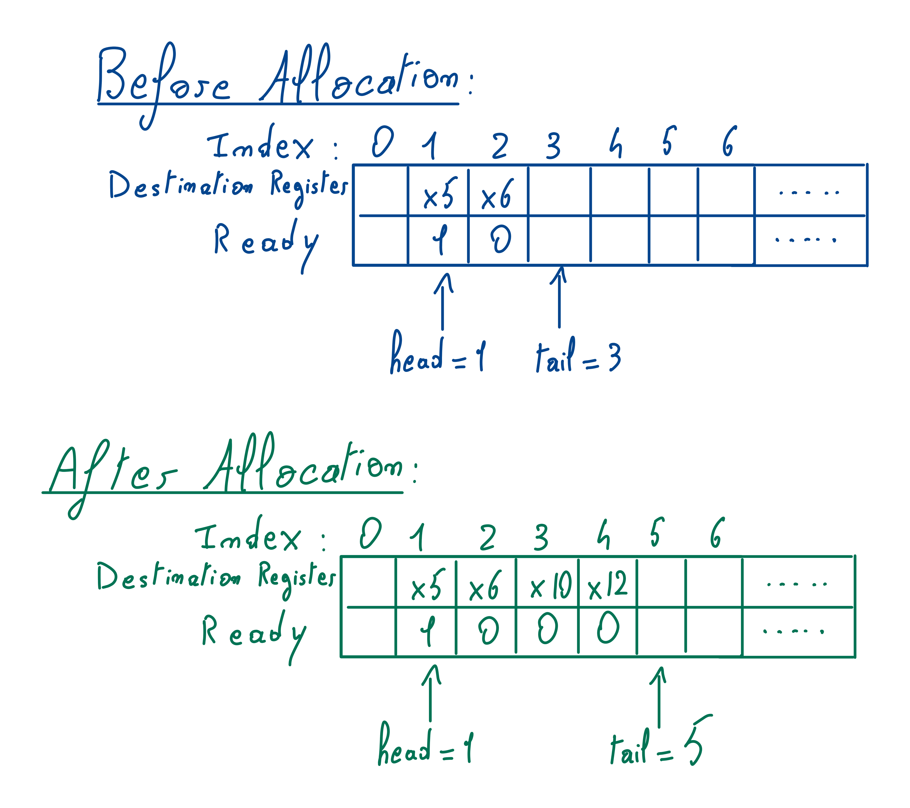

In this diagram, we clearly observe how the tail pointer advances in the buffer at allocation.

##### Writeback: Marking Instructions Complete

When an ALU finishes execution, it broadcasts the result on the CDB. The ROB captures the value and sets `ready=1`.

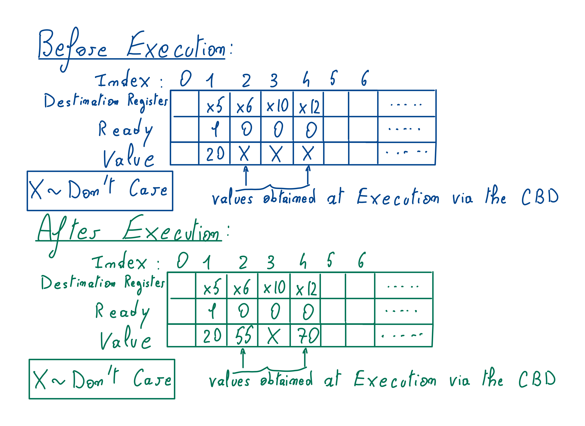

In this diagram, we clearly observe how the common data bus transmits the results of each execution which are allocated to specific tags in the Re-Order Buffer.
We also note that since execution does not occur in order, the transmission of data in the Re-Order Buffer will not necessarly follow the program order.

##### Commit: Retiring Instructions In Order

Instructions commit from the `head` in program order. 

Only entries with `ready=1` and `commit = 0` (it has not yet been commited) can commit.

The Re-Order Buffer commits up to 2 instructions per cycle, the number of commits per cycle depends on the number of ready instructions in the buffer:
- No instructions ready : 0 instrutcions commmited
- 1 instruction ready (even though the other instructions might be valid, here we only consider the ones that are ready) : 1 instruction commited
- 2 or more instructions ready : exactly 2 instructions commited


### 2.3 Register Update Unit (RUU)

#### Purpose

The Register Update Unit (also known as **Reservation Stations** in Tomasulo's algorithm) holds instructions that are waiting for their operands. It enables **out-of-order execution** by:

1. **Buffering instructions** until their source operands become available
2. **Waking up instructions** when results are broadcast on the CDB
3. **Issuing ready instructions** to the ALUs for execution

#### Structure

The RUU is implemented as an array of 64 entries:

```systemverilog
parameter DEPTH          = 64,
parameter TAG_BITS       = $clog2(DEPTH),  // 6 bits
parameter CONTROL_WIDTH  = 4               // ALU control bits
```

Each entry is a packed struct containing:

```systemverilog
typedef struct packed {
    logic                     valid;      // Slot in use
    logic                     issued;     // Already sent to ALU?
    logic [TAG_BITS-1:0]      dest_tag;   // ROB tag for this instruction
    logic                     src1_valid; // Is source 1 ready?
    logic [TAG_BITS-1:0]      src1_tag;   // Producer tag for source 1
    logic [31:0]              src1_value; // Value of source 1
    logic                     src2_valid; // Is source 2 ready?
    logic [TAG_BITS-1:0]      src2_tag;   // Producer tag for source 2
    logic [31:0]              src2_value; // Value of source 2
    logic [CONTROL_WIDTH-1:0] ctrl;       // ALU control signals
} ruu_entry_t;
```

| Field | Description |
|-------|-------------|
| `valid` | Entry contains an instruction |
| `issued` | Instruction has been sent to ALU (prevents re-issue) |
| `dest_tag` | The ROB tag identifying this instruction |
| `src1_valid` | Source operand 1 is available |
| `src1_tag` | If not valid, the ROB tag of the producing instruction |
| `src1_value` | The actual value (when valid) |
| `src2_valid`, `src2_tag`, `src2_value` | Same for source operand 2 |
| `ctrl` | ALU operation control signals |

#### Interfaces

##### Dispatch Interface (2 instructions per cycle)

```systemverilog
// Instruction 1
input  logic                 dispatch1_en,
input  logic [TAG_BITS-1:0]  dispatch1_dest_tag,
input  logic                 dispatch1_src1_valid,
input  logic [TAG_BITS-1:0]  dispatch1_src1_tag,
input  logic [31:0]          dispatch1_src1_value,
input  logic                 dispatch1_src2_valid,
input  logic [TAG_BITS-1:0]  dispatch1_src2_tag,
input  logic [31:0]          dispatch1_src2_value,
input  logic [CONTROL_WIDTH-1:0] dispatch1_ctrl,

// Instruction 2 (same signals)
```

##### Writeback Interface (CDB broadcast)

```systemverilog
input  logic                 wb1_en,
input  logic [TAG_BITS-1:0]  wb1_tag,
input  logic [31:0]          wb1_value,

input  logic                 wb2_en,
input  logic [TAG_BITS-1:0]  wb2_tag,
input  logic [31:0]          wb2_value,
```

##### Free Interface (after commit)

```systemverilog
input  logic                 free1_en,
input  logic [TAG_BITS-1:0]  free1_tag,
input  logic                 free2_en,
input  logic [TAG_BITS-1:0]  free2_tag,
```

##### Execute Interface (to ALUs)

```systemverilog
output logic [TAG_BITS-1:0]  exec0_dest_tag,
output logic [31:0]          exec0_src1_value,
output logic [31:0]          exec0_src2_value,
output logic [CONTROL_WIDTH-1:0] exec0_ctrl,

// Same for exec1 (second ALU)
```

---

#### Sequential Operations

The RUU performs four operations: **Dispatch**, **Writeback (Wake-up)**, **Issue**, and **Free**. 

##### Dispatch: Adding New Instructions

When instructions are decoded, they are dispatched to the first available RUU slots. The module scans for free entries (`valid == 0`):

```systemverilog
always_comb begin
    found1 = 1'b0;
    found2 = 1'b0;
    for (int i = 0; i < DEPTH; i++) begin
        if (!entries[i].valid) begin
            if (!found1) begin
                found1    = 1'b1;
                slot1_idx = i;
            end else if (!found2) begin
                found2    = 1'b1;
                slot2_idx = i;
            end
        end
    end
end
```

##### Writeback (Wake-up): CDB Broadcast

When an ALU completes, it broadcasts the result on the CDB. All RUU entries **simultaneously** check if they're waiting for this tag. This happens on the **negative edge** to allow same-cycle wake-up and issue.

```systemverilog
always_ff @(negedge clk) begin
    if (wb1_en) begin
        for (int i = 0; i < DEPTH; i++) begin
            // Check source 1
            if (entries[i].valid && !entries[i].src1_valid &&
                (entries[i].src1_tag == wb1_tag)) begin
                entries[i].src1_valid <= 1'b1;
                entries[i].src1_value <= wb1_value;
            end
            // Check source 2
            if (entries[i].valid && !entries[i].src2_valid &&
                (entries[i].src2_tag == wb1_tag)) begin
                entries[i].src2_valid <= 1'b1;
                entries[i].src2_value <= wb1_value;
            end
        end
    end
    // Same for wb2...
end
```

##### Issue: Selecting Ready Instructions

The issuer scans for entries that are **valid**, **not yet issued**, and have **both operands ready**. Up to 2 instructions can issue per cycle to the 2 ALUs.

```systemverilog
always_comb begin
    issue0_valid = 1'b0;
    issue0_idx   = '0;
    
    // First ALU: find oldest ready instruction
    for (int i = 2; i < DEPTH; i++) begin
        if (!issue0_valid &&
            entries[i].valid &&
            !entries[i].issued &&
            entries[i].src1_valid &&
            entries[i].src2_valid) begin
            issue0_valid = 1'b1;
            issue0_idx   = i;
        end
    end
    
    // Second ALU: find next ready instruction (different from first)
    for (int i = 2; i < DEPTH; i++) begin
        if (!issue1_valid &&
            entries[i].valid &&
            !entries[i].issued &&
            entries[i].src1_valid &&
            entries[i].src2_valid &&
            (!issue0_valid || (issue0_idx != i))) begin
            issue1_valid = 1'b1;
            issue1_idx   = i;
        end
    end
end
```

##### Free: Releasing Entries After Commit

When the ROB commits an instruction, the corresponding RUU entry is freed by clearing its `valid` bit. The entry is matched by `dest_tag`.

```systemverilog
if (free1_en) begin
    for (int i = 0; i < DEPTH; i++) begin
        if (free1_tag == entries[i].dest_tag) begin
            entries[i].valid  <= 1'b0;
            entries[i].issued <= 1'b0;
        end
    end
end
```

---

#### Timing strategy: Negative Edge for Writeback

```systemverilog
always_ff @(negedge clk) begin
    // Writeback (wake-up) logic
end
```

The writeback logic runs on the **negative edge** of the clock while dispatch, issue, and free run on the **positive edge**. This design choice enables **same-cycle wake-up**:

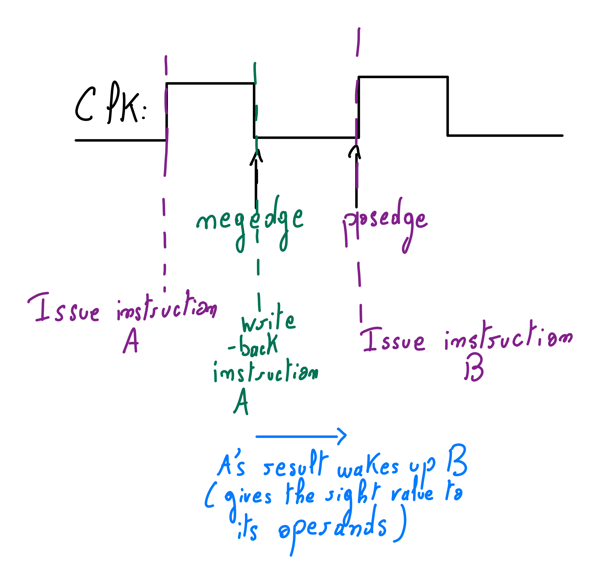

Without this, an instruction would have to wait an extra cycle after its producer completes before it could issue.

This technique was not part of the first implementation of this circuit. However, using GTKWave, we examined the ALU operands signals wave and observed a delay.

Below is what we observed before writing back at the negative edge of the clock: (all the work was done in the positive edge)

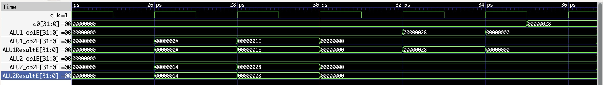

Below is what we observed before writing back at the negative edge of the clock:

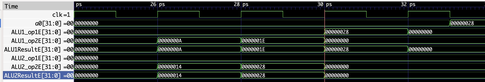

Indeed, this strategy of writing back at the negative edge eliminates the delay and increase the throughput.

---

### 2.4 Pipelined Design

#### Overview

To maximize throughput, we divide the processor into **5 pipeline stages**, each designed to complete within a similar time budget. The clock period is determined by the **slowest stage**, so balancing stage delays is critical for performance.

#### Component Delays

The following table (from Harris and Harris) shows typical propagation delays:


---

#### Pipeline Stages and Timing Analysis

##### Stage 1: Fetch (F)

**Operations:**
- Read 2 instructions from instruction memory using PC
- Compute PC + 8 for next fetch

**Components in critical path:**
```
t_pcq + t_mem + t_setup
= 40 + 200 + 50
= 290 ps
```

> Note: The instruction memory is implemented as a dual-port memory, allowing two instructions to be fetched in parallel within a single t_mem = 200 ps access.
> 
---

##### Stage 2: Rename/Decode (D)

**Operations:**
- Decode both instructions (control unit)
- Sign-extend immediates
- Read 4 source registers from register file
- Query RAT for producer tags (4 lookups)
- Query ROB for operand values (4 lookups)
- Determine operand validity
- Select operand sources via muxes

**Components in critical path:**
```
t_pcq + t_dec + t_RFread + t_mux + t_setup
= 40 + 25 + 100 + 30 + 50
= 245 ps
```

However, the RAT/ROB queries and validity logic run in parallel with register file reads:
```
RAT lookup + ROB lookup + validity logic + mux:
t_pcq + t_RAT + t_ROB + t_AND-OR + t_mux + t_setup
≈ 40 + 30 + 30 + 20 + 30 + 50
= 200 ps
```

The register file read path dominates, so: **245 ps**

---

##### Stage 3: Dispatch/Issue (Iss)

**Operations:**
- Insert entries into RUU (dispatch)
- Scan RUU for ready instructions (issue selection)
- Output operands and control signals for ready instructions

**Components in critical path:**

The issue logic scans all 64 RUU entries to find ready instructions. This is a priority encoder over valid & ready bits:
```
t_pcq + t_RUU_scan + t_mux + t_setup
= 40 + (64 × t_AND-OR) + 30 + 50
```

In practice, the scan is implemented as combinational logic with depth proportional to log(DEPTH):
```
≈ 40 + 6 × 20 + 30 + 50
= 240 ps
```

---

##### Stage 4: Execute + Writeback to ROB (E)

**Operations:**
- ALU computation (2 ALUs in parallel)
- Broadcast results on CDB
- Write results to ROB entries

**Components in critical path:**
```
t_pcq + t_ALU + t_setup
= 40 + 120 + 50
= 210 ps
```

The ROB write is a register array write, so we use t_setup.

The CDB broadcast to RUU (wake-up) happens on the **negative edge**, so it doesn't add to this stage's delay.

---

##### Note: Implicit Pipelining Between Execute and Commit

There is **no explicit pipeline register** between the Execute (E) and Commit (C) stages. However, pipelining is still correctly maintained because:

- **Execute stage** writes results to ROB on the **positive edge**
- **Commit stage** reads from ROB head and writes to the register file on the **positive edge**

Since the ROB is a buffer **with separate head and tail pointers**, these operations target **different entries**.

As a result, while a pair of instruction is being written to the Re-Order Buffer another pair of instruction is being commited into the register file.

---

##### Stage 5: Commit (C)

**Operations:**
- Read 2 entries from ROB head
- Write up to 2 results to architectural register file
- Free corresponding RUU entries

**Components in critical path:**
```
t_pcq + t_ROB_read + t_RFsetup
= 40 + 30 + 60
= 130 ps
```

---

#### Pipeline Summary

| Stage | Name | Operations | Critical Path Delay |
|-------|------|------------|---------------------|
| **F** | Fetch | Read 2 instructions from memory | **290 ps** |
| **D** | Rename/Decode | Decode, read registers, RAT/ROB lookup | 245 ps |
| **Iss** | Dispatch/Issue | Insert to RUU, select ready instructions | 240 ps |
| **E** | Execute | ALU computation, write to ROB | 240 ps |
| **C** | Commit | Write to register file, free RUU | 130 ps |

**Clock Period = max(all stages) = 290 ps** (limited by Fetch stage)

---

#### Performance Comparison

For a fair comparison, we consider a single-cycle arithmetic-only processor (no load/store), where the single cycle clock cycle can be calculated as follow:

```
Tc_single_arith = t_pcq + t_mem + t_RFread + t_ALU + t_mux + t_RFsetup
                = 40 + 200 + 100 + 120 + 30 + 60
                = 550 ps
```

| Metric | Single-Cycle (Arith Only) | 5-Stage Pipelined OoO |
|--------|---------------------------|----------------------|
| Clock Period | ~550 ps | **290 ps** |
| CPI | 1.0 | < 1.0 (superscalar) |
| Instructions/Cycle | 1 | Very close to 2 |

**Theoretical Speedup:**
- Clock speedup: 550 / 290 = **1.9×**
- Superscalar factor: up to **2×** (2 ALUs)
- Combined potential: up to **3.8×** throughput improvement
In practice, dependencies and structural hazards reduce the effective IPC below 2.0, but the out-of-order execution minimizes stalls compared to an in-order superscalar design.

---

### 2.5 Overall Integration

This section describes how all components connect together, with particular focus on the **source operand validity logic** which is the critical decision-making process that determines where each operand comes from and whether the instruction can issue immediately.

#### Modified Core Components

To support 2-way superscalar out-of-order execution, the basic processor components were modified:

##### Register File: 4 Read Ports, 2 Write Ports

```systemverilog
module sup_regfile (
    // WRITE PORT 1
    input  logic [DATA_WIDTH-1:0] WD1,
    input  logic WE1,
    input  logic [4:0] AD1W,
    // WRITE PORT 2
    input  logic [DATA_WIDTH-1:0] WD2,
    input  logic WE2,
    input  logic [4:0] AD2W,
    // READ PORTS 1-4
    input  logic [4:0] AD1R, AD2R, AD3R, AD4R,
    output logic [DATA_WIDTH-1:0] RD1, RD2, RD3, RD4,
    ...
);
```

| Ports | Purpose |
|-------|---------|
| 4 Read Ports | 2 source registers × 2 instructions |
| 2 Write Ports | 2 commits per cycle from ROB |

Writes occur on **negative edge** to allow same-cycle read-after-write .

##### ALU: Simplified (No Comparison Flags)

```systemverilog
module sup_alu (
    input  logic [DATA_WIDTH-1:0] ALUop1,
    input  logic [DATA_WIDTH-1:0] ALUop2,
    input  logic [3:0]            ALUCtrl,
    output logic [DATA_WIDTH-1:0] ALUout
);
```

Since we only support arithmetic instructions (no branches), the ALU no longer outputs comparison flags (`EQ`, `LT`, `LTU`). Two identical ALUs operate in parallel.

##### Control Unit: Arithmetic Only

```systemverilog
module sup_control (
    input  logic [DATA_WIDTH-1:0] instr,
    output logic [3:0] ALUCtrl,   // ALU operation
    output logic       ALUSrc,    // 0=register, 1=immediate for operand 2
    output logic [2:0] ImmSrc,    // Immediate format
    output logic       ALUsrc2    // 0=register, 1=PC for operand 1
);
```

The control unit is simplified to only decode:
- R-type arithmetic (`ADD`, `SUB`, `AND`, `OR`, `XOR`, `SLT`, `SLTU`, `SLL`, `SRL`, `SRA`)
- I-type arithmetic (`ADDI`, `ANDI`, `ORI`, `XORI`, `SLTI`, `SLTIU`, `SLLI`, `SRLI`, `SRAI`)
- Upper immediate (`LUI`, `AUIPC`)

Two identical control units decode both instructions in parallel.

---

#### Source Operand Validity Logic

The most critical part of the integration is determining **where each source operand comes from** and **whether it's available**. This logic runs during the Rename/Decode stage.

##### Decision Tree

For each source register, we follow this decision process:

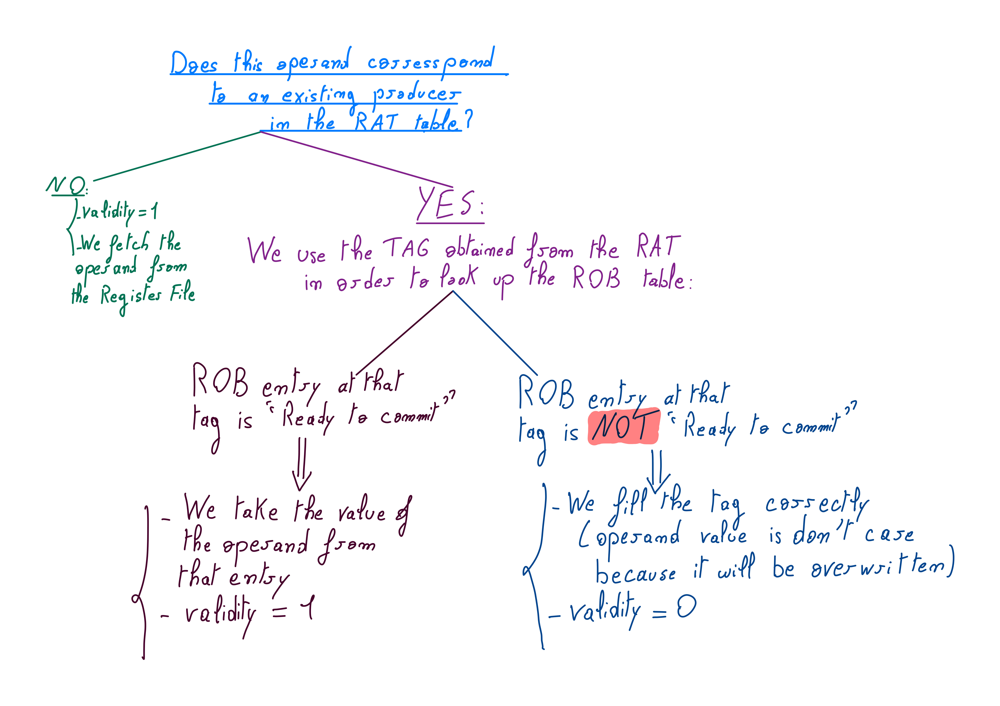

##### Implementation

```systemverilog
module src_operand_validity_logic (
    input  logic                      rat_has_producer,
    input  logic [ROB_TAG_WIDTH-1:0]  rat_tag,
    input  logic                      rob_entry_ready,
    output logic                      operand_valid,
    output logic                      fetch_from_regfile
);
    always_comb begin
        if (!rat_has_producer) begin
            // Case 1: No producer, we fetch from register file
            operand_valid      = 1'b1;
            fetch_from_regfile = 1'b1;
        end
        else if (rob_entry_ready) begin
            // Case A: Producer finished, we fetch from ROB
            operand_valid      = 1'b1;
            fetch_from_regfile = 1'b0;
        end
        else begin
            // Case B: Producer not finished, we wait for CDB
            operand_valid      = 1'b0;
            fetch_from_regfile = 1'b0;  // Don't care
        end
    end
endmodule
```

##### Value Selection

Based on the validity logic output, we select the operand value:

```systemverilog
assign value_source1 = source1_selectline ? q1_value : RS1_val;

```

---

#### Special Case: Instruction 2 Depends on Instruction 1

The logic above works for Instruction 1, but **Instruction 2 has a complication**: the RAT and ROB haven't been updated yet with Instruction 1's destination.

Consider this sequence fetched together:
```asm
ADD  x5, x1, x2    # Instr1: produces x5
SUB  x6, x5, x3    # Instr2: needs x5 — but RAT doesn't know about Instr1 yet!
```

When we look up `x5` in the RAT for Instruction 2, it returns the **old** producer (or none), not Instruction 1. We must add **extra dependency checking**:

```systemverilog
// Check if Instruction 2's sources depend on Instruction 1's destination
assign is_rs3_dependent_on_RD1 = (RD1 == RS3);  // RD1 = Instr1's dest
assign is_rs4_dependent_on_RD1 = (RD1 == RS4);
```

If there's a dependency, we **bypass** the normal RAT/ROB lookup :

```systemverilog
// Source 3 (Instruction 2's first source)
assign value_source3 = is_rs3_dependent_on_RD1 ? 
                       32'b0 :                          // Value unknown, will come via CDB
                       (source3_selectline ? q3_value : RS3_val);

assign validity_source3 = is_rs3_dependent_on_RD1 ? 
                          1'b0 :                        // Not valid — must wait
                          tmp_validity_source3;

assign tag_source3 = is_rs3_dependent_on_RD1 ? 
                     (latest_tag - 1) :                 // Use Instr1's tag
                     tmp_q3_tag;
```

The key insight: when Instruction 2 depends on Instruction 1, we:
1. Set `validity = 0` (operand not ready)
2. Set `tag = Instr1's tag` (so CDB can wake it up)
3. Set `value = don't care` (will be filled by CDB)

When Instruction 2 depends on Instruction 1, we use `latest_tag - 1` as the producer tag so that when it's paired instruction has executed, it will correctly fill the corresponding operand value in the register update unit.

The RAT assigns tags as:
- Instruction 1 gets `latest_tag - 1`
- Instruction 2 gets `latest_tag`


---

#### Immediate Operand Handling

For I-type instructions, the second operand is an immediate, not a register. In this case, we **force validity to 1** because we know that the operand contains the right value and we avoid overwritting in the register update unit by the common data bus:

```systemverilog
assign final_validity_source1 = ALU1Src2 ? 1'b1 : validity_source1;
assign final_validity_source2 = ALU1Src1 ? 1'b1 : validity_source2;
assign final_validity_source3 = ALU2Src2 ? 1'b1 : validity_source3;
assign final_validity_source4 = ALU2Src1 ? 1'b1 : validity_source4;
```

The muxes select between register values and immediates/PC in the decode/rename stage because we want to store the correct operand in the Register Update Unit (Reservation Station) :

```systemverilog
// Operand 1: Register value or PC
mux mux_ALU1_pcVSreg(
    .in0(value_source1),
    .in1(PCPlus8D - 8),      // PC value for AUIPC
    .sel(ALU1Src2),
    .out(ALU1_op1D)
);

// Operand 2: Register value or Immediate
mux mux_ALU1_immVSreg(
    .in0(value_source2),
    .in1(ExtImm1D),          // Sign-extended immediate
    .sel(ALU1Src1),
    .out(ALU1_op2D)
);
```

---

## 3. Schematic

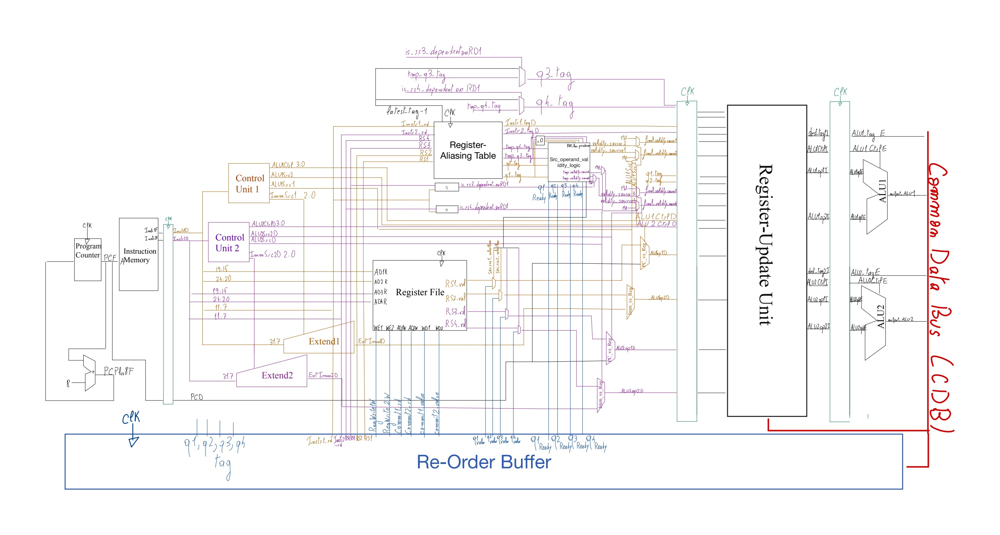

---

## 4. Testing & Verification

### 4.1 Unit Testing

#### 4.1.1 RAT Testing


We created a testbench ( `rat_tb.cpp ` , in ` tb/tests ` ) that verifies the RAT module's ability to eliminate false dependencies through register renaming:

- **Initial State:** All entries map to tag 0 after reset
- **Tag Assignment:** Correct tag allocation (inst1 gets counter-1, inst2 gets counter)
- **Counter Increment:** Producer counter increments by 2 each cycle
- **x0 Handling:** Writes to x0 are ignored
- **WAW Hazard:** Younger instruction wins when both write the same register
- **Source Lookup:** All 4 source registers return correct producer tags

#### Running the test

1. Navigate to the testbench ( `tb` ) folder:
   ```bash
   cd repo/tb
   ```

2. Make script executable:
   ```bash
   chmod +x doitrat.sh
   ```
   Grant execution permissions to the run script.

3. Run the test:
   ```bash
   ./doitrat.sh tests/rat_tb.cpp
   ```
   Execute the testbench with the verification file to validate the program.

Here are the results:

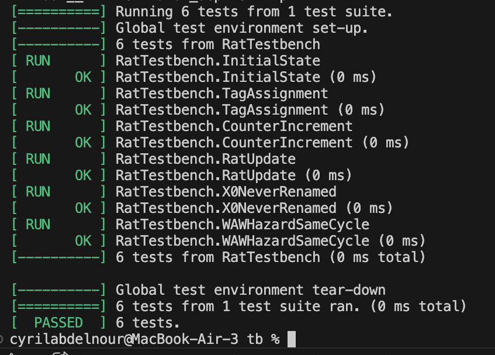

---

#### 4.1.2 ROB Testing

We created a testbench ( `rob_tb.cpp ` , in ` tb/tests ` ) that verifies the ROB module's three critical functions: tracking in-flight instructions, storing execution results, and ensuring in-order commit.

**Allocation Interface:**
- **Single/Dual Allocation:** 1 or 2 instructions allocated per cycle at the tail pointer
- **Entry Initialization:** `dest_reg` set and `ready` bit cleared on allocation

**Writeback Interface:**
- **Single/Dual Writeback:** Results written via both CDB ports
- **Ready Flag:** Entry marked ready with correct value after writeback

**Query Interface:**
- **4-Port Lookup:** All query ports return correct ready status and values
- **Out-of-Order Access:** Results accessible before commit via tag lookup

**Commit Interface:**
- **In-Order Retirement:** Head commits only when ready and younger instructions must wait
- **Dual Commit:** Both head and head+1 commit when both are ready
- **Commit2 Dependency:** Second commit requires first to be valid (cannot skip head)
- **Ready Cleared:** Ready bit reset after successful commit for entry reuse


#### Running the test

1. Navigate to the testbench ( `tb` ) folder:
   ```bash
   cd repo/tb
   ```

2. Make script executable:
   ```bash
   chmod +x doitrob.sh
   ```
   Grant execution permissions to the run script.

3. Run the test:
   ```bash
   ./doitrob.sh tests/rob_tb.cpp
   ```
   Execute the testbench with the verification file to validate the program.

Here are the results:

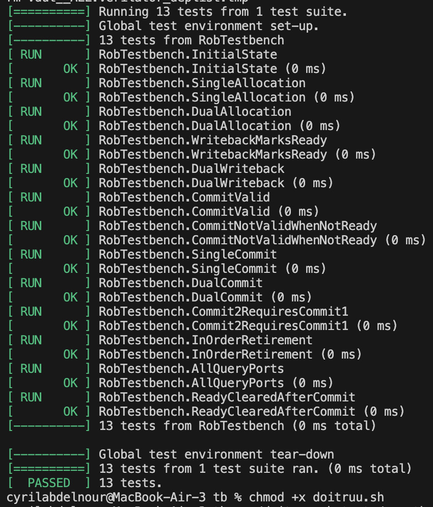


---

#### 4.1.3 RUU Testing

We created a testbench ( `ruu_tb.cpp ` , in ` tb/tests ` ) that verifies the RUU's ability to buffer instructions, wake up waiting operands via Common Data Bus broadcast, and issue ready instructions to the ALUs.

- **Initial State:** No instructions issued after reset
- **Dispatch Ready:** Instructions with both sources ready issue immediately
- **Waiting Does Not Issue:** Instructions with missing operands wait
- **Writeback Wakeup:** CDB broadcast wakes waiting instructions

#### Running the test

1. Navigate to the testbench ( `tb` ) folder:
   ```bash
   cd repo/tb
   ```

2. Make script executable:
   ```bash
   chmod +x doitruu.sh
   ```
   Grant execution permissions to the run script.

3. Run the test:
   ```bash
   ./doitruu.sh tests/ruu_tb.cpp
   ```
   Execute the testbench with the verification file to validate the program.

Here are the results:

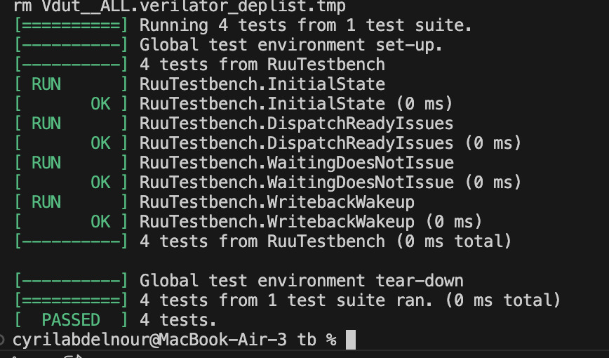


---

### 4.2 Assembly Test Programs

This section presents the assembly programs built to verify the out-of-order superscalar processor. Each test targets specific edge cases and hazard scenarios.

Some of the tests are followed by a GTKWave simulation providing evidence of the performance upgrade through the cycle by cycle simulation.

---

#### Test 1: Basic Arithmetic (`2_li_add.s`)
```asm
li t1, -9000
li t2, 10000
add a0, t1, t2      # a0 = 1000
```
This test verifies basic immediate loading and addition operations. The `li` pseudo-instruction expands to `lui` and `addi` , testing the processor's ability to handle multi-instruction sequences. Expected output: **a0 = 1000**.

---

#### Test 2: RAW Dependency Chain (`straight_raw_chain.s`)
```asm
addi t0, x0, 5
addi t1, x0, 7
add  t2, t0, t1     # t2 = 12
add  t3, t2, t1     # t3 = 19 (RAW: depends on t2)
add  a0, t3, t0     # a0 = 24 (RAW: depends on t3)
```
This test creates a straight chain of Read-After-Write dependencies where each instruction depends on the result of the previous one. The RUU must correctly wake up waiting instructions as their operands become available via the CDB. Expected output: **a0 = 24**.

---

#### Test 3: WAR Hazard (`war_simple.s`)
```asm
addi t0, zero, 5        # t0 = 5 (old value)
addi a0, t0, 0          # a0 = t0 (must read old value)
addi t0, zero, 100      # t0 = 100 (new value)
```
This test verifies Write-After-Read hazard resolution. The RAT must ensure the second instruction reads the old value of t0 (5), not the new value (100) written by the third instruction. Register renaming eliminates this false dependency. Expected output: **a0 = 5**.

---

#### Test 4: WAW Hazard (`waw_simple.s`)
```asm
addi a0, zero, 10       # a0 = 10 (first write)
addi a0, zero, 99       # a0 = 99 (second write)
```
This test verifies Write-After-Write hazard resolution. Despite potential out-of-order execution, the ROB ensures in-order commit so the final architectural value of a0 reflects the program-order last write. Expected output: **a0 = 99**.

---

#### Test 5: Instruction-Level Parallelism (`parrallelism.s`)
```asm
addi t0, zero, 10
addi t1, zero, 20
addi t2, zero, 30
addi t3, zero, 40
addi a0, t3, 0          # a0 = 40
```
This test demonstrates the superscalar processor's ability to exploit instruction-level parallelism. The first four instructions are completely independent and can be dispatched, issued, and executed in parallel across the dual ALUs. Expected output: **a0 = 40**.

GTKWave analysis confirms simultaneous execution:

The waveform demonstrates both ALUs executing simultaneously, with ALU1 processing values 0x0A (10) and 0x1E (30) while ALU2 concurrently handles 0x14 (20) and 0x28 (40). This confirms the superscalar processor successfully exploits instruction-level parallelism by dispatching and executing independent instructions in parallel across both ALUs.


---

#### Test 6: Register Reuse (`reg_reuse.s`)
```asm
addi t0, zero, 1        # t0 = 1
addi t1, t0, 1          # t1 = 2
addi t0, t1, 1          # t0 = 3
...                     # alternating writes to t0, t1
addi a0, t1, 90         # a0 = 100
```

This test verifies the logic implemented in the Decode/Rename stage to address the edge case where the second instruction fetched depends on the value taken by the destination register of the first one. Expected output: **a0 = 100**.

---

#### Test 7: Addition and Subtraction (`sup_sub_add.s`)
```asm
li t1, 1
li t2, 2
sub a1, t1, t2          # a1 = -1
add a0, t2, a1          # a0 = 1
add a3, t1, t2          # a3 = 3 (independent)
add a0, a0, a3          # a0 = 4
```
This test verifies both ALU operations (add and sub) with mixed dependencies. Expected output: **a0 = 4**.


---

#### Test 8: Shift Operations (`sup_shifts.s`)
```asm
addi t0, zero, 1
slli t1, t0, 4          # t1 = 16
slli t2, t1, 2          # t2 = 64
addi t3, zero, 256
srli t4, t3, 1          # t4 = 128
add  a0, t2, t4         # a0 = 192
srli a0, a0, 1          # a0 = 96
addi a0, a0, 32         # a0 = 128
```
This test verifies shift-immediate operations (slli, srli) with RAW dependencies. The processor must correctly execute logical shifts and forward results through the CDB for dependent instructions. Expected output: **a0 = 128**.

This waveform provides evidence of the performance advantage of out-of-order execution. We observe ALU1 executing tag 02 (the `slli t1, t0, 4` instruction producing 0x10 = 16) while simultaneously ALU2 executes tag 04 (the independent `addi t3, zero, 256` producing 0x100 = 256). The out-of-order scheduler ( the Register-Update Unit) identified that instruction 4 has no dependencies on instructions 2 or 3 and issued it immediately to the second ALU.

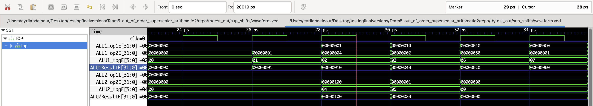

**IPC Calculation:**

- In-order scalar processor: 8 instructions ÷ 8 cycles = **IPC = 1.0**
- In-order superscalar processor: 8 instructions ÷ 6 cycles = **IPC = 1.33**
- Out-of-order superscalar: 8 instructions ÷ 5 cycles = **IPC = 1.6**

This represents a **60% improvement** over the baseline IPC of 1.

---

#### Test 9: Logical Operations (`logical.s`)
```asm
addi t0, zero, 0xF0     # t0 = 240
addi t1, zero, 0x0F     # t1 = 15
or   t2, t0, t1         # t2 = 255
addi t3, zero, 0xAA     # t3 = 170
and  t4, t2, t3         # t4 = 170
addi t5, zero, 0xDE     # t5 = 222
xor  s0, t4, t5         # s0 = 116
addi a0, s0, -16        # a0 = 100
```

This test verifies bitwise logical operations (OR, AND, XOR) with RAW dependencies. It ensures the ALU correctly computes bitwise operations and the results propagate through the pipeline. Expected output: **a0 = 100**.

---

#### Test 10: Complex Shifts (`complexshifts.s`)
```asm
addi t0, zero, 1
slli t1, t0, 5          # t1 = 32
addi t2, zero, 3
sll  t3, t0, t2         # t3 = 8  (register-based shift)
add  t4, t1, t3         # t4 = 40
addi t5, zero, 64
srli s2, t5, 2          # s2 = 16
addi s0, zero, 2
srl  s1, s2, s0         # s1 = 4  (register-based shift)
add  a0, t4, s1         # a0 = 44
```

This test combines immediate shifts (slli, srli) with register-based shifts (sll, srl), creating complex dependency graphs. Expected output: **a0 = 44**.

---

### 4.3 Results


1. Navigate to the testbench ( `tb` ) folder:
   ```bash
   cd repo/tb
   ```

2. Make script executable:
   ```bash
   chmod +x doit.sh
   chmod +x assemble.sh
   ```

3. Run the test:
   ```bash
   ./doit.sh tests/verify_tb.cpp
   ```
   Execute the testbench with the verification file to validate the program.

Here are the results:


> **Note:** The performance upgrade results and evidence are included in the [4.2 Assembly Test Programs](#42-assembly-test-programs) under the tests `Test 5 :parrallelism.s` `Test 8 :sup_shifts.s` using GTKWave cycle by cycle analysis.

---

## 5. References

The concepts implemented in this out-of-order superscalar processor extend beyond the scope of the lecture material, requiring extensive independent research into advanced computer architecture techniques pioneered in the 1960s and refined through decades of processor development.

- [Superscalar Processor](https://en.wikipedia.org/wiki/Superscalar_processor)
- [Out-of-Order Processor Overview from ScienceDirect](https://www.sciencedirect.com/topics/computer-science/out-of-order-processor)
- [Register Renaming Techniques](https://fiveable.me/advanced-computer-architecture/unit-6/register-renaming-techniques/study-guide/6kjpVCqRFiiGhaTX)
- [The Reorder Buffer](https://docs.boom-core.org/en/latest/sections/reorder-buffer.html)
- [The Rename Stage](https://docs.boom-core.org/en/latest/sections/rename-stage.html)

---
# Out-of-Order Superscalar Processor with Load Instructions

## Table of Contents
- [1. Overview](#1-overview)
- [2. Implementation](#2-implementation)
  - [2.1 Adapting Data Memory in the Out of Order Superscalar circuit](#21-adapting-data-memory-for-superscalar)
  - [2.2 Doubling the Common Data Bus Width](#22-doubling-the-common-data-bus-width)
  - [2.3 Load Instruction Integration](#23-load-instruction-integration)
- [3. Schematic](#3-schematic)
- [4. Testing & Verification](#4-testing--verification)

---

## 1. Overview

### Building on the Foundation

This branch extends the **out-of-order superscalar arithmetic processor** developed in the previous branch by adding support for **load instructions** (`LW`, `LH`, `LB`, `LHU`, `LBU`).

The core Tomasulo-based infrastructure remains unchanged:
- **Register Alias Table (RAT)** for register renaming
- **Re-Order Buffer (ROB)** for in-order commit
- **Register Update Unit (RUU)** for instruction buffering and issue
- **Common Data Bus (CDB)** for result broadcasting
- **Source operand logic** for correct dispatch in the register update unit (RUU)

> **Important**: The fundamental logic of the out-of-order execution (including the source operand validity logic, the renaming in the Register Aliasing Table, the ROB circular buffer mechanics, and the RUU wake-up mechanism) is thoroughly explained in the [Out-of-Order Superscalar Arithmetic branch](../ooo-superscalar-arith/README.md). This README focuses only on the **modifications required to support load instructions**.

### Challenges imposed by the implementation of the load instruction

**Control Unit Complexity**: Loads decode differently from arithmetic instructions (single source operand, memory control signals), and integrating this into the already complex dual-instruction Rename/Decode stage requires careful control logic expansion.

**Additional Writeback Source**: Results now come from both ALUs and memory, requiring a wider Common Data Bus. The ROB and RUU must handle writeback from 4 sources instead of 2.

**Synchronization Between All 4 Writeback Sources**:The CDB must broadcast all results, the ROB must update four entries , and the RUU must wake up any instruction waiting on any of these four tags, all within a single clock cycle.

### Approach

To integrate loads while minimizing changes to the existing architecture:

- **Re-Using already existing signals in decode** : For a load instruction we ignore RS2 and use only RS1, we also calculate the offset in this stage so that we can store the correct operand in the Register Update Unit
- **Add memory stage To the Pipeline Architecture**: After address calculation, loads access data memory in a subsequent stage
- **Double CDB width**: The ROB and RUU now accept 4 writeback inputs (2 from ALUs, 2 from memory) instead of 2

The following sections detail each modification. For understanding the base Tomasulo implementation, refer to the previous branch documentation.

---

## 2. Implementation

### 2.1 Adapting Data Memory for Superscalar

#### Original Data Memory (Single-Port)

The original data memory module from the pipelined processor supports **one read and one write** per cycle:

```systemverilog
module datamem (
    input  logic                     MemWrite,
    input  logic [ADDRESS_WIDTH-1:0] WD,
    input  logic [1:0]               SizeWrite,
    input  logic [ADDRESS_WIDTH-1:0] A, 
    input  logic [1:0]               LoadSize,
    input  logic                     LoadUnsigned,
    input  logic                     clk,
    output logic [DATA_WIDTH-1:0]    dout
);
```

This is insufficient for our 2-way superscalar processor where **two load instructions may execute simultaneously**.

#### Superscalar Data Memory (Dual-Port)

The adapted memory module provides **two independent read ports**:

```systemverilog
module sup_datamem (
    // Port 1
    input  logic [ADDRESS_WIDTH-1:0] A1, 
    input  logic [1:0]               LoadSize1,
    input  logic                     LoadUnsigned1,
    output logic [DATA_WIDTH-1:0]    dout1,
    
    // Port 2
    input  logic [ADDRESS_WIDTH-1:0] A2,
    input  logic [1:0]               LoadSize2,
    input  logic                     LoadUnsigned2,
    output logic [DATA_WIDTH-1:0]    dout2
);
```

#### Load Type Encoding Remains The Same

| LoadSize | LoadUnsigned | Instruction | Loaded Data |
|----------|--------------|-------------|-------------|
| `2'b00` | `0` | `LB` | Sign-extended byte |
| `2'b00` | `1` | `LBU` | Zero-extended byte |
| `2'b01` | `0` | `LH` | Sign-extended halfword |
| `2'b01` | `1` | `LHU` | Zero-extended halfword |
| `2'b10` | `X` | `LW` | Full word (no extension) |


Both ports can access the same underlying memory array simultaneously, enabling two loads per cycle in our superscalar design.

Since we only support **load instructions** (not stores), the superscalar data memory has no write interface

---

### 2.2 Doubling the Common Data Bus Width

With load instructions, results can come from **two sources**: the ALUs and the data memory. Since both can produce results in the same cycle, the Common Data Bus must be widened to handle 4 writebacks simultaneously.

#### 2.2.1 ROB Writeback Expansion

##### Previous Design: 2 Writeback Ports

In the arithmetic-only implementation, the ROB received results from **2 ALUs**:

```systemverilog
// Writeback interface (2 ALUs)
input  logic                  wb1_en,
input  logic [TAG_BITS-1:0]   wb1_tag,
input  logic [31:0]           wb1_value,

input  logic                  wb2_en,
input  logic [TAG_BITS-1:0]   wb2_tag,
input  logic [31:0]           wb2_value,
```

##### New Design: 4 Writeback Ports

With memory operations, we add **2 additional ports** for memory results:

```systemverilog
// Writeback interface from the Execute stage (ALUs)
input  logic                  wb1_en,
input  logic [TAG_BITS-1:0]   wb1_tag,      
input  logic [31:0]           wb1_value,     

input  logic                  wb2_en,
input  logic [TAG_BITS-1:0]   wb2_tag,       
input  logic [31:0]           wb2_value,

// Writeback interface from the Memory stage (Loads)
input  logic                  wb3_en,
input  logic [TAG_BITS-1:0]   wb3_tag,        
input  logic [31:0]           wb3_value,      

input  logic                  wb4_en,
input  logic [TAG_BITS-1:0]   wb4_tag,        
input  logic [31:0]           wb4_value,
```

| Port | Source | Description |
|------|--------|-------------|
| `wb1` | ALU 1 | First ALU result |
| `wb2` | ALU 2 | Second ALU result |
| `wb3` | Memory Port 1 | First load result |
| `wb4` | Memory Port 2 | Second load result |

##### Writeback Logic Expansion

The sequential writeback logic is extended to handle all 4 ports:

**Before (2 ports):**
```systemverilog
always_ff @(posedge clk) begin
    // ...
    if (wb1_en) begin
        value[wb1_tag] <= wb1_value;
        ready[wb1_tag] <= 1'b1;
    end

    if (wb2_en) begin
        value[wb2_tag] <= wb2_value;
        ready[wb2_tag] <= 1'b1;
    end
end
```

**After (4 ports):**
```systemverilog
always_ff @(posedge clk) begin
    // ...
    // ALU writebacks
    if (wb1_en) begin
        value[wb1_tag] <= wb1_value;
        ready[wb1_tag] <= 1'b1;
    end

    if (wb2_en) begin
        value[wb2_tag] <= wb2_value;
        ready[wb2_tag] <= 1'b1;
    end

    // Memory writebacks
    if (wb3_en) begin
        value[wb3_tag] <= wb3_value;
        ready[wb3_tag] <= 1'b1;
    end

    if (wb4_en) begin
        value[wb4_tag] <= wb4_value;
        ready[wb4_tag] <= 1'b1;
    end
end
```

##### No Conflicts Between Ports

Each writeback port writes to a **different ROB entry** (identified by its unique tag). Since:
- Each in-flight instruction has a unique tag
- ALU results and memory results correspond to different instructions
- Tags are assigned sequentially and never reused until commit


#### 2.2.2 RUU Writeback Expansion

The Register Update Unit requires similar modifications to handle results from both ALUs and memory. Additionally, the RUU entry structure and issue logic must be adapted for load instructions.

##### Expanded Writeback Interface

**Before (2 CDB inputs):**
```systemverilog
// Execute stage only
input  logic                 wb1_en,
input  logic [TAG_BITS-1:0]  wb1_tag,
input  logic [31:0]          wb1_value,

input  logic                 wb2_en,
input  logic [TAG_BITS-1:0]  wb2_tag,
input  logic [31:0]          wb2_value,
```

**After (4 CDB inputs):**
```systemverilog
// Execute stage (ALUs)
input  logic                 wb1_en,
input  logic [TAG_BITS-1:0]  wb1_tag,
input  logic [31:0]          wb1_value,

input  logic                 wb2_en,
input  logic [TAG_BITS-1:0]  wb2_tag,
input  logic [31:0]          wb2_value,

// Memory stage (Loads)
input  logic                 wb3_en,
input  logic [TAG_BITS-1:0]  wb3_tag,
input  logic [31:0]          wb3_value,

input  logic                 wb4_en,
input  logic [TAG_BITS-1:0]  wb4_tag,
input  logic [31:0]          wb4_value,
```

##### Expanded Wake-Up Logic

The CDB broadcast logic now checks **4 sources** instead of 2. Each waiting operand must compare its tag against all 4 possible broadcasts:

```systemverilog
always_ff @(negedge clk) begin
    // ALU 1 broadcast
    if (wb1_en) begin
        for (int i = 0; i < DEPTH; i++) begin
            if (entries[i].valid && !entries[i].src1_valid &&
                (entries[i].src1_tag == wb1_tag)) begin
                entries[i].src1_valid <= 1'b1;
                entries[i].src1_value <= wb1_value;
            end
            if (entries[i].valid && !entries[i].src2_valid &&
                (entries[i].src2_tag == wb1_tag)) begin
                entries[i].src2_valid <= 1'b1;
                entries[i].src2_value <= wb1_value;
            end
        end
    end

    // ALU 2 broadcast
    if (wb2_en) begin
        // ... same pattern
    end

    // Memory port 1 broadcast
    if (wb3_en) begin
        // ... same pattern
    end

    // Memory port 2 broadcast
    if (wb4_en) begin
        // ... same pattern
    end
end
```

##### Expanded Entry Structure

Each RUU entry now includes **load-specific control signals**:

**Before:**
```systemverilog
typedef struct packed {
    logic                     valid;
    logic                     issued;
    logic [TAG_BITS-1:0]      dest_tag;
    logic                     src1_valid;
    logic [TAG_BITS-1:0]      src1_tag;
    logic [31:0]              src1_value;
    logic                     src2_valid;
    logic [TAG_BITS-1:0]      src2_tag;
    logic [31:0]              src2_value;
    logic [CONTROL_WIDTH-1:0] ctrl;
} ruu_entry_t;
```

**After:**
```systemverilog
typedef struct packed {
    logic                     valid;
    logic                     issued;
    logic [TAG_BITS-1:0]      dest_tag;
    logic                     src1_valid;
    logic [TAG_BITS-1:0]      src1_tag;
    logic [31:0]              src1_value;
    logic                     src2_valid;
    logic [TAG_BITS-1:0]      src2_tag;
    logic [31:0]              src2_value;
    logic [CONTROL_WIDTH-1:0] ctrl;
    // New fields for load instructions
    logic [1:0]               ResultSrc;      // 01 = load instruction
    logic [1:0]               LoadSize;       // 00=byte, 01=half, 10=word
    logic                     LoadUnsigned;   // 0=signed, 1=unsigned
} ruu_entry_t;
```

##### Modified Issue Logic: Loads Need Only One Operand

A critical change for load instructions: **loads only need `src1` (base address)**, not `src2`. The issue condition is modified:

**Before (arithmetic only):**
```systemverilog
// Issue when BOTH operands ready
if (!issue0_valid &&
    entries[i].valid &&
    !entries[i].issued &&
    entries[i].src1_valid &&
    entries[i].src2_valid) begin
    issue0_valid = 1'b1;
    issue0_idx   = i;
end
```

**After (with loads):**
```systemverilog
// Issue when src1 ready AND (src2 ready OR it's a load)
if (!issue0_valid &&
    entries[i].valid &&
    !entries[i].issued &&
    entries[i].src1_valid &&
    (entries[i].src2_valid || (entries[i].ResultSrc == 2'b01))) begin
    issue0_valid = 1'b1;
    issue0_idx   = i;
end
```

The condition `(entries[i].src2_valid || (entries[i].ResultSrc == 2'b01))` means:
- For arithmetic: both operands must be valid
- For loads (`ResultSrc == 01`): only `src1` (base address) needs to be valid

##### Expanded Execute Interface

The execute outputs now include load control signals:

```systemverilog
// Execute interface outputs
output logic [TAG_BITS-1:0]      exec0_dest_tag,
output logic [31:0]              exec0_src1_value,
output logic [31:0]              exec0_src2_value,
output logic [CONTROL_WIDTH-1:0] exec0_ctrl,
output logic [1:0]               exec0_ResultSrc,    // New
output logic [1:0]               exec0_LoadSize,     // New
output logic                     exec0_LoadUnsigned, // New

// Same for exec1
```

These signals flow to the memory stage to control the load operation.

##### Dispatch Interface Expansion

The dispatch interface also accepts load control signals:

```systemverilog
input logic [1:0] dispatch1_ResultSrc,
input logic [1:0] dispatch1_LoadSize,
input logic       dispatch1_LoadUnsigned,

input logic [1:0] dispatch2_ResultSrc,
input logic [1:0] dispatch2_LoadSize,
input logic       dispatch2_LoadUnsigned,
```

---

### 2.3 Load Instruction Integration

This section details the specific changes required to integrate load instructions into the out-of-order superscalar processor. We compare the arithmetic-only version with the load-enabled version to highlight each modification.

#### Control Unit Expansion

The control unit now generates additional signals for load instructions:

**Before (arithmetic only):**
```systemverilog
sup_control control1 (
    .instr(Instr1D),
    .ALUCtrl(ALUCtrl1D),
    .ALUSrc(ALU1Src1),
    .ImmSrc(ImmSrc1D),
    .ALUsrc2(ALU1Src2)
);
```

**After (with loads):**
```systemverilog
sup_control control1 (
    .instr(Instr1D),
    .ALUCtrl(ALUCtrl1D),
    .ALUSrc(ALU1Src1),
    .ImmSrc(ImmSrc1D),
    .ALUsrc2(ALU1Src2),
    .ResultSrc(ResultSrc1D),      // New: 01 = load instruction
    .LoadSize(LoadSize1D),        // New: byte/half/word
    .LoadUnsigned(LoadUnsigned1D) // New: sign extension control
);
```

| New Signal | Width | Purpose |
|------------|-------|---------|
| `ResultSrc` | 2 bits | `00` = ALU result, `01` = memory result |
| `LoadSize` | 2 bits | `00` = byte, `01` = half, `10` = word |
| `LoadUnsigned` | 1 bit | `0` = sign-extend, `1` = zero-extend |

---

#### Critical Change (Key design choice): Address Calculation in Decode Stage

The most significant change in the Decode/Rename stage is **pre-computing the effective address** for load instructions.

Load instructions have the form: `lw rd, offset(rs1)`

The effective address is: `address = rs1 + offset`

In the arithmetic-only design, operand 1 (`ALU_op1`) was simply the register value. For loads, we need to **add the immediate offset before storing in the RUU**.

##### Implementation

**Before (arithmetic only):**
```systemverilog
mux mux_ALU1_pcVSreg(
    .in0(value_source1),
    .in1(PCPlus8D - 8),
    .sel(ALU1Src2),
    .out(ALU1_op1D)      // Direct output to pipeline
);
```

**After (with loads):**
```systemverilog
logic [DATA_WIDTH-1:0] tmp_ALU1_op1D;

mux mux_ALU1_pcVSreg(
    .in0(value_source1),
    .in1(PCPlus8D - 8),
    .sel(ALU1Src2),
    .out(tmp_ALU1_op1D)  // Intermediate value
);

// If load instruction, pre-add the offset
assign ALU1_op1D = (ResultSrc1D == 2'b00) ? tmp_ALU1_op1D : tmp_ALU1_op1D + ExtImm1D;
```

This means:
- **Arithmetic instructions** (`ResultSrc == 00`): `ALU_op1 = rs1` (unchanged)
- **Load instructions** (`ResultSrc == 01`): `ALU_op1 = rs1 + offset` (pre-computed address)

##### Justifying This Design Choice

This design decision involves a trade-off between **Decode stage complexity** and **RUU storage efficiency**.

**Option A: Pre-compute address in Decode (Our Choice)**
- Add an adder and mux in Decode stage
- Store only the computed address in RUU

**Option B: Store offset separately, compute in Execute**
- Store both `rs1_value` (32 bits) AND `offset` (32 bits) in each RUU entry
- Compute `rs1 + offset` in Execute stage

We chose Option A for the following reasons:

**1. RUU Entry Size Matters**

Each RUU entry already stores:
```
valid (1) + issued (1) + dest_tag (6) + 
src1_valid (1) + src1_tag (6) + src1_value (32) +
src2_valid (1) + src2_tag (6) + src2_value (32) +
ctrl (4) + ResultSrc (2) + LoadSize (2) + LoadUnsigned (1)
= 95 bits per entry
```

Adding a separate 32-bit offset field would increase this to **127 bits per entry**. With 64 entries, this adds **2,048 bits (256 bytes)** of storage.

**2. RUU Scan Performance**

The RUU performs multiple operations that scan all 64 entries every cycle:
- **Issue logic**: Find 2 oldest ready instructions
- **Wake-up logic**: Compare 4 CDB tags against all waiting operands
- **Free logic**: Find entries matching commit tags

Larger entries mean:
- More comparators and wider buses
- Increased wire delay across the array
- Higher power consumption

**3. Decode Stage Can Absorb the Cost**

The Decode stage already performs:
- Control decoding (t_dec = 25 ps)
- Register file read (t_RFread = 100 ps)
- RAT/ROB lookups
- Sign extension (t_ext = 35 ps)
- Operand validity logic

Adding one 32-bit adder in parallel with existing logic has minimal impact on the critical path, since:
- The adder operates on `value_source1` (already available from regfile/ROB)
- The immediate `ExtImm1D` is already computed by sign extension
- A 32-bit adder delay ≈ 30-40 ps (similar to t_mux)

**4. Pipeline Stage Timing Comparison**

| Stage | Without Pre-compute | With Pre-compute |
|-------|---------------------|------------------|
| Decode | 245 ps | ~275 ps (+adder) |
| RUU Scan | Slower (larger entries) | Faster (smaller entries) |
| Execute | +adder for loads | No change |

The Decode stage increase (~30 ps) is acceptable because:
- Decode (275 ps) is still faster than Fetch (290 ps)
- The clock period is limited by Fetch, not Decode
- RUU efficiency benefits every cycle, not just load cycles

The trade-off favors pre-computing: a small Decode stage penalty for significant RUU efficiency gains.

---

#### Conditional Writeback Enable

A critical change: writeback enables are now **conditional** based on instruction type.

**Before (arithmetic only):**
```systemverilog
// ROB writeback lways enabled
.wb1_en(write_back_rob),  // Constant 1
.wb1_tag(ALU1_tagE),
.wb1_value(ALU1ResultE),
```

**After (with loads):**
```systemverilog
// Execute stage writeback only for arithmetic
.wb1_en((ResultSrc1E == 2'b00)),  
.wb1_tag(ALU1_tagE),
.wb1_value(ALU1ResultE),

// Memory stage writeback only for loads
.wb3_en((ResultSrc1M == 2'b01)),  
.wb3_tag(mem1_tag),
.wb3_value(MemoryOut1),
```

This ensures:
- **Arithmetic results** write back from Execute stage (immediate)
- **Load results** write back from Memory stage (one cycle later)
- No double-writeback for the same instruction

---

#### New Execute Memory Pipeline

A completely new pipeline register is added:

```systemverilog
em_sup_pipeline em_pipeline(
    .clk(clk),
    .rst(rst),

    // Control signals
    .ResultSrc1_e(ResultSrc1E),
    .LoadSize1_e(LoadSize1E), 
    .LoadUnsigned1_e(LoadUnsigned1E),
    .ResultSrc1_m(ResultSrc1M),
    .LoadSize1_m(LoadSize1M), 
    .LoadUnsigned1_m(LoadUnsigned1M),

    .ResultSrc2_e(ResultSrc2E),
    .LoadSize2_e(LoadSize2E), 
    .LoadUnsigned2_e(LoadUnsigned2E),
    .ResultSrc2_m(ResultSrc2M),
    .LoadSize2_m(LoadSize2M), 
    .LoadUnsigned2_m(LoadUnsigned2M),

    // Address (computed in Execute, used in Memory)
    .address1_e(ALU1_op1E),
    .address1_m(A1),
    .address2_e(ALU2_op1E),
    .address2_m(A2),

    // ROB tags (for writeback identification)
    .ALU1_tagE(ALU1_tagE),
    .ALU2_tagE(ALU2_tagE),
    .ALU1_tagM(mem1_tag),
    .ALU2_tagM(mem2_tag)
);
```

The tags are propagated so the Memory stage knows which ROB entry to update.

---


## 3. Schematic


---

## 4. Testing & Verification

This section documents the testing for the complete out-of-order superscalar processor . The test suite consists of 17 tests: 10 reused from the ALU-only version and 7 new tests specifically designed to verify load instruction functionality.

### Test Data Memory

All load tests use `reference/testing.mem` as the data memory, which contains a sequential byte pattern from `0x01` to `0xFF`:

```
01 02 03 04 05 06 07 08 09 0A 0B 0C 0D 0E 0F 10
...
F1 F2 F3 F4 F5 F6 F7 F8 F9 FA FB FC FD FE FF
```

This predictable pattern allows easy verification of load operations at any address. 

---

### Reused Tests (1-10)

The following 10 tests from the ALU-only superscalar processor are reused to ensure backward compatibility:

| # | Test Name | Assembly File | Expected `a0` | Purpose |
|---|-----------|---------------|---------------|---------|
| 1 | TestLiAdd | `2_li_add.s` | 1000 | Basic arithmetic, `li` pseudo-instruction |
| 2 | TestSubAdd | `sup_sub_add.s` | 4 | Mixed add/sub with dependencies |
| 3 | TestRAWChain | `straight_raw_chain.s` | 24 | RAW dependency chain, CDB wakeup |
| 4 | SimpleWAW | `waw_simple.s` | 99 | WAW hazard, in-order commit |
| 5 | warsimple | `war_simple.s` | 5 | WAR hazard, register renaming |
| 6 | parrallelism | `parrallelism.s` | 40 | ILP demonstration, parallel execution |
| 7 | ReUsingRegisters | `reg_reuse.s` | 100 | RAT stress test with alternating writes |
| 8 | logicalops | `logical.s` | 100 | Bitwise OR/AND/XOR operations |
| 9 | shifts | `sup_shifts.s` | 128 | Shift operations with RAW dependencies |
| 10 | complexshifts | `complexshifts.s` | 44 | Immediate + register shifts |

---

### New Load Tests (11-17)

#### Test 11: Basic Word Load (`loadword.s`)

```asm
main:
    lw a0, 0(x0)
```

**Purpose:** Verifies basic `lw` instruction functionality.

**Execution:**
- Loads 4 bytes from address 0: `01 02 03 04`
- Little-endian assembly: `0x04030201`

**Expected:** `a0 = 67305985` (0x04030201)

---

#### Test 12: Load with RAW Dependency (`multidependency.s`)

```asm
main:
    lw   a2, 0(x0)        # a2 = 0x04030201
    lw   a1, 4(x0)        # a1 = 0x08070605
    add  a0, a2, a1       # a0 = a2 + a1
```

**Purpose:** Tests RAW dependencies between load instructions and subsequent ALU operations. The `add` must wait for both loads to complete via CDB wakeup.

**Execution:**
- `a2 = MEM[0] = 0x04030201`
- `a1 = MEM[4] = 0x08070605`
- `a0 = 0x04030201 + 0x08070605 = 0x0C0A0806`

**Expected:** `a0 = 201984006` (0x0C0A0806)

---

#### Test 13: Load WAW Hazard (`loadwaw.s`)

```asm
main:
    lw   a0, 0(x0)        # older: a0 = 0x04030201
    lw   a0, 4(x0)        # younger: a0 = 0x08070605
    addi a0, a0, 1        # a0 = 0x08070606
```

**Purpose:** Verifies WAW hazard handling with load instructions. The younger load to `a0` must overwrite the older load's result, and the `addi` must use the correct (younger) value.

**Execution:**
- First `lw` writes `0x04030201` to `a0` (stale)
- Second `lw` writes `0x08070605` to `a0` (this value persists)
- `addi` uses `0x08070605 + 1 = 0x08070606`

**Expected:** `a0 = 134678022` (0x08070606)

---

#### Test 14: Independent Load Chains (`independentchains.s`)

```asm
main:
    lw   a3, 0(x0)        # chain 1: load
    addi a1, a3, 1        # chain 1: depends on a3

    lw   a2, 8(x0)        # chain 2: load
    addi a0, a2, 2        # chain 2: depends on a2
```

**Purpose:** Tests the processor's ability to identify and execute two independent chains in parallel.

**Execution:**
- Chain 1: `a3 = 0x04030201`, `a1 = 0x04030202`
- Chain 2: `a2 = 0x0C0B0A09`, `a0 = 0x0C0B0A0B`

**Expected:** `a0 = 202050059` (0x0C0B0A0B)

---

#### Test 15: Signed vs Unsigned Byte Load (`loadbytes.s`)

```asm
main:
    addi a3, x0, 127      # a3 = 127
    lb   a2, 0(a3)        # a2 = sign-extended 0x80 → 0xFFFFFF80
    lbu  a1, 0(a3)        # a1 = zero-extended 0x80 → 0x00000080
    add  a0, a2, a1       # a0 = 0xFFFFFF80 + 0x00000080 = 0x00000000
```

**Purpose:** Verifies correct sign-extension (`lb`) vs unsigned-extension (`lbu`) for byte loads. Address 127 contains `0x80`, which has its MSB set, making it ideal for testing sign behavior.

**Expected:** `a0 = 0`

---

#### Test 16: Signed vs Unsigned Halfword Load (`loadhalf.s`)

```asm
main:
    lh   a2, 0(x0)        # a2 = sign-extended 0x0201 → 0x00000201
    lhu  a1, 0(x0)        # a1 = zero-extended 0x0201 → 0x00000201
    add  a0, a2, a1       # a0 = 0x00000402
```

**Purpose:** Verifies `lh` and `lhu` instructions. Since `0x0201` is positive (MSB=0), both produce the same result.

**Expected:** `a0 = 1026` (0x0402)

---

#### Test 17: Mixed Load Operations (`mixedloads.s`)

```asm
main:
    lw   a7, 0(x0)        # a7 = 0x04030201

    lb   a1, 1(x0)        # a1 = sign-ext 0x02 → 0x00000002
    lbu  a2, 127(x0)      # a2 = zero-ext 0x80 → 0x00000080
    lb   a3, 127(x0)      # a3 = sign-ext 0x80 → 0xFFFFFF80

    lh   a4, 0(x0)        # a4 = sign-ext 0x0201 → 0x00000201
    lhu  a5, 126(x0)      # a5 = zero-ext 0x807F → 0x0000807F
    lh   a6, 126(x0)      # a6 = sign-ext 0x807F → 0xFFFF807F

    add  a0, a1, a2       # a0 = 0x02 + 0x80 = 0x82
```

**Purpose:** test combining `lw`, `lb`, `lbu`, `lh`, and `lhu` with various addresses. Tests multiple in-flight loads and verifies the scheduler correctly handles all load types.

**Execution:**
- 7 different loads to various registers
- Final computation: `a0 = 0x02 + 0x80 = 0x82 = 130`

**Expected:** `a0 = 130` (0x82)

---

### Test Results

1. Navigate to the testbench ( `tb` ) folder:
   ```bash
   cd repo/tb
   ```

2. Make script executable:
   ```bash
   chmod +x doit.sh
   chmod +x assemble.sh
   ```

3. Run the test:
   ```bash
   ./doit.sh tests/verify_tb.cpp
   ```
   Execute the testbench with the verification file to validate the program.

Here are the results:


---


