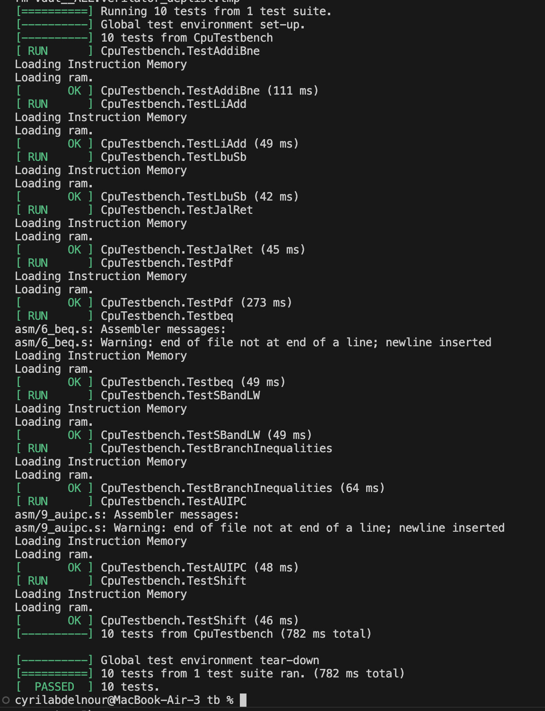

Personal statement · MD
Copy

# Personal Statement: Contributions to RISC-V Processor Project

## Table of Contents
- [1. Overview](#1-overview)
- [2. Single-Cycle Processor](#2-single-cycle-processor)
- [3. Full 37-Instruction Implementation](#3-full-37-instruction-implementation)
  - [3.1 Data Path Expansion](#31-data-path-expansion)
  - [3.2 Control Path Design](#32-control-path-design)
  - [3.3 Integration](#33-integration)
  - [3.4 Testing](#34-testing)
- [4. Pipelined Processor](#4-pipelined-processor)
  - [4.1 Forwarding Logic](#41-forwarding-logic)
  - [4.2 Top-Level Integration](#42-top-level-integration)
  - [4.3 Testing](#43-testing)
- [5. Branch Prediction](#5-branch-prediction)
  - [5.1 Branch Predictor](#51-branch-predictor)
  - [5.2 PCSrcF Assertion Logic](#52-pcsrcf-assertion-logic)
  - [5.3 Top-Level Integration](#53-top-level-integration)
  - [5.4 Testing](#54-testing)
- [6. Cache Implementation](#6-cache-implementation)
  - [6.1 L1 Cache Design](#61-l1-cache-design)
  - [6.2 Top-Level Integration](#62-top-level-integration)
  - [6.3 Testing](#63-testing)
- [7. Out-of-Order Superscalar (Arithmetic Instructions)](#7-out-of-order-superscalar-arithmetic-instructions)
  - [7.1 Register Alias Table (RAT)](#71-register-alias-table-rat)
  - [7.2 Re-Order Buffer (ROB)](#72-re-order-buffer-rob)
  - [7.3 Register Update Unit (RUU)](#73-register-update-unit-ruu)
  - [7.4 Pipelined Design](#74-pipelined-design)
  - [7.5 Overall Integration](#75-overall-integration)
- [8. Out-of-Order Superscalar (Full Version with Loads)](#8-out-of-order-superscalar-full-version-with-loads)
  - [8.1 Adapting Data Memory for Superscalar](#81-adapting-data-memory-for-superscalar)
  - [8.2 Doubling the Common Data Bus Width](#82-doubling-the-common-data-bus-width)
  - [8.3 Load Instruction Integration](#83-load-instruction-integration)
- [9. Mistakes Made](#9-mistakes-made)
- [10. Reflections](#10-reflections)
- [11. References](#11-references)


---

## 1. Overview

My passion for digital electronics and computer architecture drove my engagement throughout this project and the extensive research I undertook in order to implement more advanced concepts. In this statement, I present my work spanning multiple processor architectures, covering not only design and implementation but also the verification strategies I developed and the reasoning behind critical architectural decisions. I contributed to the development of several processor implementations, beginning with the single-cycle design and progressing through pipelining, cache integration, and branch prediction. The most substantial portion of my work focused on designing and implementing an out-of-order superscalar execution engine, which required thorough research beyond the scope of the course material. This involved understanding and building components such as the Register Aliasing Table, Re-Order Buffer, and Register Update Unit, culminating in a fully functional Out-of Order superscalar processor capable of handling both arithmetic and load instructions. Additionally, this document covers the strategies I used to address technical challenges, mistakes encountered along the way and their subsequent resolution, as well as the insights and lessons I gained from this experience.

---

## 2. Single-Cycle Processor

I worked on the core datapath components: data memory, register file, and ALU. The design choices I made here made it easier to extend the processor later.

**Data Memory:** I separated reads and writes into combinational and sequential logic. Reads don't change memory, so they can be combinational. Writes need to be clocked to avoid corrupting data:

```systemverilog
always_comb begin
    if(ByteWrite) begin
        dout[7:0] = ram_array[A];
        dout[31:8] = 24'b0;
    end
    else begin
        dout[7:0] = ram_array[A];
        dout[15:8] = ram_array[A+1];
        dout[23:16] = ram_array[A+2];
        dout[31:24] = ram_array[A+3];
    end
end

always_ff @(posedge clk) begin
    if (MemWrite && ByteWrite)
        ram_array[A] <= WD[7:0];
end
```

I used a single `ByteWrite` signal to handle both byte and word operations in the same module, so I didn't need separate memory interfaces. I used little-endian ordering to match the RISC-V spec: the least significant byte is stored at the lowest address. You can see this in the read logic where `ram_array[A]` maps to `dout[7:0]` (the lowest byte), and `ram_array[A+3]` maps to `dout[31:24]` (the highest byte).

**Register File:** I implemented two read ports and one write port, which is enough for RV32I. One important detail was hardwiring `x0` to zero in the read logic:

```systemverilog
always_comb begin
    RD1 = regfile_array[AD1];
    RD2 = regfile_array[AD2];
    A0  = regfile_array[10];
    regfile_array[0] = 0;
end
```

**ALU:** Instead of computing separate flags for each branch condition, I used a single equality flag (`EQ`) from subtraction. This kept the hardware simple and made it easy to add more branch types later:

```systemverilog
always_comb begin
    ALUout = 0;
    EQ = 1'b0;
    if (ALUop1 - ALUop2 == 0) EQ = 1'b1;
    case (ALUctrl)
        3'b000 : ALUout = ALUop1 + ALUop2;
        3'b001 : ALUout = ALUop1 - ALUop2;
        3'b010 : ALUout = ALUop1 & ALUop2;
        3'b011 : ALUout = ALUop1 | ALUop2;
        3'b100 : ALUout = ALUop2;
        default: ALUout = 32'b0;
    endcase
end
```

Setting outputs to zero at the start of the combinational block prevents latch inference. I kept this practice throughout the project.

I also created an ALU testbench during this phase, which I later improved when expanding to the full 37-instruction implementation.

---

## 3. Full 37-Instruction Implementation

For the full documentation of this section, see the [GitHub README](https://github.com/TahaMunir2/Team5/blob/FULL-RV32I/README.md).

Extending from 9 to 37 instructions required changes to both the datapath and control path. The goal was to keep the same overall structure while making it general enough to handle all RV32I instructions.

### 3.1 Data Path Expansion

**New Multiplexer for AUIPC:** I added a multiplexer (`mux_pcVSreg`) to select between `rs1` and the program counter as the first ALU operand. This was needed for `AUIPC`, which computes `PC + immediate`.

I noticed something useful about RISC-V: the PC is never paired with a register operand, it's always paired with an immediate. This meant I could safely add this mux without affecting other instructions.

```systemverilog
mux mux_pcVSreg(
    .in0(regOp),      // Register source 1
    .in1(pc_save),    // Program counter
    .sel(ALUsrc2),    // Control signal
    .out(ALUop1)      // To ALU operand 1
);
```

**Extended ALU:** I widened `ALUCtrl` from 3 bits to 4 bits to support all the new operations:

| ALUCtrl | Operation |
|---------|-----------|
| `0000` | ADD |
| `0001` | SUB |
| `0010` | AND |
| `0011` | OR |
| `0100` | XOR |
| `0101` | SLL (Shift Left Logical) |
| `0110` | SRL (Shift Right Logical) |
| `0111` | SRA (Shift Right Arithmetic) |
| `1000` | SLT (Set Less Than, signed) |
| `1001` | SLTU (Set Less Than, unsigned) |
| `1010` | LUI passthrough |
| `1011` | AUIPC |

**Extended Branch Comparisons:** The original design only had an `EQ` flag for `BNE`. I added `LT` (signed less than) and `LTU` (unsigned less than) to support all six branch instructions: `BEQ`, `BNE`, `BLT`, `BGE`, `BLTU`, `BGEU`.

**Memory Interface Extensions:** I replaced the single-bit `ByteWrite` with a 2-bit `SizeWrite` signal to distinguish between byte, half-word, and word stores. For loads, I added `LoadSize` (2 bits) and `LoadUnsigned` so the data memory can handle `LB`, `LH`, `LW`, `LBU`, and `LHU` correctly.

### 3.2 Control Path Design

The original control unit used nested `if`/`else` blocks for 9 instructions. This wouldn't scale, so I rewrote it using a `case(op)` structure with named opcode constants:

```systemverilog
localparam OPC_LUI    = 7'b0110111;
localparam OPC_AUIPC  = 7'b0010111;
localparam OPC_JAL    = 7'b1101111;
localparam OPC_JALR   = 7'b1100111;
localparam OPC_BRANCH = 7'b1100011;
localparam OPC_LOAD   = 7'b0000011;
localparam OPC_STORE  = 7'b0100011;
localparam OPC_OPIMM  = 7'b0010011;
localparam OPC_OP     = 7'b0110011;
```

Within each opcode case, I decode `funct3` and `funct7` to select the exact instruction. This made the controller easier to read and extend.

The key signals and their roles:
- `RegWrite`, `ImmSrc`, `PCSrc`, `ResultSrc`, `MemWrite` kept the same meaning as before
- `ALUsrc2` was added for the PC vs register mux
- `SizeWrite`, `LoadSize`, `LoadUnsigned` were added for memory operations

### 3.3 Integration

I kept all the original module interfaces intact. The register file, sign-extension unit, PC logic, and data memory only needed small changes to accept the new control signals. This made integration straightforward and I could test each change in isolation before connecting everything.


### 3.4 Testing

I first verified individual blocks, such as the control unit and ALU, writing c++ testbenches: `alu_tb.cpp` and `control_tb.cpp` .

Once confident in the core modules, I proceeded to evaluate the full integration using the five reference tests originally provided with the reduced RV32I version. I additionally wrote custom assembly programs that tested the new behaviors introduced in the full 37-instruction implementation each targeting specific instruction groups

The 10 assembly programs tested are listed below and an explanation for each one of them can be found on [GitHub README](https://github.com/TahaMunir2/Team5/blob/FULL-RV32I/README.md) :

1. **Basic arithmetic** (`ADDI`, `ADD`, `SUB`)
2. **Logical operations** (`AND`, `OR`, `XOR`, `ANDI`, `ORI`, `XORI`)
3. **Comparisons** (`SLT`, `SLTU`, `SLTI`, `SLTIU`)
4. **Shifts** (`SLL`, `SRL`, `SRA`, `SLLI`, `SRLI`, `SRAI`)
5. **Loads and stores** (`LB`, `LH`, `LW`, `LBU`, `LHU`, `SB`, `SH`, `SW`)
6. **Branches** (`BEQ`, `BNE`, `BLT`, `BGE`, `BLTU`, `BGEU`)
7. **Jumps** (`JAL`, `JALR`)
8. **Upper immediates** (`LUI`, `AUIPC`)

One test I'm particularly happy with is the signed vs unsigned branch test. It uses `-5` (which is `0xFFFFFFFB` in two's complement) and compares it with `2`:
- Signed (`BLT`): -5 < 2 → **True**
- Unsigned (`BLTU`): 4,294,967,291 < 2 → **False**

This catches bugs where signed and unsigned comparisons are mixed up.



All 37 instructions pass verification.

---

## 4. Pipelined Processor

For the full documentation of this section, see the [GitHub README](https://github.com/TahaMunir2/Team5/blob/PIPELINING/README.md#2-implementation).

Pipelining lets different parts of multiple instructions run at the same time. Instead of finishing one instruction before starting the next, we divide the processor into 5 stages (Fetch, Decode, Execute, Memory, Writeback) with registers between them. This increases throughput significantly.

### 4.1 Forwarding Logic

Data hazards happen when an instruction needs a result that's still in the pipeline. Instead of stalling, I added forwarding paths to send data directly from where it's available to where it's needed.

The key insight is that a result computed by the ALU is available at the end of the Execute stage, before it gets written back to the register file. I added two 4-to-1 multiplexers at the ALU inputs to select between three sources:

```systemverilog
mux4 forwardingRS1(
    .in0(RD1E),           // 00: Normal path from register file
    .in1(ResultW),        // 01: Forward from Writeback stage
    .in2(ALUResultM),     // 10: Forward from Memory stage
    .in3(RD1E),           // 11: Unused (default to register file)
    .select_line(ForwardAE),
    .out(SrcAE)    
);

mux4 forwardingRS2(
    .in0(RD2E),           // 00: Normal path from register file
    .in1(ResultW),        // 01: Forward from Writeback stage
    .in2(ALUResultM),     // 10: Forward from Memory stage
    .in3(RD2E),           // 11: Unused (default to register file)
    .select_line(ForwardBE),
    .out(WriteDataE)    
);
```

The Hazard Unit monitors register addresses across pipeline stages and generates `ForwardAE` and `ForwardBE` to control these muxes.

### 4.2 Top-Level Integration

Integrating the pipeline required careful attention to signal naming and control signal propagation.

**Signal Naming Convention:** With pipeline registers, the same signal exists in multiple stages for different instructions. I used suffixes to distinguish them:

| Suffix | Stage | Example |
|--------|-------|---------|
| `F` | Fetch | `PCF`, `InstrF` |
| `D` | Decode | `PCD`, `RD1D`, `RD2D` |
| `E` | Execute | `PCE`, `ALUResultE` |
| `M` | Memory | `PCM`, `ALUResultM` |
| `W` | Writeback | `ResultW`, `RdW` |

**Control Signal Propagation:** The control unit itself stays the same as the single-cycle version. The difference is that all control signals must travel through the pipeline registers alongside the data. For example, `MemWrite` generated in Decode must arrive at the Memory stage exactly when the corresponding instruction gets there.

**Register File Timing:** A key design strategie, implemented in the Register File, was to write on the falling edge of the clock instead of the rising edge. This lets:
- First half of cycle: Write to register file (Writeback stage)
- Second half of cycle: Read from register file (Decode stage)


### 4.3 Testing

#### 1) Pipelined Overlapping (No Hazards)
This test demonstrates correct instruction overlapping in the pipeline when no data or control hazards are present, confirming that multiple instructions execute simultaneously across different pipeline stages.
Here is the assembly code run by the processor and the results are shown in the waveform below:
This assembly code can be found in the `asm` folder and was created for testing the instruction overlapping characteristic introduced by pipelining.
```
.text
.globl main
main:
    addi    t0, zero, 10        # t0 = 10 
    addi    t1, zero, 20        # t1 = 20 
    addi    t2, zero, 30        # t2 = 30 
    addi    t3, zero, 40        # t3 = 40
    addi    a0, t3, 0           # a0 = t3 = 40
```
**Waveform:**


---

#### 2) Data Hazards: Read After Write (RAW)
This test verifies the forwarding unit by demonstrating how RAW hazards are resolved through the forwarding muxes, showing the change in the forward select lines when a dependent instruction requires data from a previous instruction still in the pipeline.
Here is the assembly code run by the processor and the results are shown in the waveform below:
I modified the assembly code provided in the `asm` folder `2_li_add` such that `li` is replaced with `addi`.
`li` is broken down into `lui` and `addi`, thus when `add a0, t1, t2` is in the execute stage of the original program `2_li_add` only one of the operand depends on a previous instruction still in the pipeline.
With this modification I have both `addi t1, zero, -900` and `addi t2, 10000` still in the pipeline when `add a0, t1, t2` is in the execute stage.
Note that since `addi` is an I-type instruction -9000 and 10000 are outside the range allowed for the immediate operand. Thus I changed the immediates to 1000 and -900 to adapt to my previous modifications.
Note that I also removed the branch instructions here because they don't provide any insights in demonstrating how RAW hazards are resolved through the forwarding muxes.
```
.text
.globl main
main:
    # li is broken into lui and addi for >12-bit values
    # don't forget that addi sign-extends
    addi t1, zero, -9000    # t1 = -900
    addi t2, zero, 10000    # t2 = 1000
    add a0, t1, t2  # a0 = t1 + t2      (=1000)
```
The `add a0, t1, t2` instruction depends on the values of t1 and t2, which are written by the immediately preceding `addi` instructions still in the pipeline. 
Since these values have not yet been written back to the register file, the forwarding unit detects the RAW hazard and routes the results directly from the Memory and Writeback pipeline registers to the ALU inputs. 
This allows the add instruction to execute correctly without stalling, demonstrating the effectiveness of my forwarding mechanism.
**Waveform:**


---

#### 3) Load-Use Hazards
This test demonstrates the 1-cycle stall required when a load instruction is immediately followed by a dependent instruction. The stall is achieved by:
- Disabling (freezing) the FD pipeline register for 1 cycle
- Preventing the program counter from incrementing for 1 cycle
- Flushing the DE pipeline register

To illustrate these points on GTKWave I use the assembly test: `3_lbu_sb`, where I am only interested in the following part:
```
    lbu t3, 0(s0)   # t3 = *(0x00010000)    (=100)
    lbu t4, 1(s0)   # t4 = *(0x00010001)    (=200)
    add a0, t3, t4  # a0 = t3 + t4          (=300)
```
In the following waveform, I can track the cycle in which the `add a0, t3, t4` reaches the Decode stage through the signal `InstrD` and the cycle in which it reaches the Execute stage through the ALU operands value (0xC8 corresponds to 200 and 0x64 corresponds to 100).
An important observation is that the Decode stage and the Execute stage are separated by 1 cycle caused by the stall.
The signals causing the stall are also shown in the waveform.
**Waveform:**


---

#### 4) Control Hazards: Branch Misprediction
Branches are predicted as not taken by default (see [Branch Prediction Enhancement](https://github.com/TahaMunir2/Team5/tree/branchprediction) for improved prediction). When a branch reaches the execute stage and is determined to be taken, a flush occurs to discard the incorrectly fetched instructions.
I used the assembly code `6_beq` with a small modification consisting of adding 2 instructions after the branch to illustrate how a flush occurs to discard the incorrectly fetched instructions.
```
.text
.globl main
main:
    addi t1, zero, 1
    li a0, 0
iloop:
    addi a0, a0, 1
    beq t1, a0, iloop
    addi a0, a0, 0
    addi a0, a0, 0
```
In the following waveform, I observe the flush signals high when `beq t1, a0, iloop` is in the Execute stage. 
We identify that `beq t1, a0, iloop` is in the Execute stage using the `PCE` signal. 
Crucially, we observe the value of the program counter being redirected correctly to the address of `iloop` corresponding to the value of `(program counter at beq t1, a0, iloop) - 4`:

Value of PCE for `beq t1, a0, iloop` in the Execute stage: **0xBFC0000C**

At the next cycle the value of PCF is: **0xBFC00008** (`PCE - 4`)

**Waveform:**


All test cases pass.

**Performance Analysis:**

I calculated the performance improvement from pipelining using the formula:

```
Execution Time = (# Instructions) × CPI × Tc
```

For a single-cycle processor, the clock period must accommodate the entire critical path:
```
Tc_single = 750 ps
```

For the pipelined processor, the clock period is determined by the slowest stage (Execute):
```
Tc_pipelined = 350 ps
```

Even accounting for stalls (CPI ≈ 1.23 instead of ideal 1.0), the pipelined processor achieves a **1.74× speedup** over the single-cycle design for a 300 billion instruction program:

| Processor | Clock Period | CPI | Execution Time |
|-----------|--------------|-----|----------------|
| Single-cycle | 750 ps | 1.0 | 225 s |
| Pipelined | 350 ps | 1.23 | 129 s |

This demonstrates the fundamental advantage of pipelining: higher throughput through instruction-level parallelism, even at the cost of slightly reduced efficiency per instruction.

---

## 5. Branch Prediction

For the full documentation of this section, see the [GitHub README](https://github.com/TahaMunir2/Team5/blob/branchprediction/README.md).

In the pipelined processor, instructions are fetched assuming `PC + 4`. Branch decisions are only resolved in the Execute stage, meaning incorrect instructions may already be in the pipeline. This causes control hazards that require flushes, wasting cycles.

The baseline approach predicts all branches as not taken, but this performs poorly for loops where backward branches are typically taken repeatedly. I implemented a two-bit dynamic branch predictor to reduce these penalties and integrated in the 5 stage pipelined processor.

### 5.1 Branch Predictor

#### Two Bits Instead of One

A one-bit predictor remembers only the last outcome. The problem is it mispredicts twice per loop: once at the first iteration (no history yet) and once at the last iteration (pattern breaks).

A two-bit predictor requires two consecutive mispredictions before changing its prediction. This means it only mispredicts once per loop instead of twice. 

The four states are: Strongly Taken, Weakly Taken, Weakly Not Taken, and Strongly Not Taken.

#### State Encoding

I intentionally encoded the states so that the MSB directly gives the prediction:

```systemverilog
typedef enum logic [1:0] {
    STRONGLY_NOT_TAKEN = 2'b00,
    WEAKLY_NOT_TAKEN   = 2'b01,
    WEAKLY_TAKEN       = 2'b10,
    STRONGLY_TAKEN     = 2'b11
} my_state;
```

- `0x` → Predict not taken
- `1x` → Predict taken

This means extracting the prediction is just reading a single bit:

```systemverilog
pred_taken = array[predict_index][1];
```

This is a Moore machine: the output depends only on the current state, not the inputs.

The FSM diagram is taken from Harris and Harris book :


#### Initialization Choice

```systemverilog
if (rst) begin
    for (int i = 0; i < TARGET_BUFFER_SIZE; i++)
        array[i] <= WEAKLY_NOT_TAKEN;
end
```

On reset, all entries initialize to `WEAKLY_NOT_TAKEN`. I could have also picked `WEAKLY_TAKEN`. However, I intentionally avoided `STRONGLY_TAKEN` or `STRONGLY_NOT_TAKEN` because these extreme states would bias the predictor before any branch history is available.

#### State Transitions

The FSM implements a saturating counter: the state moves toward "strongly taken" when branches are taken, and toward "strongly not taken" when they aren't, but never wraps around.

```systemverilog
case (array[update_index])
    STRONGLY_NOT_TAKEN: next = actual_taken ? WEAKLY_NOT_TAKEN : STRONGLY_NOT_TAKEN;
    WEAKLY_NOT_TAKEN:   next = actual_taken ? WEAKLY_TAKEN     : STRONGLY_NOT_TAKEN;
    WEAKLY_TAKEN:       next = actual_taken ? STRONGLY_TAKEN   : WEAKLY_NOT_TAKEN;
    STRONGLY_TAKEN:     next = actual_taken ? STRONGLY_TAKEN   : WEAKLY_TAKEN;
endcase
```

#### Timing: Negative Edge

```systemverilog
always_ff @(negedge clk)
```

The state update occurs on the falling edge of the clock. This ensures that:
1. The prediction is read during the first half of the cycle (Fetch stage)
2. The state update from Execute happens during the second half, avoiding read-write conflicts

This follows the same strategy used for the register file in the pipelined processor.

### 5.2 PCSrcF Assertion Logic

The main challenge with branch prediction is that two stages compete to control the PC:
- **Fetch stage**: Makes speculative predictions for newly fetched branches
- **Execute stage**: Resolves actual branch outcomes and may need to correct mispredictions

I created the `PCSrcF_assertion` module to arbitrate between them using a priority-based approach.

#### Priority Logic

**Priority 1 (Highest): Jump Instructions**
```systemverilog
if (JumpE) begin
    PCSrcF = PCSrcE;
    FinalTarget = targetE;
end
```
Jumps (`JAL`/`JALR`) in Execute always take precedence since they are unconditional.

**Priority 2: Misprediction Recovery**
```systemverilog
else if (BranchE && false_prediction) begin
    if (predictionE) begin
        PCSrcF = 2'b11;  // Predicted taken, actually not taken
    end
    else begin
        PCSrcF = 2'b01;  // Predicted not taken, actually taken
        FinalTarget = targetE;
    end
end
```

When Execute detects a misprediction, I correct the PC:

| Prediction | Actual | Recovery Action |
|------------|--------|-----------------|
| Taken | Not Taken | `PCSrcF = 2'b11` : Resume at `PC + 4` (wrong path taken) |
| Not Taken | Taken | `PCSrcF = 2'b01` : Jump to `targetE` (should have branched) |

**Priority 3 (Lowest): New Branch Prediction**
```systemverilog
else begin
    if (BranchF) begin
        if (predictionF) begin
            PCSrcF = 2'b01;
            FinalTarget = targetF;
        end
        else begin
            PCSrcF = 2'b00;
        end
    end
end
```

If no Execute-stage corrections are needed and Fetch contains a branch, I follow the prediction.

#### Output Encoding

| PCSrcF | Next PC Source | Condition |
|--------|----------------|-----------|
| `2'b00` | `PC + 4` (Fetch) | Sequential execution |
| `2'b01` | `FinalTarget` | Branch predicted/confirmed taken |
| `2'b11` | `PCPlus4E` (Execute) | Misprediction recovery |

Note that `2'b00` and `2'b11` both select a `PC + 4` value, but from different stages. When recovering from a "predicted taken, actually not taken" misprediction, I must return to the `PC + 4` of the mispredicted branch, which has propagated to Execute as `PCPlus4E`.

### 5.3 Top-Level Integration

#### Misprediction Detection

I created the `evalprediction` module to compare what I predicted against what actually happened:

```systemverilog
always_comb begin
    false_prediction = 0;
    if (BranchE == 1) begin
        case (PCSrcE)
            2'b00: if (pred_taken)  false_prediction = 1;
            2'b01: if (!pred_taken) false_prediction = 1;
            default: false_prediction = 0;
        endcase
    end
end
```

Defaulting to `0` prevents unnecessary pipeline flushes when no branch is in Execute.

#### Prediction Propagation

The prediction made in Fetch must travel with the instruction to Execute for comparison. I added `predictionE` to the pipeline registers so that when a branch reaches Execute, I still know what prediction was made for it.

#### Hazard Unit Modifications

I modified the hazard unit to only flush on mispredictions or jumps, not on every taken branch:

```systemverilog
if (false_prediction || JumpE) begin
    flush_f_d    = 1;
    flush_d_exec = 1;
end
```

Here is the top sheet schematic for reference :


Thus, I achieve the key improvement: when the predictor guesses correctly, I avoid the flush penalty entirely.


### 5.4 Testing

#### Branch Predictor Unit Testing

I created a C++ testbench (`predictor_tb.cpp`) that isolates the branch predictor module and verifies:
- **Initial State**: All entries initialize to `WEAKLY_NOT_TAKEN` after reset
- **State Transitions**: Correct transitions on taken/not-taken outcomes
- **Saturation**: Counter stays at `STRONGLY_TAKEN` or `STRONGLY_NOT_TAKEN` when saturated
- **Misprediction Tolerance**: Two consecutive mispredictions required to flip prediction

#### Full Circuit Testing

I tested using a loop program (`1_addi_bne`) that counts from 0 to 255.

```assembly
.text
.globl main
# this is a modified version of the Lab4 test program
# which doesn't run in an infinite loop
main:
    addi    t1, zero, 0xff      # t1 = 255
    addi    a0, zero, 0x0       # output = 0
mloop:
    addi    a1, zero, 0x0       # i = 0
iloop:
    addi    a0, a1, 0           # output = i
    addi    a1, a1, 1           # i++
    bne     a1, t1, iloop       # if i != 255, goto iloop
    bne     a0, zero, finish    # enter finish state

finish:      # expected result is 254
    bne     a0, zero, finish     # loop forever
```

When the branch predictor correctly predicts the branch outcome, no pipeline flush occurs and execution continues without penalty.

Since the branch predictor's initial state is `WEAKLY_NOT_TAKEN`, it will start prediciting correctly at the second iteration of the loop. 

In the following waveform, we observe that the value of `PCF` ( PC at the fetch stage) decreases by 8 (jumps back by 2 to `iloop`) automaticaly when the branch instruction is fetched.

Thus, we avoid the penalty of waiting 2 extra cycles (until the branch instruction reaches the Execute stage) to jump back to the correct address. 

Note that:
- `0xFE659CE3` corresponds to the instruction : ` bne     a1, t1, iloop `
- `0x00058513` corresponds to the instruction : ` bne     a0, a1, 0 `


**Waveform:**


All test cases pass.

---

## 6. Cache Implementation

For the full documentation of this section, see the [GitHub README](https://github.com/TahaMunir2/Team5/blob/Hierarchical-cache/README.md).

We implemented a full memory hierarchy: 2-way associative L1 instruction and data caches, and a 4-way associative L2 cache with write-back policy and dirty bit tracking.

| Cache | Size | Sets | Associativity | Block Size |
|-------|------|------|---------------|------------|
| L1 Instruction | 4096 B | 128 | 2-way | 4 words |
| L1 Data | 4096 B | 128 | 2-way | 4 words |
| L2 | 8192 B | 64 | 4-way | 8 words |

### 6.1 L1 Cache Design

I was heavily involved in the brainstorming sessions where we defined the cache architecture and replacement policies. I wrote the first draft implementation of the L1 cache controller, including the LRU replacement logic for 2-way associativity.

My teammates then rewrote and adapted this logic to fit within the full cache circuit, adding support for different load sizes (byte, half-word, word), signed/unsigned extension, and the store path with dirty bit management. The final L1 data cache handles loads and stores of different sizes, write-back to L2, and stall generation on misses.

### 6.2 Top-Level Integration

I was responsible for integrating the cache hierarchy into the pipelined processor. The challenge was that when an L1 cache misses, the entire pipeline must freeze, because if the instruction cache misses there's nothing to decode and if the data cache misses the memory stage cannot complete.

I created global stall signals that propagate through every pipeline component:

| Component | Enable Signal |
|-----------|---------------|
| Fetch-Decode Register | `!(stall_l1i \|\| stall_l1d)` |
| Decode-Execute Register | `!(stall_l1i \|\| stall_l1d)` |
| Execute-Memory Register | `!(stall_l1i \|\| stall_l1d)` |
| Memory-Writeback Register | `!(stall_l1i \|\| stall_l1d)` |
| PC Block | `!(stall_l1i \|\| stall_l1d)` |
| Branch Predictor | `!(stall_l1i \|\| stall_l1d)` |

When either stall signal is high, every register holds its value, the PC stops incrementing, and the branch predictor stops updating. Once the miss is resolved, the pipeline resumes exactly where it left off.

One subtlety: in simulation, cache hits still take one cycle, so there's no visible speedup. But in real hardware, a cache hit takes 1-3 nanoseconds while main memory takes 50-100 nanoseconds. The cache hierarchy would provide significant acceleration in a physical implementation.

### 6.3 Testing

I tested the full cache integration using assembly programs that had previously worked correctly on the pipelined processor (with branch prediction) without cache. This approach let me isolate cache-related bugs from other issues.

One bug I caught through GTKWave was particularly subtle. A loop that ran correctly without cache started mispredicting every branch once cache was enabled. Tracing through the signals, I noticed the branch predictor was updating its state during cache stalls but with garbage inputs, since the pipeline was frozen and no valid branch information was flowing. The predictor table got corrupted.

The fix was simple once I understood the problem: I had forgotten to include the branch predictor in the global stall logic. Adding `enable_branch_predictor = !(stall_l1i || stall_l1d)` ensured the predictor freezes alongside everything else during a cache miss.

---

## 7. Out-of-Order Superscalar (Arithmetic Instructions)

For the full documentation of this section, see the [GitHub README](https://github.com/TahaMunir2/Team5/blob/ooo-superscalar/README.md).

This section represents the most substantial part of my contribution to the project. The concepts implemented here extend beyond the scope of the lecture material, requiring extensive independent research into advanced computer architecture techniques pioneered in the 1960s and refined through decades of processor development.

### Background and Motivation

A conventional pipelined processor achieves a CPI (Cycles Per Instruction) of 1 or above, limited by hazards and dependencies. A superscalar processor breaks this barrier by duplicating execution hardware, enabling multiple instructions to complete per cycle.

I implemented a 2-way superscalar processor featuring:
- 2 instructions fetched per cycle
- 2 ALUs operating in parallel
- Dual-ported register file to support simultaneous reads and writes
- Duplication of the necessary logic like control unit and sign extension block to support these changes

The problem with superscalar execution is that data hazards are amplified. When two instructions are fetched together, they may depend on each other or on recently issued instructions. In an in-order superscalar processor, a dependent instruction blocks all subsequent instructions from executing, even if they are independent.

Consider this example:
```asm
ADD  x1, x2, x3    # Produces x1
SUB  x4, x1, x5    # Depends on x1, must wait
AND  x6, x7, x8    # Independent, could execute, but is blocked
```

In an in-order design, `AND` cannot be issued until `SUB` is issued, even though `AND` has no dependency.

Out-of-order execution solves this by allowing independent instructions to bypass stalled ones. The processor fetches instructions into a buffer, analyzes their dependencies, and issues them not in program order, but in an order that maximizes ALU utilization while respecting true data dependencies. Instructions execute out of order (when operands are ready) but commit in order (preserving program correctness).

### The Tomasulo Algorithm

My implementation is based on Tomasulo's algorithm, originally developed for the IBM System/360 Model 91. After researching this algorithm extensively, I identified four key components:

| Component | Purpose |
|-----------|---------|
| **Register Alias Table (RAT)** | Renames registers to eliminate false dependencies (WAR and WAW) |
| **Re-Order Buffer (ROB)** | Tracks instructions for in-order commit |
| **Register Update Unit (RUU)** | Holds instructions waiting for operands (reservation stations) |
| **Common Data Bus (CDB)** | Broadcasts results to wake up dependent instructions |

### 7.1 Register Alias Table (RAT)

The RAT eliminates false dependencies (WAR and WAW hazards) through register renaming. Instead of tracking architectural register names (x0–x31), the RAT maps each register to a producer tag.

The producer tag is a unique identifier for the instruction that will produce the register's value.

#### Tag Width Selection

```systemverilog
parameter NREGS     = 32,   // Number of architectural registers (x0–x31)
parameter PROD_BITS = 6     // Tag width (supports up to 64 in-flight instructions)
```

I chose 6-bit tags to match the ROB depth of 64 entries. Since each in-flight instruction occupies one ROB entry, 6 bits (`2^6 = 64`) provides enough unique tags to identify all possible instructions in the pipeline. This keeps the tag field compact to minimize access delays while supporting sufficient instruction-level parallelism for the 2-way superscalar design.

#### Tag Assignment Strategy

Each cycle, two new instructions receive consecutive tags:

```systemverilog
assign inst1_prod_id = producer_counter - 6'b000001;  // Tag N-1
assign inst2_prod_id = producer_counter;               // Tag N
```

Instruction 1 (older) gets `producer_counter - 1`, instruction 2 (younger) gets `producer_counter`. This ensures program order is encoded in the tag values, which is critical for the ROB to maintain correct commit order.

### 7.2 Re-Order Buffer (ROB)

The ROB is the central module in the implementation. It interacts in three different stages:
1. **Decode/Rename**: Keeps track of all instructions fetched because it retains program order
2. **Execution**: Stores results after execution
3. **Commit**: Commits results in program order to the register file

#### Circular Buffer Implementation

The ROB is implemented as a circular buffer with 64 entries. Each entry contains:

| Field | Width | Description |
|-------|-------|-------------|
| `dest_reg` | 5 bits | Destination architectural register |
| `value` | 32 bits | Computed result (filled on writeback) |
| `ready` | 1 bit | Set when execution completes |

I use head and tail pointers to track the oldest instruction (ready to commit) and the next free slot (ready for allocation) without searching through the entire buffer.

#### Sequential Operations

The ROB performs three operations: Allocation, Writeback, and Commit.

**Allocation:** When instructions are dispatched, they are allocated at the `tail` pointer. The tail advances by 1 or 2 depending on how many instructions are allocated.


**Writeback:** When an ALU finishes execution, it broadcasts the result on the CDB. The ROB captures the value and sets `ready=1`. Since execution does not occur in order, results arrive at the ROB out of program order.


**Commit:** Instructions commit from the `head` in program order. Only entries with `ready=1` that haven't been committed yet can retire. The ROB commits up to 2 instructions per cycle:

| Instructions Ready | Instructions Committed |
|--------------------|------------------------|
| 0 | 0 |
| 1 | 1 |
| 2+ | 2 |


#### Dual Commit Logic

For single commit, the logic is straightforward:
```systemverilog
assign commit1_valid = !rob_empty && ready[head];
```

For the second commit slot, I had to handle a tricky condition:

```systemverilog
assign commit2_valid =
    commit1_valid &&                  // First must be valid
    (head_next != tail) &&            // Second entry exists
    ready[head_next];                 // Second is ready
```

The key insight is that `tail` marks the first empty slot. If `head_next == tail`, I've reached the empty region, meaning only one instruction can potentially be committed.

### 7.3 Register Update Unit (RUU)

The RUU (also known as Reservation Stations in Tomasulo's algorithm) holds instructions waiting for their operands. It enables out-of-order execution by:
1. Buffering instructions until source operands become available
2. Waking up instructions when results are broadcast on the CDB
3. Issuing ready instructions to the ALUs for execution

#### Entry Structure

Each entry is a packed struct:

```systemverilog
typedef struct packed {
    logic                     valid;      // Slot in use
    logic                     issued;     // Already sent to ALU?
    logic [TAG_BITS-1:0]      dest_tag;   // ROB tag for this instruction
    logic                     src1_valid; // Is source 1 ready?
    logic [TAG_BITS-1:0]      src1_tag;   // Producer tag for source 1
    logic [31:0]              src1_value; // Value of source 1
    logic                     src2_valid; // Is source 2 ready?
    logic [TAG_BITS-1:0]      src2_tag;   // Producer tag for source 2
    logic [31:0]              src2_value; // Value of source 2
    logic [CONTROL_WIDTH-1:0] ctrl;       // ALU control signals
} ruu_entry_t;
```

The `issued` flag prevents an instruction from being sent to an ALU multiple times.

#### Timing Strategy: Negative Edge for Writeback

This was one of the most important optimizations I discovered through debugging with GTKWave:

```systemverilog
always_ff @(negedge clk) begin
    // Writeback (wake-up) logic
end
```

The writeback logic runs on the negative edge of the clock while dispatch, issue, and free run on the positive edge. 

When an ALU produces a result, dependent instructions can wake up and potentially issue in the same cycle.

Without this, an instruction would have to wait an extra cycle after its producer completes before it could issue. I discovered this delay by examining ALU operand signals in GTKWave, where I observed instructions waiting unnecessarily. After implementing negative-edge writeback, the delay was eliminated and throughput increased.

Below is what I observed before writing back at the negative edge of the clock: (all the work was done in the positive edge)


Below is what I observed before writing back at the negative edge of the clock:


### 7.4 Pipelined Design

To maximize throughput, I divided the processor into 5 pipeline stages, each designed to complete within a similar time budget.

#### Pipeline Stages

| Stage | Name | Operations | Critical Path |
|-------|------|------------|---------------|
| **F** | Fetch | Read 2 instructions from memory | 290 ps |
| **D** | Rename/Decode | Decode, read registers, RAT/ROB lookup | 245 ps |
| **Iss** | Dispatch/Issue | Insert to RUU, select ready instructions | 240 ps |
| **E** | Execute | ALU computation, write to ROB | 210 ps |
| **C** | Commit | Write to register file, free RUU | 130 ps |

**Clock Period = 290 ps** (limited by Fetch stage)

#### Implicit Pipelining Between Execute and Commit

There is no explicit pipeline register between Execute and Commit stages. However, pipelining is maintained because:
- Execute stage writes results to ROB on the positive edge
- Commit stage reads from ROB head and writes to the register file on the positive edge

Since the ROB has separate head and tail pointers, these operations target different entries. While one pair of instructions is being written to the ROB, another pair is being committed to the register file.

#### Performance Analysis

For comparison with a single-cycle arithmetic-only processor:

| Metric | Single-Cycle | 5-Stage OoO Superscalar |
|--------|--------------|-------------------------|
| Clock Period | 550 ps | 290 ps |
| CPI | 1.0 | < 1.0 (superscalar) |
| Instructions/Cycle | 1 | Close to 2 |

**Theoretical Speedup:**
- Clock speedup: 550 / 290 = **1.9×**
- Superscalar factor: up to **2×**
- Combined potential: up to **3.8×** throughput improvement

### 7.5 Overall Integration

#### Source Operand Validity Logic

The most critical part of the integration is determining where each source operand comes from and whether it's available. For each source register, I follow this decision process:


1. **Check RAT**: Does this register have an in-flight producer?
2. **If no producer**: Fetch from register file (operand valid)
3. **If has producer, check ROB**: Is the producer's result ready?
4. **If ROB ready**: Fetch from ROB (operand valid)
5. **If ROB not ready**: Wait for CDB (operand not valid, store tag)


```systemverilog
always_comb begin
    if (!rat_has_producer) begin
        operand_valid      = 1'b1;
        fetch_from_regfile = 1'b1;
    end
    else if (rob_entry_ready) begin
        operand_valid      = 1'b1;
        fetch_from_regfile = 1'b0;
    end
    else begin
        operand_valid      = 1'b0;
        fetch_from_regfile = 1'b0;
    end
end
```

#### Special Case: Instruction 2 Depends on Instruction 1

The logic above works for Instruction 1, but Instruction 2 has a complication: the RAT and ROB haven't been updated yet with Instruction 1's destination.

Consider:
```asm
ADD  x5, x1, x2    # Instr1: produces x5
SUB  x6, x5, x3    # Instr2: needs x5 — but RAT doesn't know about Instr1 yet!
```

When I look up `x5` in the RAT for Instruction 2, it returns the old producer, not Instruction 1. I added extra dependency checking:

```systemverilog
assign is_rs3_dependent_on_RD1 = (RD1 == RS3);
assign is_rs4_dependent_on_RD1 = (RD1 == RS4);
```

If there's a dependency, I bypass the normal RAT/ROB lookup and use Instruction 1's tag (`latest_tag - 1`) so that when Instruction 1 executes, it will correctly fill the operand value in the RUU via the CDB.

#### Schematic


### Testing

I created unit testbenches for each component (RAT, ROB, RUU) and 10 assembly test programs targeting specific hazard scenarios:

1. **Basic arithmetic** : verifies immediate loading and addition
2. **RAW dependency chain** : instructions depending on previous results
3. **WAR hazard** : ensures old values are read before new values are written
4. **WAW hazard** : ensures in-order commit preserves final values
5. **Instruction-level parallelism** : independent instructions execute in parallel
6. **Register reuse** : alternating writes to the same register
7. **Addition and subtraction** : mixed operations with dependencies
8. **Shift operations** : shift-immediate with RAW dependencies
9. **Logical operations**  : OR, AND, XOR with dependencies
10. **Complex shifts** : immediate and register-based shifts combined

#### Performance Evidence

```asm
addi t0, zero, 1
slli t1, t0, 4          # t1 = 16
slli t2, t1, 2          # t2 = 64
addi t3, zero, 256
srli t4, t3, 1          # t4 = 128
add  a0, t2, t4         # a0 = 192
srli a0, a0, 1          # a0 = 96
addi a0, a0, 32         # a0 = 128
```


In the shift operations test, I measured:
- In-order scalar: 8 instructions ÷ 8 cycles = **IPC = 1.0**
- In-order superscalar: 8 instructions ÷ 6 cycles = **IPC = 1.33**
- Out-of-order superscalar: 8 instructions ÷ 5 cycles = **IPC = 1.6**

This represents a **60% improvement** over the baseline IPC of 1.

GTKWave analysis confirmed simultaneous execution: ALU1 processing one instruction while ALU2 concurrently handles an independent instruction that was fetched later but had no dependencies.


We observe ALU1 executing tag 02 (the `slli t1, t0, 4` instruction producing 0x10 = 16) while simultaneously ALU2 executes tag 04 (the independent `addi t3, zero, 256` producing 0x100 = 256). The out-of-order scheduler ( the Register-Update Unit) identified that instruction 4 has no dependencies on instructions 2 or 3 and issued it immediately to the second ALU.

All test cases pass.

---

Section8 personal statement · MD
Copy

## 8. Out-of-Order Superscalar (Full Version with Loads)

For the full documentation of this section, see the [GitHub README](https://github.com/TahaMunir2/Team5/blob/out_of_order_superscalar_full_version/README.md).

Building on the arithmetic out-of-order processor, I extended the design to support load instructions (`LW`, `LH`, `LB`, `LHU`, `LBU`). The core Tomasulo infrastructure (RAT, ROB, RUU, CDB) remained unchanged, my goal was to integrate loads with minimal disruption to the existing architecture.

### 8.1 Adapting Data Memory for Superscalar

The original data memory supported one read per cycle. In a 2-way superscalar processor, two load instructions may execute simultaneously, so I adapted the memory to provide two independent read ports:

```systemverilog
module sup_datamem (
    // Port 1
    input  logic [ADDRESS_WIDTH-1:0] A1, 
    input  logic [1:0]               LoadSize1,
    input  logic                     LoadUnsigned1,
    output logic [DATA_WIDTH-1:0]    dout1,
    
    // Port 2
    input  logic [ADDRESS_WIDTH-1:0] A2,
    input  logic [1:0]               LoadSize2,
    input  logic                     LoadUnsigned2,
    output logic [DATA_WIDTH-1:0]    dout2
);
```

Both ports access the same underlying memory array simultaneously. Since I only support load instructions (not stores) in this version, there's no write interface—this simplification avoids the complexity of memory disambiguation that stores would require.

### 8.2 Doubling the Common Data Bus Width

The key challenge was that results now come from two sources: ALUs and memory. Since both can produce results in the same cycle, the CDB must handle 4 writebacks simultaneously.

#### ROB and RUU Modifications

I extended both modules from 2 writeback ports to 4:

| Port | Source | Description |
|------|--------|-------------|
| `wb1` | ALU 1 | First ALU result |
| `wb2` | ALU 2 | Second ALU result |
| `wb3` | Memory Port 1 | First load result |
| `wb4` | Memory Port 2 | Second load result |

The writeback logic is straightforward, each port writes to a different ROB entry (identified by its unique tag), so there are no conflicts:

```systemverilog
always_ff @(posedge clk) begin
    // ALU writebacks
    if (wb1_en) begin
        value[wb1_tag] <= wb1_value;
        ready[wb1_tag] <= 1'b1;
    end
    if (wb2_en) begin
        value[wb2_tag] <= wb2_value;
        ready[wb2_tag] <= 1'b1;
    end
    // Memory writebacks
    if (wb3_en) begin
        value[wb3_tag] <= wb3_value;
        ready[wb3_tag] <= 1'b1;
    end
    if (wb4_en) begin
        value[wb4_tag] <= wb4_value;
        ready[wb4_tag] <= 1'b1;
    end
end
```

The RUU wakeup logic required the same extension, any instruction waiting on any of these four tags must wake up in the same cycle.

### 8.3 Load Instruction Integration

#### Single Source Operand Strategy

Loads use only RS1 (base address), unlike arithmetic instructions that use both RS1 and RS2. Rather than creating separate logic paths, I reused the existing dual-operand infrastructure:

- RS1 provides the base address (processed normally through RAT/ROB lookup)
- RS2 is ignored; instead, I calculate `RS1 + immediate` in the Decode stage
- The computed address is stored directly in the RUU as the "operand"

This means by the time a load reaches the Issue stage, its effective address is already computed and ready.

#### New Execute-Memory Pipeline Register

Loads require an additional pipeline stage for memory access. I added a new pipeline register between Execute and Memory:

```systemverilog
em_sup_pipeline em_pipeline(
    .clk(clk),
    .rst(rst),
    // Control signals propagate
    .ResultSrc1_e(ResultSrc1E),
    .LoadSize1_e(LoadSize1E), 
    .LoadUnsigned1_e(LoadUnsigned1E),
    .ResultSrc1_m(ResultSrc1M),
    .LoadSize1_m(LoadSize1M), 
    .LoadUnsigned1_m(LoadUnsigned1M),
    // Address (computed in Execute, used in Memory)
    .address1_e(ALU1_op1E),
    .address1_m(A1),
    // ROB tags propagate for writeback identification
    .ALU1_tagE(ALU1_tagE),
    .ALU1_tagM(mem1_tag)
);
```

The tags propagate so the Memory stage knows which ROB entry to update when the load completes.

#### Schematic


### 8.4 Testing

I created 7 new tests specifically for load functionality, in addition to reusing the 10 arithmetic tests to ensure backward compatibility:

| Test | Purpose | Key Verification |
|------|---------|------------------|
| Basic word load | `LW` functionality | Correct little-endian assembly |
| Load with RAW dependency | CDB wakeup for loads | `add` waits for both `lw` results |
| Load WAW hazard | In-order commit with loads | Younger load overwrites older |
| Independent load chains | Parallel execution | Two chains execute simultaneously |
| Signed vs unsigned byte | `LB` vs `LBU` | Sign extension correctness |
| Signed vs unsigned halfword | `LH` vs `LHU` | Sign extension correctness |
| Mixed load operations | All load types combined | Multiple in-flight loads |

All 17 tests pass.


---

## 9. Mistakes Made

**Loose Naming Conventions:** Before pipelining, the team agreed on a naming convention, but it wasn't strict enough. We said signals should have stage suffixes like `D`, `E`, `M`, but we didn't define exactly how to name intermediate wires or which signals needed suffixes. When we integrated our modules, half the time was spent figuring out what each other's signals meant. This taught me that agreeing on interfaces before coding individually is just as important as the code itself.

**Cache Stall Not Freezing the Branch Predictor:** When I integrated the cache, I added enable signals to freeze all pipeline registers during a cache miss. But I forgot the branch predictor. The pipeline was frozen, but the predictor kept updating its state based on stale signals. This corrupted the prediction table. I only found this because a loop that ran correctly without cache started mispredicting every branch with cache in the processor. Once I traced through the signals, I realized the predictor was seeing garbage inputs while the pipeline was stalled. Adding `enable_branch_predictor = !(stall_l1i || stall_l1d)` fixed it.

**Instruction 2 Depending on Instruction 1:** In the superscalar design, I fetch two instructions per cycle. When the second instruction depends on the first (for example: `ADD x5, x1, x2` followed by `SUB x6, x5, x3`), the RAT lookup for `x5` returns the old producer and not Instruction 1 because the RAT hasn't been updated yet. I only caught this when a specific test failed. The fix was adding explicit bypass logic to detect when RS3 or RS4 matches RD1.

**Positive-Edge Writeback in the RUU:** In the out-of-order processor, I did everything on the positive clock edge. When I looked at the waveforms in GTKWave, I saw instructions waiting an extra cycle for no reason. Moving writeback to the negative edge fixed it. I wouldn't have found this without tracing signals cycle-by-cycle.

These mistakes taught me more than getting things right the first time would have.

---

## 10. Reflections

Looking back at this project, I'm genuinely grateful for the experience. It pushed me far beyond what I expected to learn in a single coursework.

### What I'm Taking Away

The most valuable outcome is the set of skills I'll carry into my career. Debugging with GTKWave taught me how to systematically trace through a complex system, choosing the right signals to watch and reasoning about timing. Early on, the processor felt overwhelming with so many signals. By the end, I could follow a single instruction through the entire pipeline cycle-by-cycle. This kind of methodical analysis applies far beyond processor design.

I also became much more comfortable thinking in hardware rather than software. SystemVerilog looks like code, but it describes circuits. There were moments where I wrote something that made sense sequentially, only to realize it would synthesize into something completely wrong because hardware is concurrent. The mindset shift of understanding what's happening in parallel rather than step-by-step—is something I'll use in any future hardware work.

### Collaboration

But beyond the technical skills, the biggest growth came from collaborating with my teammates to build something real. We started with basic components and ended up with an actual working processor. Coordinating across multiple branches, agreeing on interfaces, integrating each other's modules, debugging together. I learned how to communicate technical decisions clearly, how to divide work without creating gaps or overlaps, and how to adapt when things didn't go as planned. Having the opportunity to work with peers on something this complex was invaluable.

### Research Beyond the Course

The out-of-order superscalar work was also a good learning experience. The lectures gave us pipelining and basic hazard handling, but Tomasulo's algorithm wasn't covered. I spent time reading about the algorithm through different ressources (mentioned below), understanding how register renaming is implemented, and figuring out how the Re-Order Buffer maintains correctness while allowing out-of-order execution. Piecing this together from papers and documentation and then actually building it was incredibly satisfying.

### Looking Forward

I'm proud of what we built however there's more I'd love to explore: extending the superscalar design to handle stores, implementing speculative execution with misprediction recovery and integrating these features requires addressing 2 main challenges:

**Branch and Jump Handling**: The ROB already tracks program order, which is what we need for speculative execution. On misprediction, we would flush younger ROB entries and restore the RAT. The challenge is that misprediction penalties are much worse in Out-of Order superscalar. This is because in a 2-way issue and out-of-order execution, the pipeline fills faster, so each misprediction wastes more work. Our 2-bit predictor helps, but modern wide processors use neural-network-based predictors because the cost is so high.

**Store Instruction Handling**: Stores are tricky because out-of-order execution could write to memory in the wrong order. The solution is to only write to cache at commit time, ensuring stores complete in program order.

This coursework gave me both the foundation and the confidence to keep going, enabling me to tackle increasingly complex projects with clarity and purpose.

## 11. References

- [Out-of-Order Processor Overview from ScienceDirect](https://www.sciencedirect.com/topics/computer-science/out-of-order-processor)
- [Register Renaming Techniques](https://fiveable.me/advanced-computer-architecture/unit-6/register-renaming-techniques/study-guide/6kjpVCqRFiiGhaTX)
- [The Reorder Buffer](https://docs.boom-core.org/en/latest/sections/reorder-buffer.html)
- [The Rename Stage](https://docs.boom-core.org/en/latest/sections/rename-stage.html)

---
