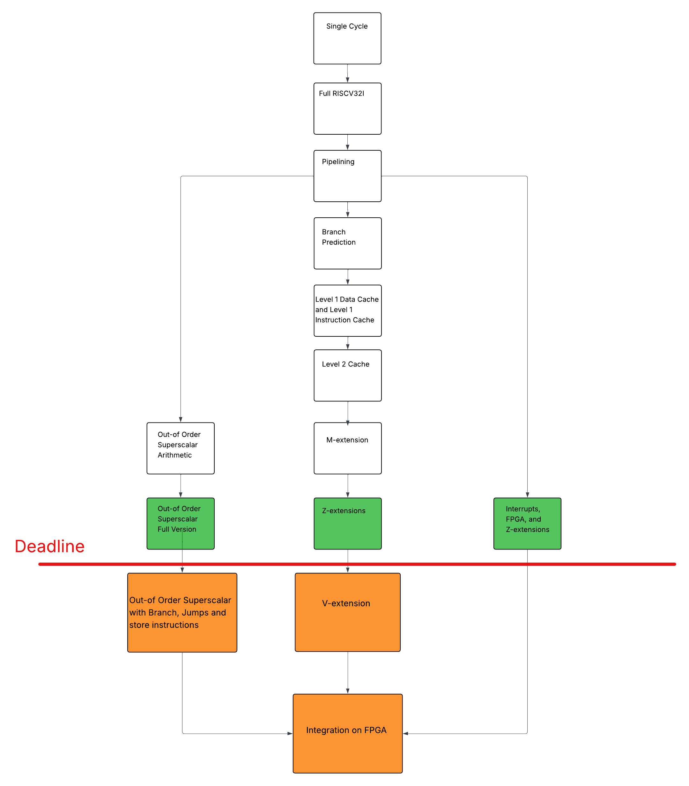

## Introduction

This Team Statement details the design and testing processes carried out by Team 5 for the implementation of the RISCV 32-bit CPU architecture, including a number of its extensions. 

Throughout the project, we maintained regular discussions to validate design decisions, prioritised deadlines, and resolved implementation challenges collaboratively. Whenever a module affected others, we aligned our work through version control, interface documentation, and consistent SystemVerilog conventions. This helped us avoid conflicts, streamline testing, and iterate on complex features in our design.

At the beginning of each stage of the project, our team established a clear division of tasks and agreed on common design principles to ensure that every component of the processor could integrate smoothly into a single unified architecture. Difficulties such as timing conflicts or inconsistent module behaviour were addressed collaboratively, reinforcing the importance of collective problem-solving in computer architecture projects.

Overall, this CPU project has been a practical demonstration of technical cooperation, disciplined planning, and organised development. Our final implementation not only reflects the functionality of a working RISC-V processor but also the effectiveness of our workflow, communication, and mutual accountability as a team. We all worked with passion, which we believe drove us to produce the results that we revel in.

## Quick Start
For this project, in accordance with the guidance provided in the Project Brief, we implemented the full set of 37 instructions in the RISCV32I architecture, and the proposed extensions of Pipelining and Cache. We implemented 2 levels of cache: 2-way associative split level 1 cache (L1d and L1i) and 4-way associative level 2 cache. 

We then further complemented our design by implementing a 2-bit branch predictor, the RISCV M, Zicsr and Zba extensions, and an out-of-order Superscalar architecture for arithmetic and load instructions. Finally, we added external and timer interrupts and specific control status registers for trap handling, which we then used to port our CPU onto a DE-10 Lite FPGA board with external inputs, an internal timer and external outputs.

For a complete breakdown of every design decision, please look at the [book](https://github.com/TahaMunir2/Team5/blob/main/book.md).

Our final design is split amongst 3 different models:
- **5-stage pipelined, with hierarchical cache and a 2-bit branch predictor RV32IM_Zicsr_Zba Processor**
- **5-stage pipelined Out-of-Order Superscalar Processor**
- **5-stage FPGA-ported Processor with 2 types of interrupts and a trap handler**

## Methodology

### Collaboration
We decided that having a strong collaborative approach was key to having success in this project. We had almost daily meetings where everyone would recap the work they've done in the past day, and then we would all plan together on how to approach the next extension we want to add. We often developed the theory as a group, which allowed us to bounce ideas off each other and make sure everyone understood what was going on in the CPU. This also helped keep motivation high as we found we are much more productive when working together than alone, and allowed us to keep pushing each other to add more and more extensions.

### Testing Philosophy
We decided to implement both CPU testing and unit testing each time we added a new component. This not only meant we were able to thoroughly test each case for each new component, but also check that it works in the overall circuit. We also heavily relied on gtkWave for debugging and traced instructions through our CPU to work out exactly where our bugs were coming from, which we found to be the most effective testing approach. 

### Shift in Design Approach
We initially approached each branch by breaking it into sections as suggested by the project brief (i.e. 1 person does testing, 1 does data path, etc.), and we continued this approach until everyone had testbenched 1 branch each to make sure everyone was comfortable with both hardware and software. However, after that we realised integrating code between different people can be tricky so we decided to focus on the theoretical implementation to each branch as a group but assigning the actual coding to 1 person, this is reflected in our contribution table where initially each section is split up evenly between each person and then later on 1 person does the whole section, although everyone was still involved in the theoretical appraoch. Due to this, and also for complexity and time issues, we forked our implementation at branch prediction and ended up with 3 different CPU's as our final implementations, as they were developed in parallel, as shown in the diagram below:


## Implementation and Design Decisions:

### Single-Cycle Reduced RV32I CPU

For the full documentation of this section, see the [GitHub README](https://github.com/TahaMunir2/Team5/blob/single-cycle-cpu/README.md).

This section covers the baseline foundation of our RV32I CPU from Lab 4. The single-cycle design gave our team an introduction to working together and designing a CPU using SystemVerilog.

#### Supported Instructions

| # | Mnemonic | Type | Opcode | Brief Description |
|---|----------|------|--------|-------------------|
| 1 | `ADDI` | I | `0010011` | Add sign-extended immediate to rs1 |
| 2 | `BNE` | B | `1100011` | Branch if rs1 ≠ rs2 |
| 3 | `ADD` | R | `0110011` | Register-register add |
| 4 | `LW` | I | `0000011` | Load 32-bit word from memory |
| 5 | `LBU` | I | `0000011` | Load zero-extended byte |
| 6 | `JALR` | I | `1100111` | Jump to rs1 + imm, save return address |
| 7 | `SB` | S | `0100011` | Store byte to memory |
| 8 | `JAL` | J | `1101111` | PC-relative jump, save return address |
| 9 | `LUI` | U | `0110111` | Load 20-bit upper immediate |

#### Key Design Decisions

**Memory Map Compliance:** Our ROM starts at address `0xBFC00000` and spans 4KB, while RAM occupies 128KB starting at `0x00000000`, following the project specification.


**Little-Endian Byte Ordering:** All memory accesses use little-endian format, with the least significant byte at the lowest address.

**Separated Read/Write Timing:** Reads are combinational (asynchronous) while writes are sequential (clocked). This ensures memory state only changes when we are absolutely ready.

**Single Equality Flag:** The ALU outputs a single `EQ` flag derived from subtraction, which the control unit uses for branch decisions.

#### Control Signals

| Signal | Purpose |
|--------|---------|
| `RegWrite` | Enable writing to register file |
| `ALUCtrl` | Selects ALU operation |
| `ALUSrc` | Selects between register or immediate for ALU input |
| `ImmSrc` | Selects immediate format (I, S, B, U, J) |
| `PCSrc` | Selects next PC source (PC+4, branch, jump) |
| `ResultSrc` | Selects write-back source (ALU, memory, PC+4) |
| `MemWrite` | Enable writing to data memory |
| `ByteWrite` | Selects byte vs word operation |

#### Schematic


---

### Full RV32I (37-Instruction)

For the full documentation of this section, see the [GitHub README](https://github.com/TahaMunir2/Team5/blob/FULL-RV32I/README.md).

This section extends the reduced RV32I core from 9 instructions to the complete 37-instruction base integer ISA. The key idea is to move from a special-case control unit to a fully decoded, opcode-driven controller while keeping the same overall datapath structure.

#### Instruction Set Coverage

The extended control unit now covers all 37 base RV32I instructions:

| Category | Instructions |
|----------|--------------|
| Upper Immediate | `LUI`, `AUIPC` |
| Jumps | `JAL`, `JALR` |
| Branches | `BEQ`, `BNE`, `BLT`, `BGE`, `BLTU`, `BGEU` |
| Loads | `LB`, `LH`, `LW`, `LBU`, `LHU` |
| Stores | `SB`, `SH`, `SW` |
| I-Type ALU | `ADDI`, `SLTI`, `SLTIU`, `XORI`, `ORI`, `ANDI`, `SLLI`, `SRLI`, `SRAI` |
| R-Type ALU | `ADD`, `SUB`, `SLL`, `SLT`, `SLTU`, `XOR`, `SRL`, `SRA`, `OR`, `AND` |

#### Key Design Changes

**Extended ALU Control (3-bit to 4-bit):**

| ALUCtrl | Operation |
|---------|-----------|
| `0000` | ADD |
| `0001` | SUB |
| `0010` | AND |
| `0011` | OR |
| `0100` | XOR |
| `0101` | SLL (Shift Left Logical) |
| `0110` | SRL (Shift Right Logical) |
| `0111` | SRA (Shift Right Arithmetic) |
| `1000` | SLT (Set Less Than, signed) |
| `1001` | SLTU (Set Less Than, unsigned) |
| `1010` | LUI passthrough |
| `1011` | AUIPC |

**Extended Branch Comparison Signals:**

The 9-instruction version only supported `BNE` with a single equality flag. The full implementation adds signed and unsigned comparison outputs.

| Branch | Condition |
|--------|-----------|
| `BEQ` | `EQ == 1` |
| `BNE` | `EQ == 0` |
| `BLT` | `LT == 1` |
| `BGE` | `LT == 0` |
| `BLTU` | `LTU == 1` |
| `BGEU` | `LTU == 0` |

**New Multiplexer for AUIPC:**

A key observation about RISC-V: the PC is never paired with a register operand—it is always paired with an immediate. This allows us to add a simple multiplexer (`ALUsrc2`) selecting between `rs1` and PC for ALU operand 1, enabling `AUIPC` without disrupting other instructions.

**Memory Interface Extensions:**

| SizeWrite | Store Operation | Bytes Written |
|-----------|-----------------|---------------|
| `2'b00` | `SB` | 1 |
| `2'b01` | `SH` | 2 |
| `2'b10` | `SW` | 4 |

| LoadSize | LoadUnsigned | Load Operation |
|----------|--------------|----------------|
| `2'b00` | `0` | `LB` (sign-extend) |
| `2'b00` | `1` | `LBU`  |
| `2'b01` | `0` | `LH` (sign-extend) |
| `2'b01` | `1` | `LHU`  |
| `2'b10` | `X` | `LW` |

**Systematic Opcode-Based Decoding:**

Instead of nested `if`/`else` blocks, the new controller uses a `case(op)` structure with named opcode constants (`OPC_LUI`, `OPC_AUIPC`, `OPC_JAL`, etc.). Within each opcode, `funct3` and `funct7` are decoded to select the exact instruction.

#### Schematic


---

### Pipelined Processor 

For the full documentation of this section, see the [GitHub README](https://github.com/TahaMunir2/Team5/blob/Pipelining/README.md).

Pipelining improves processor performance by letting different parts of multiple instructions run simultaneously. We extended the single-cycle design into a 5-stage pipeline with forwarding, stalling, and flushing mechanisms to handle hazards.

#### The Five Pipeline Stages

| Stage | Name | Description |
|-------|------|-------------|
| **F** | Fetch | Retrieve instruction from instruction memory using PC |
| **D** | Decode | Read registers and decode instruction; generate control signals |
| **E** | Execute | Perform ALU operation or calculate memory address |
| **M** | Memory | Access data memory for loads and stores |
| **W** | Writeback | Write result back to register file |

#### Signal Naming Convention

Pipeline registers create multiple instances of the same signal, each belonging to a different instruction. We append a suffix indicating the stage:

| Suffix | Stage | Example |
|--------|-------|---------|
| `F` | Fetch | `PCF`, `InstrF` |
| `D` | Decode | `PCD`, `RD1D`, `RD2D` |
| `E` | Execute | `PCE`, `ALUResultE` |
| `M` | Memory | `ALUResultM`, `WriteDataM` |
| `W` | Writeback | `ResultW`, `RdW` |

#### Key Design Decision

**Register File Timing:** Writeback occurs on the falling edge of the clock rather than the rising edge. This allows a subsequent instruction to read a value written by a preceding instruction within the same clock cycle, reducing certain data hazards.

#### Hazard Handling

**Data Hazards (RAW):** Resolved through forwarding. Two 4-to-1 multiplexers at the ALU inputs select between three sources:

| ForwardAE/BE | Operand Source |
|--------------|----------------|
| `00` | Register file output (normal path) |
| `01` | Forward from Writeback stage |
| `10` | Forward from Memory stage |

**Load Hazards:** Forwarding cannot resolve dependencies on load instructions since data is only available after the Memory stage. The hazard unit inserts a 1-cycle stall by freezing the FD register and flushing the DE register.

**Control Hazards:** Branches are predicted as not taken. When a branch is determined to be taken in the Execute stage, the pipeline flushes incorrectly fetched instructions from the Fetch and Decode stages.

#### PCSrc Assertion Logic

In the pipelined design, branch resolution requires a dedicated module in the Execute stage that combines pipelined control signals with ALU comparison flags:

| PCSrcE | Next PC Source | Condition |
|--------|----------------|-----------|
| `2'b00` | `PC + 4` | Sequential execution |
| `2'b01` | `PCTargetE` | Branch taken or JAL |
| `2'b10` | `ALUResultE` | JALR (register-based jump) |

#### Performance Analysis

| Metric | Single-Cycle | Pipelined |
|--------|--------------|-----------|
| Clock Period | 750 ps | 350 ps |
| CPI | 1.0 | ~1.23 (due to stalls) |
| Execution Time (300B instr) | 225 s | 129 s |
| **Speedup** | — | **1.74×** |


#### Schematic


---

### Branch Prediction

For the full documentation of this section, see the [GitHub README](https://github.com/TahaMunir2/Team5/blob/branchprediction/README.md).

In our pipelined processor, branches are only resolved in the Execute stage, meaning incorrect instructions may already be in the pipeline. The baseline approach predicts all branches as not taken, but this performs poorly for loops where backward branches are typically taken repeatedly.

#### Two-Bit Dynamic Prediction

Consider a simple loop that iterates 100 times:

| Predictor | Mispredictions per Loop | Problem |
|-----------|-------------------------|---------|
| One-bit   | 2 (first and last iteration) | Remembers only the last outcome |
| Two-bit   | 1 (last iteration only)     | Requires two consecutive mispredictions to change prediction |


The key insight is that after exiting a loop, the two-bit predictor stays in `WEAKLY_TAKEN` rather than flipping to "not taken". This means when the loop is re-entered, it still predicts correctly.

The two-bit predictor uses a four-state finite state machines:


#### State Encoding

| State | Encoding | Prediction |
|-------|----------|------------|
| `STRONGLY_NOT_TAKEN` | `2'b00` | Not Taken |
| `WEAKLY_NOT_TAKEN` | `2'b01` | Not Taken |
| `WEAKLY_TAKEN` | `2'b10` | Taken |
| `STRONGLY_TAKEN` | `2'b11` | Taken |

The states are intentionally encoded so that the **MSB directly gives the prediction**.

The predictor a Moore machine where output depends only on current state.

#### Key Design Decisions

**Initialization:** All entries initialize to `WEAKLY_NOT_TAKEN` on reset. We intentionally avoid `STRONGLY_TAKEN` or `STRONGLY_NOT_TAKEN` because these extreme states would bias the predictor before any branch history is available.

**Negative-Edge Update:** State updates occur on the falling edge of the clock. This ensures the prediction is read during the first half of the cycle (Fetch stage) while the state update from Execute happens during the second half, avoiding read-write conflicts.

**Branch Target Buffer (BTB):** We maintain a 64-entry table indexed by `PC[7:2]` (skipping the 2 LSBs since instructions are word-aligned), containing the 2-bit prediction state.

#### PCSrcF Assertion: Fetch vs Execute Arbitration

Two stages compete to control the PC. The module uses priority-based arbitration:

| Priority | Condition | Action |
|----------|-----------|--------|
| 1 (Highest) | Jump instruction in Execute | Use resolved target from Execute |
| 2 | Misprediction detected | Correct PC  |
| 3 (Lowest) | New branch in Fetch | Follow prediction |

**Misprediction Recovery:**

| Prediction | Actual | Recovery |
|------------|--------|----------|
| Taken | Not Taken | Resume at `PC + 4` from Execute stage |
| Not Taken | Taken | Jump to branch target |

#### Hazard Unit Modifications

| Condition | Old Behavior | New Behavior |
|-----------|--------------|--------------|
| Branch taken, correctly predicted | Flush | **No flush** |
| Branch taken, mispredicted | Flush | Flush |
| Branch not taken, correctly predicted | No flush | No flush |
| Branch not taken, mispredicted | No flush | **Flush** |

This reduces unnecessary flushes when the branch predictor guesses correctly, improving pipeline efficiency.

#### Schematic


---

### Hierarchical Cache

For the full documentation of this section, see the [GitHub README](https://github.com/TahaMunir2/Team5/blob/hierarchical-cache/README.md).

Caches exploit spatial and temporal locality to improve processor performance. We implemented a two-level cache hierarchy: separate 2-way associative set L1 instruction and data caches, and a unified 4-way associative L2 cache.

#### Memory Hierarchy

The processor reads instructions from the L1 instruction cache and reads/writes data through the L1 data cache. Both L1 caches communicate with the unified L2 cache, which in turn accesses main memory.

#### Cache Specifications

| Parameter | L1 Instruction | L1 Data | L2 |
|-----------|----------------|---------|-----|
| Size | 4 KB | 4 KB | 32 KB |
| Sets | 128 | 128 | 256 |
| Associativity | 2-way | 2-way | 4-way |
| Block Size | 4 words | 4 words | 8 words |

#### Key Design Decisions

**Write-Back Policy with Dirty Bits:** The data cache writes only to the cache on store instructions, setting a dirty bit. Data is written back to L2 (and eventually main memory) only when the block is evicted. This reduces memory traffic compared to write-through.

**LRU Replacement:**
- L1 caches (2-way): Single `used` bit per set tracks the most recently accessed way
- L2 cache (4-way): **LEOOOO TO WRITE HERE**

**L2 Arbiter Logic:** The L2 cache has a single read port serving both L1 caches. When both request simultaneously, data cache requests take priority.

| fetch_i | fetch_d | Serviced |
|---------|---------|----------|
| 0 | 0 | None |
| 1 | 0 | Instruction |
| 0 | 1 | Data |
| 1 | 1 | Data (instruction waits) |

**Variable Load/Store Sizes:** The data cache supports byte, half-word, and word operations with proper sign extension for loads and byte masking for stores.

#### Pipeline Integration

Each L1 cache outputs a `stall` signal when waiting for data from higher levels. We combine these into enable signals that freeze the entire pipeline:

| Signal | Asserted When |
|--------|---------------|
| `stall_l1i` | Instruction cache fetching from L2 |
| `stall_l1d` | Data cache fetching from L2 or waiting for writeback |

When either stall is high, all pipeline registers, the PC, and the branch predictor are disabled. The pipeline resumes exactly where it stopped once the miss is resolved.

#### A Note on Performance

In our cycle-by-cycle simulation, the cache does not appear faster—a hit still takes one cycle. However, in real hardware, cache hits complete in 0.1–3 ns while main memory takes 50–100 ns. Our simulation abstracts this latency difference, but a physical implementation would show significant acceleration.

---

### M-Type Instructions (RV32M Extension)

For the full documentation of this section, see the [GitHub README](https://github.com/TahaMunir2/Team5/blob/m-extension/README.md).

We implemented the full RV32M integer multiply/divide extension, adding eight instructions to our processor. From the pipeline's perspective, M instructions behave like ordinary R-type ALU operations, only the ALU and control unit required changes.

#### Supported Instructions

| Instruction | Operation | Result |
|-------------|-----------|--------|
| `MUL` | signed × signed | Low 32 bits |
| `MULH` | signed × signed | High 32 bits |
| `MULHSU` | signed × unsigned | High 32 bits |
| `MULHU` | unsigned × unsigned | High 32 bits |
| `DIV` | signed ÷ signed | Quotient |
| `DIVU` | unsigned ÷ unsigned | Quotient |
| `REM` | signed % signed | Remainder |
| `REMU` | unsigned % unsigned | Remainder |

#### Key Design Decisions

**ALUCtrl Widened (4-bit to 5-bit):** The eight new M instructions required additional encodings. All existing RV32I codes remain unchanged in the lower range.

| ALUCtrl | Operation |
|---------|-----------|
| `5'b01100` | MUL |
| `5'b01101` | MULH |
| `5'b01110` | MULHU |
| `5'b01111` | MULHSU |
| `5'b10000` | DIV |
| `5'b10001` | DIVU |
| `5'b10010` | REM |
| `5'b10011` | REMU |

**64-bit Product for Multiplication:** We extend operands to 64 bits before multiplying, then select either the low or high 32 bits. This is necessary because SystemVerilog's `a * b` produces a result with width equal to the wider operand—if we multiplied 32-bit values, the upper bits would be lost.


**KEREM TO WRITE IN THE SECTION ABOVE**

**RISC-V Division Edge Cases:** The spec defines specific behaviour for corner cases:

| Condition | DIV/DIVU Result | REM/REMU Result |
|-----------|-----------------|-----------------|
| Divisor = 0 | `0xFFFFFFFF` (-1) | Dividend (rs1) |
| −2³¹ ÷ −1 (signed overflow) | `0x80000000` | 0 |

#### Minimal Integration

M instructions are treated as ordinary R-type ALU operations:
- `RegWrite = 1`, `ALUSrc = 0`, `ResultSrc = ALU`
- Forwarding and hazard logic unchanged, the hazard unit only inspects register numbers, not the operation type
- Pipeline registers, branch logic, and memories see no difference

#### Note

Our implementation is purely combinational (single-cycle). Combinational implementation is easy to verify but slow. Alternatives for synthesis: multi-cycle or pipelined multiply/divide units, or a long‑latency functional unit.


### Out-of-Order Superscalar Processor

For the full documentation of this section, see the [GitHub README](https://github.com/TahaMunir2/Team5/blob/out_of_order_superscalar_arithmetic/README.md).

A conventional pipelined processor achieves CPI ≥ 1. Our 2-way superscalar processor breaks this barrier by fetching 2 instructions per cycle and executing them on dual ALUs. **Out-of-order execution** allows independent instructions to bypass stalled ones, maximizing ALU utilization.

#### Core Components (Tomasulo's Algorithm)

| Component | Purpose |
|-----------|---------|
| **Register Alias Table (RAT)** | Renames registers to eliminate false dependencies (WAR, WAW) |
| **Re-Order Buffer (ROB)** | Tracks instructions for in-order commit |
| **Register Update Unit (RUU)** | Reservation stations holding instructions waiting for operands |
| **Common Data Bus (CDB)** | Broadcasts results to wake up dependent instructions |

#### Instruction Flow

1. **Fetch**: 2 instructions per cycle
2. **Decode/Rename**: Rename destinations via RAT, allocate ROB entries
3. **Dispatch/Issue**: Place in RUU; issue to ALUs when operands ready (out of order)
4. **Execute**: ALUs compute; results broadcast on CDB
5. **Commit**: Retire in program order from ROB head

#### Key Design Decisions

**6-bit Tags:** Tag width matches ROB depth (64 entries). Each in-flight instruction gets a unique tag encoding program order.

**Negative-Edge Writeback in RUU:** Discovered through GTKWave debugging, writing results on the falling edge enables same-cycle wakeup of dependent instructions, eliminating a 1-cycle delay.

**Dual Commit:** The ROB can commit up to 2 instructions per cycle when both are ready at the head.

| Instructions Ready at Head | Committed |
|---------------------------|-----------|
| 0 | 0 |
| 1 | 1 |
| 2+ | 2 |

**Instruction 2 Depends on Instruction 1:** When two instructions fetched in the same cycle have a dependency, the RAT isn't yet updated. We added explicit bypass logic to detect this case.

#### Performance

| Processor Type | IPC (shift test, see Results section below) |
|----------------|------------------|
| In-order scalar | 1.0 |
| In-order superscalar | 1.33 |
| Out-of-order superscalar | **1.6** |

This represents a **60% improvement** over baseline. GTKWave confirmed simultaneous ALU execution of independent instructions. (see Results section below)


#### Schematic


---

### Out-of-Order Superscalar with Load Instructions

For the full documentation of this section, see the [GitHub README](https://github.com/TahaMunir2/Team5/blob/out_of_order_superscalar_full_version/README.md). 

This branch extends the out-of-order superscalar processor to support load instructions (`LW`, `LH`, `LB`, `LHU`, `LBU`). The core Tomasulo infrastructure (RAT, ROB, RUU, CDB) remains unchanged.

#### Key Modifications

**Dual-Port Data Memory:** Two load instructions may execute simultaneously, so the data memory was adapted from single-port to dual-port with independent read interfaces.

**Wider Common Data Bus (2 to 4 ports):** Results now come from both ALUs and memory. The CDB, ROB, and RUU all handle 4 writeback sources per cycle:

| Port | Source |
|------|--------|
| `wb1` | ALU 1 |
| `wb2` | ALU 2 |
| `wb3` | Memory Port 1 |
| `wb4` | Memory Port 2 |

**New Execute-Memory Pipeline Register:** The memory is accessed in a subsequent Memory stage. Tags propagate so the Memory stage knows which ROB entry to update.

**Single Source Operand for Loads:** Loads use only RS1 (base address). The offset is calculated in Decode and stored directly in the RUU, eliminating the need for RS2.


#### Schematic


---

## Over-arching Results

## VBuddy results
#### F1 test on Vbuddy


https://github.com/user-attachments/assets/0c69e605-449a-43a5-ae6c-754687139dbb

The delay that I introduced at the beginning of each cycle allows us to have the distinguisably slow count-up that you can observe in the video. To achieve interactivity, we mapped our trigger to one register 8 in our register file. Then, in the testbench, we set trigger via vbdFlag(), which corresponds to pushing the rotary encoder on the Vbuddy chip. To distinguish the change in the LEDs and make them truly similar to F1 lights, a delay was introduced at the beginning of each cycle in the testbench. See the single-cycle-cpu branch for details.

#### PDF tests

##### gaussian.mem


https://github.com/user-attachments/assets/e1337251-4626-412e-a283-311f928022b8


##### triangle.mem


https://github.com/user-attachments/assets/bff91a51-b9f0-47c0-a872-223c2331e0df


##### noisy.mem, 1


https://github.com/user-attachments/assets/770a829a-33fc-433d-b491-fc4e19501dce


##### noisy.mem, 2

The reason for the second video showing noisy.mem being dislayed on Vbuddy is to emphasize the custom displaying frequency capability that I achieved by choosing to display the value of our output register a0 every N counter cycles. This allows us to fit the shapes on the Vbuddy display as we wish.


https://github.com/user-attachments/assets/ee6f12fb-fede-4ab4-96b9-0ce7068977f9


### Superscalar arithmetic: Shift Operations (`sup_shifts.s`)
```asm
addi t0, zero, 1
slli t1, t0, 4          # t1 = 16
slli t2, t1, 2          # t2 = 64
addi t3, zero, 256
srli t4, t3, 1          # t4 = 128
add  a0, t2, t4         # a0 = 192
srli a0, a0, 1          # a0 = 96
addi a0, a0, 32         # a0 = 128
```
This test verifies shift-immediate operations (slli, srli) with RAW dependencies. The processor must correctly execute logical shifts and forward results through the CDB for dependent instructions. Expected output: **a0 = 128**.

This waveform provides evidence of the performance advantage of out-of-order execution. We observe ALU1 executing tag 02 (the `slli t1, t0, 4` instruction producing 0x10 = 16) while simultaneously ALU2 executes tag 04 (the independent `addi t3, zero, 256` producing 0x100 = 256). The out-of-order scheduler ( the Register-Update Unit) identified that instruction 4 has no dependencies on instructions 2 or 3 and issued it immediately to the second ALU.


**IPC Calculation:**

- In-order scalar processor: 8 instructions ÷ 8 cycles = **IPC = 1.0**
- In-order superscalar processor: 8 instructions ÷ 6 cycles = **IPC = 1.33**
- Out-of-order superscalar: 8 instructions ÷ 5 cycles = **IPC = 1.6**

This represents a **60% improvement** over the baseline IPC of 1.

---

### FPGA: F1 test with external and timer interrupts on DE-10 Lite


https://github.com/user-attachments/assets/2adacb26-7459-44d5-94f8-997369829358


## Future Considerations

Our current implementation represents a solid foundation that is architecturally close to supporting several advanced features. The modular design choices we made throughout the project position us well for future extensions. This section outlines the next steps we would pursue given additional time.



### Out-of-Order Superscalar with Branches, Jumps, and Store Instructions

Our current out-of-order superscalar processor handles arithmetic instructions and Load instructions. Extending it to support control flow and store operations requires addressing two key challenges:

**Branch and Jump Handling**: The ROB already tracks instructions in program order, which is exactly what we need for speculative execution. When a branch misprediction is detected at commit, we would flush all ROB entries younger than the mispredicted branch and restore the RAT to its state before the branch was renamed. This is similar to what we implemented in our branch predictor section, but applied to the superscalar context.

The challenge is that misprediction penalties in superscalar processors are severe. This is because with 2-way issue and out-of-order execution, the pipeline fills with instructions much faster, so a misprediction wastes far more work than in a simple 5-stage pipeline.

Our simple 2-bit predictor would help, but achieving real performance gains requires a much more sophisticated predictor. Modern processors like the Cortex-A77 use neural-network-based predictors precisely because the cost of misprediction is so high in wide out-of-order machines.


**Store Instruction Handling:** Stores introduce complexity because different store operations could write to the same area in memory in a different order from the one specified in the assembly program. Hence, we need to implement Stores such that they would only write to the data cache at commit time.


### RISC-V Vector Extension (RVV)

The RISC-V "V" extension enables powerful vector processing, performing the same operation on multiple data elements simultaneously. Unlike traditional SIMD with fixed vector widths, RVV is **vector length agnostic**: the same code runs efficiently across different hardware vector sizes.

Implementation would require:

**Vector Register File:** A separate set of vector registers (v0–v31).

**Vector Functional Units:** Parallel ALUs that operate on all elements of a vector register simultaneously. Our existing dual-ALU infrastructure provides a starting point, we would extend this to process vector lanes in parallel.

**Vector Control Logic:** New control signals for vector length, element width, and masking operations that allow conditional execution on individual vector elements.

The key insight is that our superscalar infrastructure naturally extends to vector processing since we already have multiple ALUs operating in parallel, so vector instructions would simply dispatch the same operation across multiple lanes.

### FPGA Integration

Our ultimate goal is to synthesise the complete processor onto an FPGA, demonstrating that these advanced microarchitectural concepts translate to working hardware. We have already validated our pipelined design on FPGA with the F1 lights program.

The path forward involves:

**Synthesis of the Out-of Order superscalar design:** Mapping the RAT, ROB, and RUU structures to FPGA block RAMs

**Performance measurement:** Comparing cycle counts between our single-cycle, pipelined, and out of order superscalar implementations on real hardware to validate our theoretical performance analysis.

**Further MMIO and Outputs:** We currently only use them for LED's the 7-segment display, and the timer; however, there are many more implementations that we can have with these concepts, for example, we can make use of the switches on the DE-10 lite.

The architectural decisions we made, such as tag-based register renaming, negative-edge timing for same-cycle wakeup, and others, are all techniques used in commercial processors. Our design demonstrates that the gap between educational implementations and real-world processor design is smaller than it appears. We are grateful that this course provided us with the foundational tools and knowledge to pursue these ambitious goals. We are excited to continue exploring advanced computer architecture and look forward to building on this foundation in future work.

---

## References

1.  Harris, S.L. and Harris, D.M. (2022) Digital Design and computer architecture: RISC-V edition. Cambridge, MA: Morgan Kaufmann.
